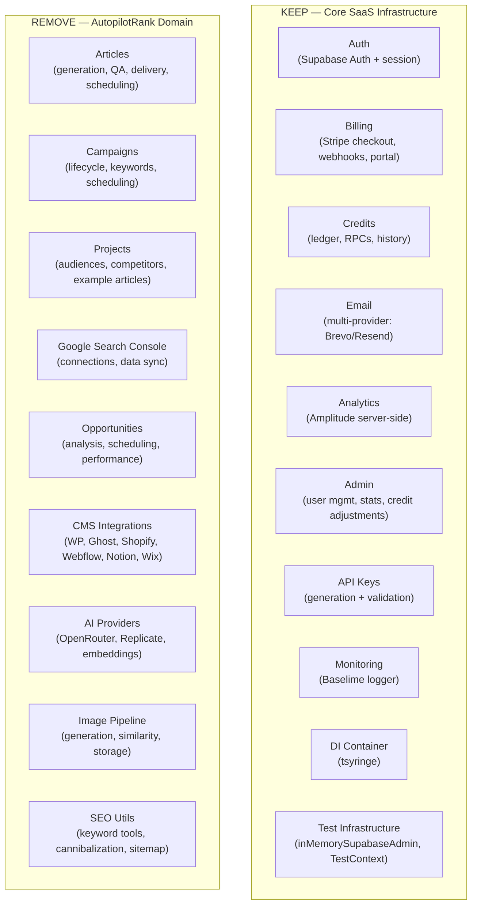

# PRD: Strip AutopilotRank to Reusable SaaS Boilerplate

**Complexity: 10 → HIGH mode** (10+ directories, multi-layer deletion, DB migrations, tests, i18n)

---

## 1. Context

**Problem:** AutopilotRank contains generic SaaS infrastructure (auth, billing, credits, analytics, email, admin) mixed with SEO/article-generation domain code. We want a clean "Cloudflare + Astro + Supabase + Stripe SaaS Boilerplate" that any new product can fork.

**Files Analyzed:**
- `src/pages/api/` — 90+ API route files
- `server/services/` — 70+ service files
- `server/integrations/` — 8 CMS adapter files
- `client/components/`, `client/hooks/`, `client/store/`
- `shared/types/`, `shared/config/`, `shared/validation/`, `shared/utils/`
- `supabase/migrations/` — 95 migration files
- `tests/` — API, E2E, unit test suites
- `emails/`, `content/`, `locales/`
- `workers/cron/`

**Current State:**
- Full SEO content-generation SaaS (projects → campaigns → keywords → articles → CMS delivery)
- 8 CMS integrations (WordPress, Ghost, Shopify, Webflow, Notion, Wix, Slack, Webhook)
- Google Search Console integration for opportunity analysis
- AI image generation pipeline (Replicate)
- Semantic duplicate detection via embeddings
- 90+ API routes; ~40 are domain-specific
- 95 DB migrations; ~60 are domain-specific

---

## 2. Solution

**Approach:**

1. Delete domain-specific API routes, pages, and Astro page components (articles, campaigns, projects, GSC, opportunities, feeds, calendar, integrations)
2. Delete domain server services, integrations, prompts, and internal utilities
3. Delete domain client components, hooks, and stores
4. Delete domain shared types, Zod schemas, config files, constants, and utils
5. Delete domain-specific DB migrations (articles, campaigns, projects, integrations, opportunities, onboarding, image, GSC, content-strategy, blog)
6. Delete domain tests; keep infrastructure tests (credits, auth, middleware, DI, Stripe)
7. Clean up emails, blog content, and domain i18n keys
8. Clean up Cloudflare Workers cron handlers (keep routing pattern, remove domain jobs)
9. Fix all broken imports introduced by deletions; run `yarn verify` to confirm clean build
10. Update README and CLAUDE.md to describe the boilerplate

**Architecture (Post-Strip):**



**What Remains After Strip:**
- ~15 API routes (auth, checkout, subscription, credits, email, admin, health, portal, analytics, settings/api-keys, webhooks/stripe)
- ~12 server services (SubscriptionCredits, email, api-key, admin-stats, admin-users, admin-subscription, subscription-sync, webhook-event, email-providers)
- ~30 DB migrations (profiles, subscriptions, credit_transactions, processing_jobs, admin_role, webhook_events, email_tables, api_keys, security fixes)
- Auth UI, Stripe UI, common UI primitives
- Credit/subscription client hooks, auth store, toast store
- Test infrastructure (inMemorySupabaseAdmin, TestContext, test-fixtures)

---

## 3. Execution Phases

### Phase 1: Remove Domain API Routes and Pages

**Files to delete (~45 files):**

```
src/pages/api/articles/           (entire directory)
src/pages/api/campaigns/          (entire directory)
src/pages/api/opportunities/      (entire directory)
src/pages/api/projects/           (entire directory)
src/pages/api/gsc/                (entire directory)
src/pages/api/integrations/       (entire directory — keep nothing)
src/pages/api/feeds/              (entire directory)
src/pages/api/calendar/articles.ts
src/pages/api/onboarding/keywords/suggestions.ts
src/pages/api/onboarding/         (directory if empty after above)
src/pages/api/seo/indexnow/index.ts
src/pages/api/seo/                (directory if empty)
src/pages/api/validate-sitemap.ts
src/pages/api/crawl.ts
src/pages/api/cron/analyze-opportunities/index.ts
src/pages/api/cron/process-scheduled-campaigns/index.ts
src/pages/api/cron/check-opportunity-performance/index.ts
src/pages/api/cron/recover-stale-articles/index.ts
src/pages/api/cron/generate-planned-articles/index.ts
src/pages/api/cron/publish-scheduled-articles/index.ts
src/pages/api/models/index.ts
src/pages/api/webhooks/article-published.ts
src/pages/api/analytics/performance/index.ts
src/pages/api/analytics/sync/index.ts
src/pages/api/admin/blog/         (entire directory)
src/pages/api/admin/failure-metrics/index.ts
```

**Astro pages to delete:**
```
src/pages/dashboard/              (entire directory — all dashboard sub-pages)
src/pages/blog/                   (entire directory)
src/pages/tools/                  (entire directory if exists)
src/pages/onboarding/             (entire directory if exists)
```

**Keep:**
- `src/pages/api/_utils.ts`
- `src/pages/api/auth/welcome.ts`
- `src/pages/api/health/`
- `src/pages/api/checkout/`
- `src/pages/api/subscription/`
- `src/pages/api/subscriptions/`
- `src/pages/api/email/`
- `src/pages/api/settings/api-keys/`
- `src/pages/api/settings/feed/token.ts` (may remove if feed concept gone)
- `src/pages/api/credits/history/`
- `src/pages/api/portal/`
- `src/pages/api/webhooks/stripe/`
- `src/pages/api/support/contact/`
- `src/pages/api/analytics/event/`
- `src/pages/api/cron/check-expirations/`
- `src/pages/api/cron/reconcile/`
- `src/pages/api/admin/stats/`
- `src/pages/api/admin/credits/`
- `src/pages/api/admin/users/`
- `src/pages/api/admin/subscription/`

**Implementation steps:**
- [ ] `rm -rf` the directories/files listed above
- [ ] Fix any barrel imports in `src/pages/api/` that reference deleted routes
- [ ] Verify remaining routes have no broken imports from deleted code

**Checkpoint:**
```bash
yarn verify
```
Expected: TypeScript errors only from removed files' consumers — to be fixed in later phases.

---

### Phase 2: Remove Domain Server Services and Integrations

**Files to delete:**

```
# Services
server/services/article-generation.service.ts
server/services/article-quality-gate.service.ts
server/services/article-status-transitions.ts
server/services/embedding.service.ts
server/services/image-generation.service.ts
server/services/image-similarity.service.ts
server/services/image-storage.service.ts
server/services/openrouter.service.ts
server/services/openai-embeddings.service.ts
server/services/replicate.service.ts
server/services/campaign.service.ts
server/services/campaign-lifecycle.service.ts
server/services/campaign-scheduling.service.ts
server/services/campaign-keyword.service.ts
server/services/campaign-idempotency.service.ts
server/services/keyword-cannibalization.service.ts
server/services/project.service.ts
server/services/project-audience.service.ts
server/services/project-competitor.service.ts
server/services/project-example-article.service.ts
server/services/integration.service.ts
server/services/delivery.service.ts
server/services/opportunity-analysis.service.ts
server/services/opportunity-scheduler.service.ts
server/services/opportunity-performance.service.ts
server/services/content-planning.service.ts
server/services/content-strategy.service.ts
server/services/gsc.service.ts
server/services/planned-article-generation.service.ts
server/services/scheduled-publishing.service.ts
server/services/website-crawler.service.ts
server/services/sitemap-page.service.ts
server/services/qa.service.ts
server/services/ai-detection.service.ts
server/services/blog.service.ts
server/services/cron-article-recovery.service.ts
server/services/cron-webhook-recovery.service.ts
server/services/analytics-performance.service.ts
server/services/feed.service.ts
server/services/batch-limit.service.ts
server/services/provider-credit-tracker.service.ts

# Providers (domain AI providers)
server/services/providers/gemini.provider-adapter.ts
server/services/providers/replicate.provider-adapter.ts
server/services/providers/index.ts
server/services/provider-manager.service.ts

# Internal prompts
server/services/internal/prompt-builder.ts
server/services/internal/prompt-constants.ts
server/services/prompts/article-prompts.ts
server/services/prompts/image-prompts.ts

# Integrations (CMS adapters)
server/integrations/wordpress.adapter.ts
server/integrations/ghost.adapter.ts
server/integrations/shopify.adapter.ts
server/integrations/webflow.adapter.ts
server/integrations/wix.adapter.ts
server/integrations/notion.adapter.ts
server/integrations/notion-blocks.ts
server/integrations/slack.adapter.ts
server/integrations/index.ts           (delete or gut — keep interface only)
server/integrations/adapter.interface.ts (keep as reference, can remove if no users)
server/integrations/webhook.adapter.ts  (keep if generic webhook delivery needed, else remove)

# Service tests
server/services/__tests__/article-generation.service.test.ts
server/services/__tests__/article-quality-gate.service.test.ts
server/services/__tests__/batch-limit.service.test.ts
server/services/__tests__/campaign-schedule.service.test.ts
server/services/__tests__/delivery.service.test.ts
server/services/__tests__/gsc.service.test.ts
server/services/__tests__/openrouter.service.test.ts
server/services/__tests__/project.service.test.ts
server/services/__tests__/qa.service.test.ts
server/services/__tests__/website-crawler.service.test.ts
```

**Keep:**
- `server/services/SubscriptionCredits.ts`
- `server/services/email.service.ts`
- `server/services/email-providers/` (all)
- `server/services/api-key.service.ts`
- `server/services/admin-stats.service.ts`
- `server/services/admin-subscription.service.ts`
- `server/services/admin-users.service.ts`
- `server/services/subscription-sync.service.ts`
- `server/services/cron-subscription-sync.service.ts`
- `server/services/webhook-event.service.ts`
- `server/services/internal/rfc822.ts`
- `server/services/__tests__/SubscriptionCredits.test.ts`
- `server/services/email-providers/__tests__/email-provider-manager.test.ts`

**Also clean up DI container:**
- `server/di/container.ts` — remove registrations for all deleted services

**Implementation steps:**
- [ ] Delete all listed files/directories
- [ ] Remove all deleted service registrations from `server/di/container.ts`
- [ ] Fix any broken imports in remaining server files

**Checkpoint:**
```bash
yarn tsc --noEmit 2>&1 | grep -v "node_modules" | head -50
```

---

### Phase 3: Remove Domain Client Components, Hooks, and Stores

**Components to delete:**

```
client/components/articles/        (entire directory)
client/components/onboarding/      (entire directory)
client/components/tools/           (entire directory)
client/components/admin/blog/      (remove blog management only, keep admin user/stats components)
client/components/blog/            (entire directory — reading UI)
client/components/landing/         (landing page sections specific to AutopilotRank)
client/components/pages/           (domain-specific page components)
client/components/cta/             (domain-specific CTAs)
client/components/projects/        (entire directory)
client/components/dashboard/views/ (entire directory — all domain dashboard views)
client/components/dashboard/prompts/ (entire directory)
```

**Hooks to delete:**

```
client/hooks/useCampaigns.ts
client/hooks/useCampaignDetail.ts
client/hooks/useCampaignSettingsForm.ts
client/hooks/useArticles.ts
client/hooks/useArticleActions.ts
client/hooks/useArticleGeneration.ts
client/hooks/useArticlePoller.ts
client/hooks/useArticleBlogStatus.ts
client/hooks/useArticleDeliveries.ts
client/hooks/useCalendarArticles.ts
client/hooks/useContentPlanning.ts
client/hooks/useGscConnection.ts
client/hooks/useIntegrations.ts
client/hooks/useOnboardingProgress.ts
client/hooks/useOpportunities.ts
client/hooks/useProjects.ts
client/hooks/useBatchQueue.ts
client/hooks/usePendingActions.ts
client/hooks/useAnalytics.ts        (article performance analytics, not Amplitude)
client/hooks/useAdminBlog.ts
client/hooks/useAvailableModels.ts
client/hooks/useBlogPosts.ts
client/hooks/useBlogCategories.ts
client/hooks/useBlogMedia.ts
```

**Stores to delete:**

```
client/store/projectStore.ts
client/store/onboardingStore.ts
client/store/modalStore.ts          (if only domain modals use it)
```

**Client utils to delete:**

```
client/utils/dashboard-navigation.ts
client/utils/calendarHelpers.ts
client/utils/statusStyles.ts        (article/campaign status)
client/utils/modelAdapters.ts
client/utils/image-preprocessing.ts
client/utils/prompt-utils.ts
```

**Keep:**
- `client/components/common/` (all)
- `client/components/form/` (all)
- `client/components/layout/` (all)
- `client/components/stripe/` (all)
- `client/components/modal/auth/` (all)
- `client/components/dashboard/ui/` (primitives only)
- `client/components/i18n/` (all)
- `client/components/monitoring/` (all)
- `client/components/logo/` (all)
- `client/hooks/useApiRequest.ts`
- `client/hooks/useMutationWithToast.ts`
- `client/hooks/useAsyncAction.ts`
- `client/hooks/useClickOutside.ts`
- `client/hooks/useLowCreditWarning.ts`
- `client/hooks/useCheckoutFlow.ts`
- `client/hooks/useGoogleSignIn.ts`
- `client/hooks/useFacebookSignIn.ts`
- `client/hooks/useAzureSignIn.ts`
- `client/hooks/useEmailPreferences.ts`
- `client/hooks/useApiKeys.ts`
- `client/store/userStore.ts`
- `client/store/toastStore.ts`
- `client/store/localeStore.ts`
- `client/store/loadingStore.ts`
- `client/store/createStore.ts`
- `client/store/middleware.ts`

**Implementation steps:**
- [ ] Delete listed component directories and files
- [ ] Delete listed hooks
- [ ] Delete listed stores
- [ ] Replace `dashboard/views/` with a single placeholder `DashboardPlaceholder.tsx` showing "Your app goes here"
- [ ] Update any layout or page files that import deleted components to use placeholder
- [ ] Fix broken imports

**Checkpoint:**
```bash
yarn tsc --noEmit 2>&1 | grep -v "node_modules" | head -50
```

---

### Phase 4: Remove Domain Shared Types, Schemas, Configs, Constants, Utils

**Types to delete:**

```
shared/types/article.types.ts
shared/types/campaign.types.ts
shared/types/project.types.ts
shared/types/integration.types.ts
shared/types/opportunity.types.ts
shared/types/article-performance.types.ts
shared/types/onboarding.types.ts
shared/types/calendar.types.ts
shared/types/coreflow.types.ts
shared/types/models.types.ts
shared/types/pseo.types.ts
shared/types/outrank.types.ts
shared/types/failure.types.ts
shared/types/webhook-event.types.ts  (check if used by generic webhook service)
```

**Schemas to delete:**

```
shared/validation/campaign.schema.ts
shared/validation/project.schema.ts
shared/validation/project-settings.schema.ts
shared/validation/gsc.schema.ts
shared/validation/onboarding.schema.ts
shared/validation/opportunity.schema.ts
shared/validation/opportunity-detail.schema.ts
shared/validation/analytics.schema.ts  (article performance analytics only)
```

**Configs to delete:**

```
shared/config/ai-models.config.ts
shared/config/image-models.config.ts
shared/config/credits.config.ts       (article generation credit costs — not generic billing)
shared/config/scheduling.config.ts
shared/config/opportunity.config.ts
shared/config/preset-parser.ts
```

**Constants to delete:**

```
shared/constants/credit-costs.constants.ts  (article-specific pricing)
shared/constants/writing-guidelines.ts
```

**Utils to delete:**

```
shared/utils/keyword.ts
shared/utils/seo.ts
```

**Keep:**
- `shared/config/env.ts`
- `shared/config/security.ts`
- `shared/config/subscription.config.ts`
- `shared/config/subscription.types.ts`
- `shared/config/subscription.utils.ts`
- `shared/config/subscription.validator.ts`
- `shared/config/stripe.ts`
- `shared/config/regional-pricing.ts`
- `shared/config/timeouts.config.ts`
- `shared/types/stripe.types.ts`
- `shared/types/admin.types.ts`
- `shared/types/analytics.types.ts`
- `shared/types/api-key.types.ts`
- `shared/types/authProviders.types.ts`
- `shared/types/feed.types.ts`
- `shared/validation/authValidationSchema.ts`
- `shared/validation/email.schema.ts`
- `shared/validation/support.schema.ts`
- `shared/utils/crypto.ts`
- `shared/utils/currency.ts`
- `shared/utils/errors.ts`
- `shared/utils/string.ts`
- `shared/repositories/base.repository.ts`
- `shared/repositories/user.repository.ts`
- `shared/repositories/subscription.repository.ts`

**Implementation steps:**
- [ ] Delete listed type, schema, config, constant, and util files
- [ ] Update barrel exports (index.ts files) to remove deleted exports
- [ ] Fix any consumers that imported deleted types/configs

**Checkpoint:**
```bash
yarn tsc --noEmit 2>&1 | grep -v "node_modules" | head -50
```

---

### Phase 5: Clean Up Supabase Migrations

**Migrations to DELETE** (domain-specific, ~65 files):

```
20260205100000_create_projects_table.sql
20260205100100_create_campaigns_table.sql
20260205100200_create_articles_table.sql
20260205100300_create_keywords_table.sql
20260205200000_add_project_details_columns.sql
20260206100000_add_article_generation_columns.sql
20260206120000_remove_tone_wordcount_from_project_content_preferences.sql
20260206130000_add_approval_workflow.sql
20260207000000_create_article_images_table.sql
20260207000001_add_image_columns.sql
20260209100000_fix_project_delete_cascade.sql
20260210000000_add_failed_quality_status.sql
20260210100000_add_keyword_normalized_and_duplicate_constraint.sql
20260210110000_atomic_article_creation_with_credits.sql
20260210110100_create_integrations_tables.sql
20260210200000_migrate_ai_model_to_presets.sql
20260210210100_add_keywords_normalized_constraint.sql
20260210210200_add_stale_article_recovery.sql
20260210220100_add_campaign_generation_idempotency.sql
20260210220200_add_structured_failure_taxonomy.sql
20260210230000_add_failure_metrics_rpc.sql
20260210240100_add_topic_fingerprint_for_semantic_dedup.sql
20260210240200_add_qa_pipeline.sql
20260211000000_fix_create_articles_with_credits_array.sql
20260211000100_fix_credit_trigger_and_rpc_trust.sql  (check if credit RPCs are generic)
20260211000200_fix_transaction_id_type.sql
20260211000300_create_gsc_connections.sql
20260211000400_create_gsc_snapshots.sql
20260211000500_create_opportunities.sql
20260212100000_add_campaign_scheduling.sql
20260212200000_opportunities_scheduling.sql
20260213000000_create_user_onboarding.sql
20260213100100_add_feed_token.sql                    (keep if API feed token used)
20260213100400_add_webflow_integration_type.sql
20260213100500_add_notion_integration_type.sql
20260213100600_add_ghost_integration_type.sql
20260213100700_add_wix_integration_type.sql
20260213100800_add_shopify_integration_type.sql
20260213100900_add_slack_integration_type.sql
20260214100000_create_blog_tables.sql
20260216000000_encrypt_gsc_tokens.sql
20260216000100_encrypt_webhook_secrets.sql           (keep if generic webhook subs survive)
20260224100000_add_outrank_project_columns.sql
20260224100100_add_outrank_campaign_columns.sql
20260224100200_create_project_target_audiences.sql
20260224100300_create_project_competitors.sql
20260224100400_create_project_example_articles.sql
20260224100500_create_sitemap_pages.sql
20260224100600_create_content_strategies.sql
20260225000000_enable_pgvector.sql
20260225000000_add_image_similarity_function.sql
20260227000000_revoke_article_rpc_from_authenticated.sql
20260227010000_revoke_article_rpc_from_authenticated.sql
20260227020000_fix_decrement_credits_lock.sql        (check if generic credit lock)
20260227030000_fix_articles_project_fk_cascade.sql
20260227120000_create_article_performance_snapshots.sql
20260227200000_add_scheduled_publish_at.sql
20260228000000_add_planned_article_status.sql
20260228010000_add_atomic_planned_article_promotion.sql
20260228200000_add_keyword_cannibalization.sql
20260301100000_ensure_scheduled_publish_at_column.sql
20260301200000_fix_credit_rpc_trusted_flag.sql       (check if generic credit RPC)
20260301210000_add_ai_detection_details.sql
```

**Migrations to KEEP** (~30 files):

```
20250120000000_create_profiles_table.sql
20250120100000_create_subscriptions_table.sql
20250120200000_create_rpc_functions.sql
20250121000000_create_credit_transactions_table.sql
20250121010000_create_processing_jobs_table.sql
20250121020000_enhanced_credit_functions.sql
20250121030000_fix_initial_credits.sql
20250121040000_fix_profiles_subscription_status.sql
20250202000000_add_admin_role.sql
20250202010000_add_cancellation_reason.sql
20250202020000_add_credit_clawback_rpc.sql
20250202030000_create_webhook_events_table.sql
20250202040000_add_webhook_events_columns.sql
20250203000000_fix_admin_policy_recursion.sql
20250221000000_secure_credits.sql
20250302000000_add_sync_tables.sql
20250302010000_fix_admin_adjust_credits.sql
20250303000000_add_credit_expiration_support.sql
20250303010000_revoke_credit_rpc_from_authenticated.sql
20251205000000_add_plan_upgrade_transaction_type.sql
20251205010000_add_trial_end_to_subscriptions.sql
20251205020000_separate_credit_pools.sql
20251205030000_update_credit_rpcs.sql
20251209000000_get_user_data_rpc.sql
20251217000000_add_unrecoverable_webhook_status.sql
20251229000000_drop_dead_tables.sql
20251229010000_fix_credit_clawback.sql
20260115000000_security_fixes.sql
20260116000000_add_email_providers_to_usage.sql
20260116010000_create_email_tables.sql
20260116020000_create_provider_usage_tracking.sql
20260116030000_fix_email_logs_rls.sql
20260120000000_enable_email_provider_usage_rls.sql
20260120010000_fix_function_search_paths.sql
20260120020000_fix_signup_trigger.sql
20260205000000_enable_missing_rls.sql
20260213100000_create_api_keys.sql
20260213100200_create_webhook_subscriptions.sql      (generic webhook subscriptions)
20260213100300_add_feed_token.sql                    (keep if settings/feed/token.ts kept)
```

**Implementation steps:**
- [ ] Delete all domain migration files listed above
- [ ] Verify remaining migrations reference no dropped tables
- [ ] Run `npx supabase db lint` locally to check migration consistency (informational only — do not apply to prod)

**Note:** Migration deletions don't affect a running DB; they only affect fresh installs of the boilerplate. No prod DB changes needed.

**Checkpoint:**
```bash
yarn verify
```

---

### Phase 6: Clean Up Tests

**Test directories/files to delete:**

```
tests/api/article-generation.api.spec.ts
tests/api/article-batch-campaign.api.spec.ts
tests/api/projects-campaigns.api.spec.ts
tests/unit/server/services/article-quality-gate.service.unit.spec.ts
tests/unit/server/services/campaign-*.unit.spec.ts
tests/unit/server/services/project.unit.spec.ts
tests/unit/server/services/gsc.unit.spec.ts
tests/unit/server/services/delivery.unit.spec.ts
tests/unit/server/services/website-crawler.unit.spec.ts
tests/unit/server/services/openrouter.unit.spec.ts
tests/unit/server/services/qa.unit.spec.ts
tests/e2e/opportunities.e2e.spec.ts
tests/pages/ (page objects for domain pages: CampaignPage, ArticlePage, etc.)
```

**Test files to keep:**

```
tests/api/credits.api.spec.ts
tests/e2e/auth.e2e.spec.ts
tests/e2e/billing.e2e.spec.ts
tests/e2e/public-pages.e2e.spec.ts
tests/e2e/protected-routes.e2e.spec.ts
tests/unit/server/di/container.unit.spec.ts
tests/unit/server/stripe/
tests/unit/server/middleware/
tests/unit/server/monitoring/logger.unit.spec.ts
tests/unit/shared/config/stripe.unit.spec.ts
tests/unit/subscription-*.unit.spec.ts
tests/unit/server/services/SubscriptionCredits.unit.spec.ts
tests/unit/server/services/email-providers/
tests/test-fixtures.ts
tests/fixtures/plan-fixtures.ts
tests/global-teardown.ts
tests/pages/BasePage.ts
```

**Implementation steps:**
- [ ] Delete listed test files
- [ ] Update `tests/test-fixtures.ts` to remove any domain-specific mock setup
- [ ] Update `inMemorySupabaseAdmin.ts` defaults to remove domain tables (articles, campaigns, projects, etc.)
- [ ] Run remaining tests to confirm they pass

**Checkpoint:**
```bash
yarn test
```
Expected: All remaining tests pass.

---

### Phase 7: Clean Up Emails and Blog Content

**Emails to delete (domain-specific templates):**

```
emails/article-ready.tsx            (if exists)
emails/campaign-complete.tsx        (if exists)
emails/article-published.tsx        (if exists)
emails/weekly-digest.tsx            (if exists)
```

**Emails to keep:**
- `emails/welcome.tsx`
- `emails/password-reset.tsx`
- `emails/subscription-*.tsx`
- `emails/invoice-*.tsx`
- `emails/trial-*.tsx`

**Content to delete:**
```
content/blog/                       (all blog post MDX files)
content/                            (if empty after above)
```

**Workers cron handlers to delete:**

```
workers/cron/handlers/article-*.ts  (all article-related cron handlers)
workers/cron/handlers/campaign-*.ts
workers/cron/handlers/opportunity-*.ts
```

**Workers cron to update:**
- `workers/cron/index.ts` — remove all domain cron event routes; keep `check-expirations` and `reconcile` handlers
- Keep the routing pattern (Cloudflare scheduled event → POST to API endpoint)

**Implementation steps:**
- [ ] Delete domain email templates
- [ ] Delete blog content files
- [ ] Delete domain cron handlers
- [ ] Gut `workers/cron/index.ts` to only include generic cron routes (check-expirations, reconcile)

**Checkpoint:**
```bash
yarn verify
```

---

### Phase 8: Strip Domain i18n Keys

**Action:** For each locale file (`locales/en/`, etc.), remove all domain-specific translation keys while keeping:

```
KEEP namespaces/keys:
  auth.*           — login, register, forgot-password, oauth
  billing.*        — subscription, checkout, credits, upgrade, cancel
  common.*         — buttons, errors, loading states
  settings.*       — profile, api-keys, email preferences
  admin.*          — user management, stats
  email.*          — email preference labels
  errors.*         — generic error messages
  nav.*            — navigation labels

REMOVE namespaces/keys:
  articles.*       — article CRUD, generation, QA
  campaigns.*      — campaign management
  projects.*       — project settings, audiences, competitors
  opportunities.*  — SEO opportunity labels
  onboarding.*     — onboarding wizard copy
  integrations.*   — CMS integration labels
  tools.*          — SEO tools copy
  calendar.*       — calendar view copy
  gsc.*            — Google Search Console labels
  dashboard.*      — domain-specific dashboard copy (keep generic nav labels)
```

**Implementation steps:**
- [ ] For each locale JSON file, remove domain-specific namespaces/keys
- [ ] Run `yarn verify` which includes `yarn i18n:icu` to validate remaining keys are consistent

**Checkpoint:**
```bash
yarn i18n:icu && yarn verify
```

---

### Phase 9: Fix Build — Full `yarn verify` Pass

This phase resolves any remaining broken imports, type errors, and lint issues introduced by all previous deletions.

**Implementation steps:**
- [ ] Run `yarn tsc --noEmit` and fix all remaining type errors
- [ ] Run `yarn eslint` and fix all remaining lint errors
- [ ] Run `yarn i18n:icu` and fix any missing/extra i18n keys
- [ ] Run `yarn seo:validate` and fix any SEO validation issues (or remove the command if it depended on deleted pages)
- [ ] Confirm all remaining tests pass: `yarn test`
- [ ] Do a final `yarn verify` — must be green

**Verification:**
```bash
yarn verify && yarn test
```

Expected: All checks pass with zero errors.

**Automated Checkpoint:**

Spawn `prd-work-reviewer` agent:
```
PRD: docs/PRDs/saas-boilerplate-strip.md
Phase: 9 (Final Verification)
Summary: All domain code removed, build verified green
```

---

### Phase 10: Update README and CLAUDE.md

**Files to update:**

- `README.md` — Rewrite to describe this as a SaaS boilerplate:
  - What it includes (auth, Stripe billing, credits, analytics, email, admin panel)
  - How to set up (env vars, Supabase migrations, Stripe config)
  - How to extend (where to add new features)
  - Tech stack overview
- `CLAUDE.md` — Update to remove AutopilotRank-specific sections:
  - Remove references to articles, campaigns, projects, integrations
  - Add "Boilerplate Extension Points" section describing where new domain code should go
  - Keep tech stack, conventions, testing instructions

**Implementation steps:**
- [ ] Rewrite `README.md` as boilerplate documentation
- [ ] Update `CLAUDE.md` to reflect boilerplate scope
- [ ] Update `server/CLAUDE.md` to remove domain-specific service descriptions

**Checkpoint:**
```bash
yarn verify
```

---

## 4. Acceptance Criteria

- [ ] `yarn verify` passes (tsc, eslint, i18n:icu, seo:validate)
- [ ] `yarn test` passes (all remaining tests green)
- [ ] No domain-specific code remains (articles, campaigns, projects, integrations, opportunities, GSC, AI generation)
- [ ] Generic SaaS infrastructure is intact and functional: auth, Stripe billing, credits, email, analytics, admin, API keys
- [ ] Dashboard has a working placeholder instead of domain views
- [ ] Landing page works (even if content is generic)
- [ ] README describes the boilerplate accurately

---

## 5. Risk Notes

- **Import chains**: Deleting a type/service file may break a file that was otherwise in-scope to keep. Fix imports by removing the reference, not by adding stubs.
- **Credit RPCs**: Some DB migrations mix generic credit logic with domain (article-specific). Check each carefully before deleting.
- **`20260211000100_fix_credit_trigger_and_rpc_trust.sql`**: May reference article tables — audit before deciding to keep or delete.
- **`20260213100200_create_webhook_subscriptions.sql`**: Generic webhook subscriptions — likely KEEP, but verify it doesn't reference integration-specific tables.
- **`settings/feed/token.ts`**: If the RSS feed concept is entirely removed, delete this too.
- **Do NOT touch prod DB**: Migration deletions only affect fresh boilerplate installs, not existing running databases.
