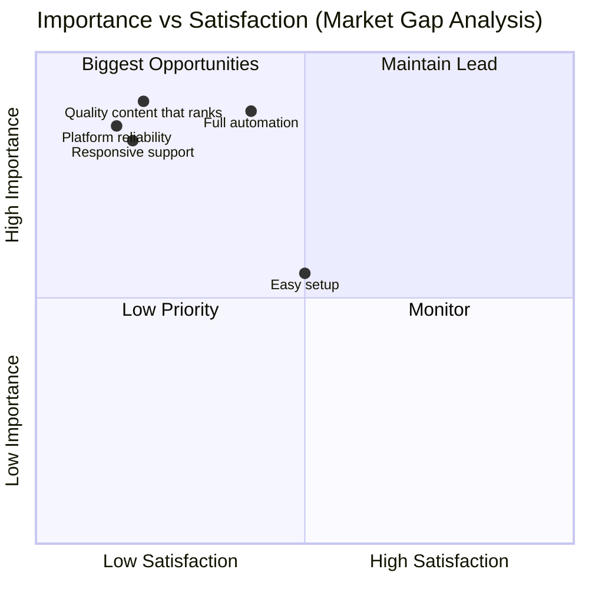
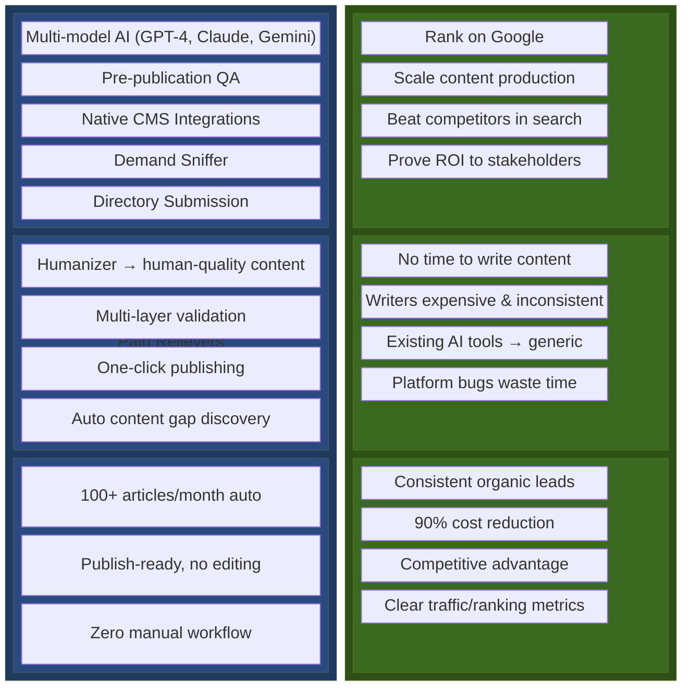
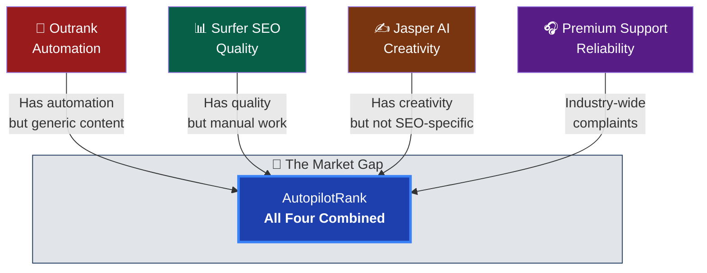
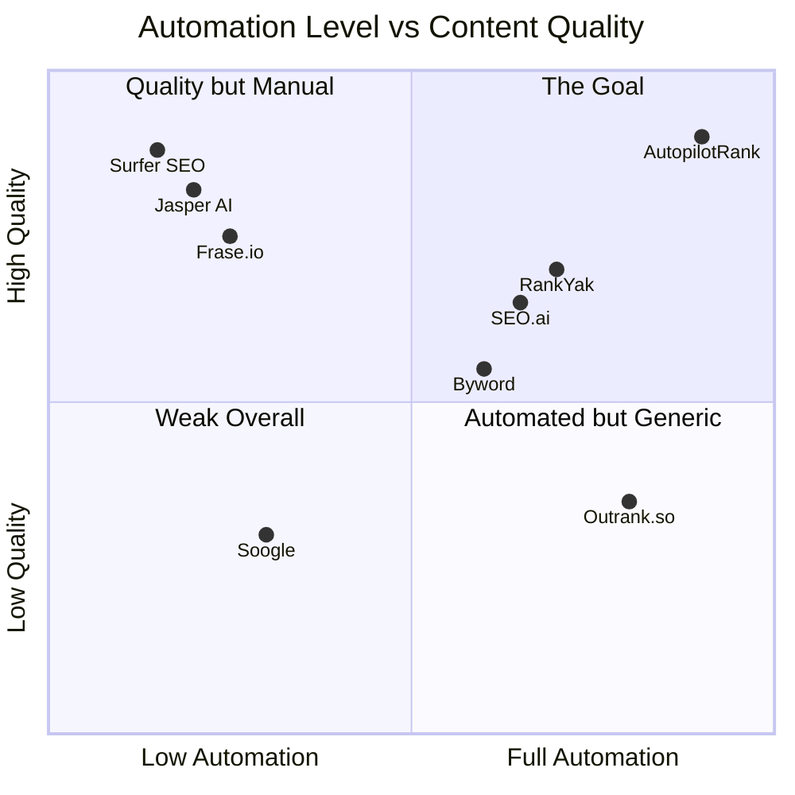
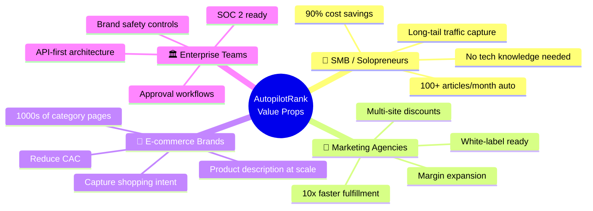
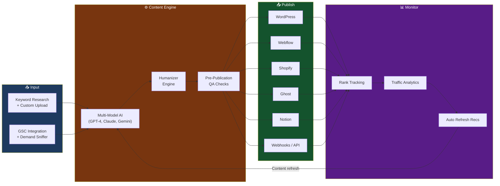
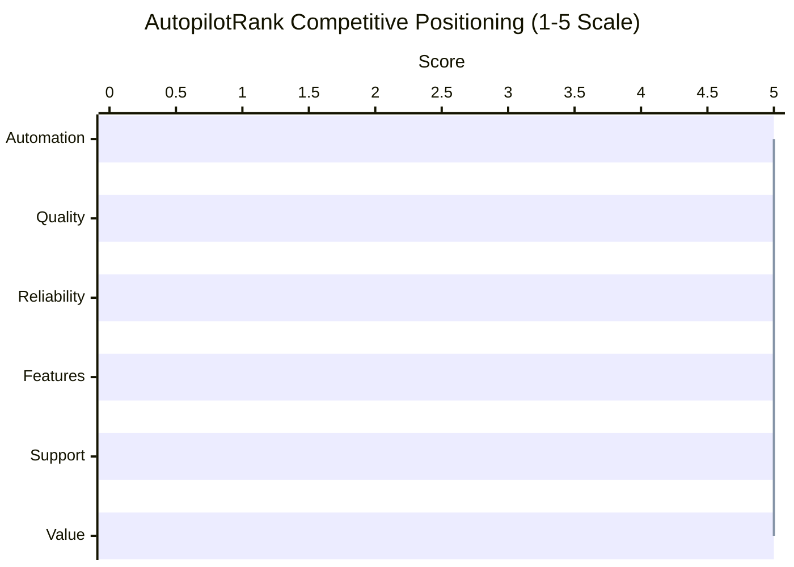
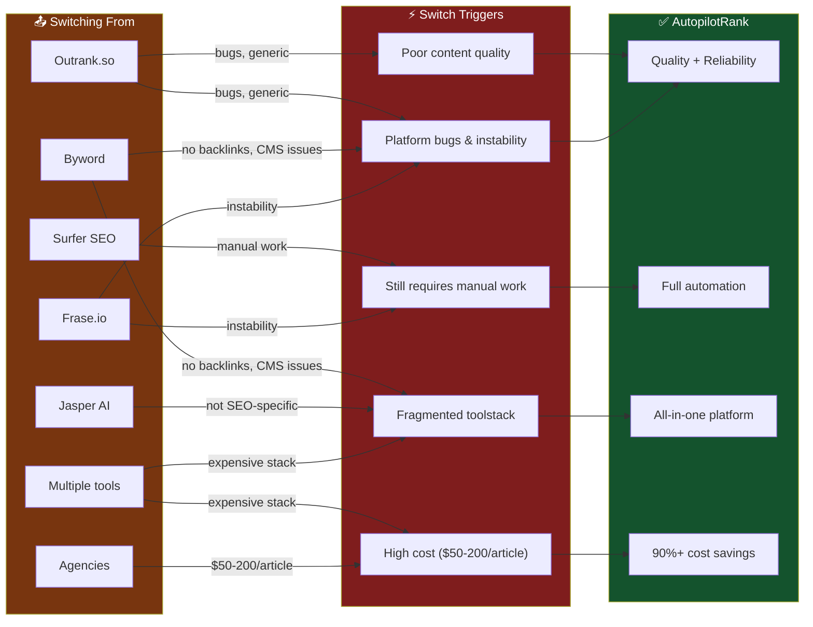

# Value Proposition

> **Lean Product Playbook Framework Applied:** This document maps AutopilotRank's value proposition to underserved customer needs identified through the Importance vs. Satisfaction analysis.

## Executive Summary

**AutopilotRank** is an autonomous SEO content automation platform that combines programmatic SEO with AI-powered content generation to help businesses scale their organic search presence without manual content creation overhead.

**Core Promise:** _"The only AI SEO platform that truly does it all – automating content creation, optimization, and backlink building with human-level quality and reliability. Scale your organic traffic on autopilot without the generic content or technical headaches. Bonus: Demand Sniffer for opportunity discovery and Directory Submission for instant local SEO wins."_

---

## Value Proposition Statement (Lean Product Playbook Format)

```
For SMB owners and marketing agencies
who need to scale organic traffic but lack time/resources,
AutopilotRank is an autonomous SEO content platform
that generates publish-ready, human-quality content at scale.
Unlike Outrank.so (buggy, generic content) and Surfer SEO (manual work required),
we deliver true automation with Surfer-level quality and rock-solid reliability.
```

---

## Underserved Needs → Value Mapping



| Underserved Need           | Importance | Satisfaction | AutopilotRank Solution              |
| -------------------------- | ---------- | ------------ | ----------------------------------- |
| Quality content that ranks | HIGH       | LOW          | Multi-model AI + Humanizer engine   |
| Platform reliability       | HIGH       | LOW          | 99.9% uptime, fast performance      |
| Responsive support         | HIGH       | LOW          | 24/7 chat, <4hr enterprise response |
| Full automation            | HIGH       | MEDIUM       | Set-and-forget campaigns            |
| Easy setup                 | MEDIUM     | MEDIUM       | WordPress plugin, guided onboarding |

---

## Value Proposition Canvas



### Customer Profile (Right Side)

| Customer Jobs                        | Customer Pains                            | Customer Gains                   |
| ------------------------------------ | ----------------------------------------- | -------------------------------- |
| Rank on Google for relevant keywords | No time to write content                  | Consistent organic leads         |
| Scale content production             | Writers expensive & inconsistent          | 90% cost reduction               |
| Beat competitors in search           | Existing AI tools produce generic content | Competitive advantage            |
| Prove ROI to stakeholders            | Platform bugs waste time                  | Clear traffic/ranking metrics    |
| Maintain brand voice                 | Content quality varies wildly             | Consistent publish-ready quality |

### Value Map (Left Side)

| Products & Services                    | Pain Relievers                             | Gain Creators                      |
| -------------------------------------- | ------------------------------------------ | ---------------------------------- |
| Multi-model AI (GPT-4, Claude, Gemini) | Humanizer produces human-quality content   | 100+ articles/month automatically  |
| Pre-publication QA checks              | Multi-layer validation catches issues      | Publish-ready, no editing needed   |
| Native CMS integrations                | One-click publishing to WordPress/Webflow  | Zero manual workflow               |
| GSC integration                        | Data-driven keyword selection              | Rank for high-opportunity keywords |
| Automated internal linking             | SEO structure handled automatically        | Better site architecture           |
| **Demand Sniffer**                     | Auto-discovers content gaps from your data | Never run out of content ideas     |
| **Directory Submission Tool**          | NAP consistency across 50+ directories     | Instant local SEO citations boost  |

---

## Kano Model Feature Classification

```mermaid
graph LR
    subgraph MH["🔴 Must-Have (P0)"]
        direction TB
        M1["AI Content Generation"]
        M2["CMS Publishing"]
        M3["Keyword Research"]
    end

    subgraph PF["🟡 Performance (P1)"]
        direction TB
        P1["Humanizer Engine"]
        P2["Multi-Model AI"]
        P3["Pre-Publication QA"]
    end

    subgraph DL["🟢 Delighter (P2-P3)"]
        direction TB
        D1["AI Detection Scoring"]
        D2["Auto Internal Linking"]
        D3["Demand Sniffer"]
        D4["Directory Submission"]
        D5["Brand Voice (P3)"]
    end

    MH -->|"Foundation"| PF -->|"Differentiation"| DL

    style MH fill:#7f1d1d,color:#fff
    style PF fill:#78350f,color:#fff
    style DL fill:#14532d,color:#fff
```



| Feature                       | Category        | Strategy                            | Priority |
| ----------------------------- | --------------- | ----------------------------------- | -------- |
| AI content generation         | **Must-Have**   | Ensure 100% reliable                | P0       |
| CMS publishing                | **Must-Have**   | WordPress first, expand             | P0       |
| Keyword research              | **Must-Have**   | Basic needs covered                 | P0       |
| Humanizer engine              | **Performance** | Key differentiator - invest heavily | P1       |
| Multi-model AI                | **Performance** | Quality + variety                   | P1       |
| Pre-publication QA            | **Performance** | Reduce edit time to zero            | P1       |
| AI detection scoring          | **Delighter**   | Unexpected value, WOW factor        | P2       |
| Automated internal linking    | **Delighter**   | Surprise feature                    | P2       |
| **Demand Sniffer**            | **Delighter**   | Opportunity discovery automation    | P2       |
| **Directory Submission Tool** | **Delighter**   | Easy wins for local SEO & citations | P2       |
| Brand voice customization     | **Delighter**   | Enterprise upsell path              | P3       |

---

## Market Opportunity

The SEO content automation market is fragmented. No single competitor delivers:

- **Outrank's automation** + **Surfer's quality** + **Jasper's creativity** + **Reliable support**



This gap represents a significant opportunity for AutopilotRank.

---

## Competitor Analysis

### Competitive Landscape Map



### Competitor Ratings Overview

| Competitor      | Rating        | Strengths                                                        | Weaknesses                                                  |
| --------------- | ------------- | ---------------------------------------------------------------- | ----------------------------------------------------------- |
| **Surfer SEO**  | ★★★★★ (5/5)   | Best-in-class optimization, 4.8/5 on G2 (500+ reviews), reliable | No automation, no link building, requires manual writing    |
| **RankYak**     | ★★★★½ (4.5/5) | E-commerce focus, reliable, keyword tracking, fewer bugs         | Newer platform, limited reviews, small team                 |
| **Frase.io**    | ★★★★½ (4.5/5) | Easy brief builder, SERP-based outlines, 4.6/5 on AppSumo        | No auto-publish, no link building, recent stability issues  |
| **Jasper AI**   | ★★★★½ (4.5/5) | Best content quality, 4.7/5 on G2 (1,200+ reviews), brand voice  | Not SEO-specific, no keyword research, no links             |
| **SEO.ai**      | ★★★★ (4/5)    | AI detection-proof content, geo-targeting, comprehensive         | Limited reviews, newer platform                             |
| **Byword**      | ★★★★ (4/5)    | Bulk generation, WordPress integration, scalable                 | No backlinks, hosting compatibility issues, refund disputes |
| **ContentMonk** | ★★★★ (4/5)    | High-quality output (4.2-4.8/5 vs Outrank's 3/5), brand voice    | Not fully automated, newer product                          |
| **Outrank.so**  | ★★★½ (3.5/5)  | Full automation, backlink exchange, all-in-one                   | Generic content, bugs, poor support, quality issues         |
| **Soogle**      | ★★★½ (3.5/5)  | Low-cost backlinks ($50-70/mo), quick results                    | No content generation, rough edges, 2.5/5 Trustpilot        |

### Detailed Competitor Profiles

#### Outrank.so - The Incumbent to Beat

- **Pricing:** $99/month
- **What they do well:** Full automation (keyword research → content → publishing → backlinks)
- **Critical flaws:**
  - Generic, templated content that "screams AI"
  - Slow platform with persistent bugs
  - Poor customer support ("support sucks" - Reddit user)
  - Backlink quality concerns in competitive niches

#### RankYak - The Rising Challenger

- **Pricing:** $99/month (3-day free trial)
- **What they do well:** Daily article generation, keyword tracking, e-commerce focus, multi-site discounts
- **Limitations:** Small 2-person team, newer platform (founded 2025), limited track record

#### Byword - The Scale Specialist

- **Pricing:** $99-$2,499/month (or $5/article pay-as-you-go)
- **What they do well:** Bulk/programmatic content, WordPress integration, clean interface
- **Critical flaws:** No backlinks, hosting compatibility issues, denied refunds, lacking unique voice

#### Surfer SEO - The Quality Leader

- **Pricing:** $99-$219/month (Essential to Scale)
- **What they do well:** Content optimization, NLP analysis, audit tools, reliable platform
- **Limitations:** No content generation, no backlinks, requires manual work

#### Frase.io - The Research Expert

- **Pricing:** $45-$115/month + Pro Add-on ($35/month)
- **What they do well:** SERP analysis, brief generation, content research, GSC integration
- **Limitations:** No auto-publishing, no link building, platform stability issues

#### SEO.ai - The AI-Native Platform

- **Pricing:** Starting at $49/month
- **What they do well:** AI detection-proof content, multi-CMS support, geo-targeting
- **Limitations:** Limited public reviews, newer platform

---

## Comprehensive Feature Matrix

### Core Features Comparison

| Feature                   | AutopilotRank                     | Outrank.so | RankYak | Byword  | Surfer | Frase | Jasper | SEO.ai |
| ------------------------- | --------------------------------- | ---------- | ------- | ------- | ------ | ----- | ------ | ------ |
| **Fully Autonomous**      | ✅                                | ✅         | ✅      | ❌      | ❌     | ❌    | ❌     | ✅     |
| **AI Content Generation** | ✅                                | ✅         | ✅      | ✅      | ❌     | ✅    | ✅     | ✅     |
| **Multi-Model AI**        | ✅ (GPT-4, Claude, Gemini, Llama) | ❌         | ❌      | ❌      | ❌     | ❌    | ❌     | ❌     |
| **Humanizer Engine**      | ✅                                | ❌         | ❌      | ❌      | ❌     | ❌    | ❌     | ❌     |
| **Pre-Publication QA**    | ✅ (Multi-layer)                  | ❌         | ❌      | ❌      | ❌     | ❌    | ❌     | ❌     |
| **Keyword Research**      | ✅                                | ✅         | ✅      | Limited | ✅     | ✅    | ❌     | ✅     |
| **Custom Keyword Upload** | ✅ (CSV, Excel)                   | ❌         | ❌      | Limited | ❌     | ❌    | ❌     | ❌     |
| **SERP Analysis**         | ✅                                | ✅         | ✅      | ❌      | ✅     | ✅    | ❌     | ✅     |
| **Content Optimization**  | ✅                                | Basic      | ✅      | ❌      | ✅     | ✅    | ❌     | ✅     |
| **On-Page SEO Scoring**   | ✅                                | Basic      | ✅      | ❌      | ✅     | ✅    | ❌     | ✅     |
| **Internal Linking**      | ✅ (Automated)                    | ❌         | ✅      | ❌      | ❌     | ❌    | ❌     | ❌     |
| **Schema Markup**         | ✅ (Automated)                    | ❌         | ❌      | ❌      | ❌     | ❌    | ❌     | ❌     |
| **Programmatic SEO**      | ✅ (Bulk 100s-1000s)              | Limited    | Limited | ✅      | ❌     | ❌    | ❌     | ❌     |

### Publishing & Integration

| Feature                  | AutopilotRank      | Outrank.so | RankYak | Byword | Surfer      | Frase | Jasper | SEO.ai |
| ------------------------ | ------------------ | ---------- | ------- | ------ | ----------- | ----- | ------ | ------ |
| **WordPress**            | ✅ (Native Plugin) | ✅         | ✅      | ✅     | ❌          | ❌    | ❌     | ✅     |
| **Webflow**              | ✅                 | ❌         | ✅      | ❌     | ❌          | ❌    | ❌     | ✅     |
| **Shopify**              | ✅                 | ❌         | ✅      | ❌     | ❌          | ❌    | ❌     | ✅     |
| **Ghost**                | ✅                 | ❌         | ❌      | ❌     | ❌          | ❌    | ❌     | ❌     |
| **Notion**               | ✅                 | ❌         | ❌      | ❌     | ❌          | ❌    | ❌     | ❌     |
| **Custom Webhooks**      | ✅                 | ❌         | ✅      | ❌     | ❌          | ❌    | ❌     | ❌     |
| **API Access**           | ✅                 | ❌         | ✅      | ❌     | ✅ (Scale+) | ❌    | ✅     | ✅     |
| **Scheduled Publishing** | ✅                 | ✅         | ✅      | ❌     | ❌          | ❌    | ❌     | ✅     |
| **Draft Review Mode**    | ✅                 | ❌         | ❌      | ✅     | N/A         | ✅    | ✅     | ✅     |

### Analytics & Monitoring

| Feature                    | AutopilotRank | Outrank.so | RankYak | Byword | Surfer   | Frase | Jasper | SEO.ai |
| -------------------------- | ------------- | ---------- | ------- | ------ | -------- | ----- | ------ | ------ |
| **GSC Integration**        | ✅            | ❌         | ❌      | ❌     | ❌       | ✅    | ❌     | ❌     |
| **Rank Tracking**          | ✅            | Limited    | ✅      | ❌     | ❌       | ❌    | ❌     | ✅     |
| **Traffic Analytics**      | ✅            | ❌         | ✅      | ❌     | ❌       | ❌    | ❌     | ✅     |
| **AI Visibility Tracking** | ✅            | ❌         | ❌      | ❌     | ✅ (New) | ❌    | ❌     | ❌     |
| **Content Performance**    | ✅            | Basic      | ✅      | ❌     | ✅       | ❌    | ❌     | ✅     |
| **Automated Refresh Recs** | ✅            | ❌         | ❌      | ❌     | ❌       | ❌    | ❌     | ❌     |

### Quality Assurance

| Feature                       | AutopilotRank | Outrank.so | RankYak | Byword | Surfer | Frase | Jasper | SEO.ai |
| ----------------------------- | ------------- | ---------- | ------- | ------ | ------ | ----- | ------ | ------ |
| **Plagiarism Check**          | ✅            | ❌         | ❌      | ❌     | ❌     | ❌    | ✅     | ❌     |
| **AI Detection Scoring**      | ✅            | ❌         | ❌      | ❌     | ❌     | ❌    | ❌     | ✅     |
| **Readability Analysis**      | ✅            | ❌         | ❌      | ❌     | ✅     | ✅    | ❌     | ❌     |
| **Brand Voice Customization** | ✅            | ❌         | ❌      | ❌     | ❌     | ❌    | ✅     | ❌     |
| **Fact-Checking**             | ✅            | ❌         | ❌      | ❌     | ❌     | ❌    | ❌     | ❌     |
| **Human Review Queue**        | ✅            | ❌         | ❌      | ❌     | N/A    | ❌    | ❌     | ✅     |

### Media & Assets

| Feature                     | AutopilotRank | Outrank.so | RankYak | Byword | Surfer | Frase | Jasper | SEO.ai |
| --------------------------- | ------------- | ---------- | ------- | ------ | ------ | ----- | ------ | ------ |
| **AI Image Generation**     | ✅            | ✅         | ✅      | ❌     | ❌     | ❌    | ✅     | ❌     |
| **Image Placement Control** | ✅            | ❌         | ❌      | ❌     | ❌     | ❌    | ❌     | ❌     |
| **Stock Image Integration** | ✅            | ✅         | ❌      | ❌     | ❌     | ❌    | ❌     | ❌     |
| **Video Embedding**         | ❌            | ❌         | ✅      | ❌     | ❌     | ❌    | ❌     | ❌     |

### SEO Tools & Automation (Bonus Features)

| Feature                       | AutopilotRank | Outrank.so | RankYak | Byword | Surfer | Frase | Jasper | SEO.ai |
| ----------------------------- | ------------- | ---------- | ------- | ------ | ------ | ----- | ------ | ------ |
| **Demand Sniffer (GSC)**      | ✅            | ❌         | ❌      | ❌     | ❌     | ❌    | ❌     | ❌     |
| **Opportunity Scoring**       | ✅            | ❌         | ❌      | ❌     | ❌     | ❌    | ❌     | ❌     |
| **Trend Detection**           | ✅            | ❌         | ❌      | ❌     | ❌     | ❌    | ❌     | ❌     |
| **CPC/Competition Analysis**  | ✅            | ❌         | ❌      | ❌     | ❌     | ❌    | ❌     | ❌     |
| **Directory Submission Tool** | ✅            | ❌         | ❌      | ❌     | ❌     | ❌    | ❌     | ❌     |
| **Citation Tracking**         | ✅            | ❌         | ❌      | ❌     | ❌     | ❌    | ❌     | ❌     |

---

## Pricing Comparison

| Platform          | Entry Plan           | Mid-Tier              | Enterprise             | Cost/Article    | Notes                                    |
| ----------------- | -------------------- | --------------------- | ---------------------- | --------------- | ---------------------------------------- |
| **AutopilotRank** | $49/mo (30 articles) | $99/mo (100 articles) | $249/mo (500 articles) | $0.50-$1.63     | Usage-based tiers, 3 free articles trial |
| **Outrank.so**    | $99/mo               | -                     | -                      | ~$12/article\*  | Single tier, 8+ articles/mo to justify   |
| **RankYak**       | $99/mo               | Multi-site discount   | -                      | ~$3-4/article   | 3-day free trial                         |
| **Byword**        | $99/mo (25 articles) | $299/mo (80 articles) | $2,499/mo (unlimited)  | $3.74-$5.00     | Pay-as-you-go: $5/article                |
| **Surfer SEO**    | $99/mo (15 credits)  | $219/mo (90 credits)  | Custom                 | N/A             | Optimization only, not generation        |
| **Frase.io**      | $45/mo (15 projects) | $115/mo (75 projects) | Custom                 | ~$3.50/doc      | Pro add-on +$35/mo for AI writer         |
| **SEO.ai**        | $49/mo               | -                     | -                      | Varies          | 46 free tools included                   |
| **Jasper AI**     | $49/mo               | $99/mo                | Custom                 | ~$10-20/article | General AI writer, not SEO-specific      |

\*Based on estimated 8 articles/month usage

---

## Market Gaps & Opportunities

### Critical Pain Points Not Addressed by Competitors

| Pain Point                      | Severity  | Market Gap                                        | AutopilotRank Solution                                        |
| ------------------------------- | --------- | ------------------------------------------------- | ------------------------------------------------------------- |
| **Generic AI content**          | 🔴 High   | Outrank outputs require 2-4 hours editing         | Multi-model AI + Humanizer engine + brand voice customization |
| **Platform instability**        | 🔴 High   | Outrank, Frase, Byword have bugs/crashes          | Rock-solid infrastructure, 99.9% uptime guarantee             |
| **Poor support**                | 🔴 High   | "Support sucks" (Outrank), slow responses (Frase) | 24/7 support, dedicated success managers                      |
| **No end-to-end solution**      | 🔴 High   | Need 3-4 tools for complete SEO workflow          | All-in-one: research → write → optimize → publish → track     |
| **Low-quality backlinks**       | 🟡 Medium | Outrank's links questioned in competitive niches  | AI-powered niche matching, quality filters (DR, traffic)      |
| **CMS compatibility**           | 🟡 Medium | Byword blocked by some hosts                      | Native plugins + flexible webhooks + API                      |
| **No GSC integration**          | 🟡 Medium | Most competitors lack direct GSC connection       | Native GSC integration for opportunity discovery              |
| **AI detection risk**           | 🟡 Medium | Content penalties increasing                      | Built-in AI detection scoring + humanizer                     |
| **Content ideation bottleneck** | 🟡 Medium | No automated way to find high-value opportunities | Demand Sniffer auto-discovers gaps from your GSC data         |
| **Local SEO manual work**       | 🟢 Low    | Manual directory submissions = hours of work      | One-click submission to 50+ directories with tracking         |

### Emotional Pain Points

- **Fear:** Google penalties for low-quality/AI content
- **Anxiety:** Falling behind competitors scaling faster
- **Frustration:** Tools promising automation but requiring manual work
- **Stress:** Managing freelance writers and quality control
- **Overwhelm:** Volume of content needed to compete

---

## AutopilotRank Value Propositions

### Customer Segments & Value Delivery



### By Customer Segment

#### For SMB Owners & Solopreneurs

> **"Scale your organic traffic without hiring a content team."**

- Generate 100+ SEO-optimized articles per month automatically
- 90% cost savings vs. hiring content writers ($0.10-$1 vs $50-$200/article)
- Done-for-you programmatic SEO that captures long-tail traffic
- No technical knowledge required

#### For Marketing Agencies

> **"Offer white-label SEO content services at scale."**

- Resell under your brand (white-label ready)
- Fulfill client content orders 10x faster
- Automated reporting and client dashboards
- Margin expansion on existing SEO retainers
- Multi-site discounts for agency accounts

#### For E-commerce Brands

> **"Automatically create product category and blog content that ranks."**

- Generate thousands of category/collection pages
- Product description optimization at scale
- Capture high-intent shopping traffic
- Reduce CAC by building organic revenue channel

#### For Enterprise Marketing Teams

> **"Enterprise-grade programmatic SEO with governance and control."**

- Brand safety and content quality controls
- API-first architecture for custom integrations
- Team collaboration and approval workflows
- Compliance and security standards (SOC 2 ready)
- SSO and advanced access controls

---

## Unique Competitive Advantages

### AutopilotRank End-to-End Workflow



### 1. True Autonomy

Set up campaigns once, let them run indefinitely with GSC-guided content opportunities. Unlike Outrank's "set and forget with quality issues," AutopilotRank delivers quality autonomy.

### 2. Quality at Scale

- **Multi-layer pre-publication QA** catches issues before they go live
- **Humanizer engine** produces undetectable AI content (vs. Outrank's "screams AI" output)
- **Multi-model AI** (GPT-4, Claude, Gemini, Llama) for variety and avoiding repetition

### 3. End-to-End Integration

From custom keyword research uploads to auto-publishing:

- Native CMS integrations (WordPress, Webflow, Shopify, Ghost, Notion)
- Flexible webhooks for any platform
- Direct GSC integration (competitors lack this)

### 4. Programmatic Excellence

Built specifically for pSEO with:

- Bulk generation (100s-1000s of pages at once)
- Automated internal linking structures
- Dynamic schema markup
- Template-based page generation

### 5. Full Content Control

- Choose your AI model and tune parameters
- Control image generation and placement
- Brand voice customization
- Custom keyword upload (CSV, Excel)
- Approval workflows before publish

### 6. Bonus Tools for SEO Wins

#### Demand Sniffer

- Automated opportunity discovery from your own GSC data
- Analyzes keywords by: search volume, competition, CPC, and opportunity score
- Identifies high-value content opportunities you're missing
- Trend detection (gaining/losing interest)
- Prioritizes keywords by commercial value and ranking feasibility
- No more guessing what to write next—data-driven content roadmap

#### Directory Submission Tool

- One-click submissions to 50+ business directories and citation sites
- Automated NAP (Name, Address, Phone) consistency across the web
- Local SEO boost for location-based businesses
- Track submission status and approval history
- Built for easy wins that compound with your content strategy

### 7. Transparent & Fair Pricing

- Pay for results, not seat licenses or per-word charges
- No hidden fees or surprise limits
- Credits that make sense
- Multi-site discounts

---

## Competitive Positioning Matrix



| Dimension                | AutopilotRank Position                              |
| ------------------------ | --------------------------------------------------- |
| **Automation Level**     | Highest (vs. Surfer/Frase that require manual work) |
| **Content Quality**      | Highest (vs. Outrank's generic output)              |
| **Platform Reliability** | Highest (vs. Outrank/Byword's bugs)                 |
| **Feature Completeness** | Most complete (vs. fragmented competitor offerings) |
| **Customer Support**     | Premium (vs. industry-wide complaints)              |
| **Price/Value**          | Best value (all-in-one vs. paying for 3-4 tools)    |

---

## Success Metrics

How we measure value delivery:

| Metric                     | Target               | Measurement                                    |
| -------------------------- | -------------------- | ---------------------------------------------- |
| **Traffic Growth**         | 2-10x in 6-12 months | Average organic traffic increase for customers |
| **Content Velocity**       | 100+ articles/month  | Articles published per customer per month      |
| **Ranking Success**        | 50%+ in top 10       | Keywords achieving top 10 positions            |
| **Cost Efficiency**        | 90% savings          | Cost per article vs. agencies                  |
| **Customer Retention**     | <5% monthly churn    | Monthly churn rate                             |
| **Satisfaction**           | NPS 50+              | Net Promoter Score and reviews                 |
| **AI Detection Pass Rate** | 95%+                 | Content passing AI detection tools             |

---

## Why Customers Will Switch to AutopilotRank



| From                     | Switch Trigger                           | AutopilotRank Advantage                              |
| ------------------------ | ---------------------------------------- | ---------------------------------------------------- |
| **Outrank.so**           | Poor quality, bugs, bad support          | Better quality + reliability + support               |
| **Byword**               | No backlinks, CMS issues, denied refunds | Full SEO suite + native integrations + fair policies |
| **Surfer SEO**           | Still requires manual writing            | Full automation with Surfer-level optimization       |
| **Frase.io**             | No publishing, recent instability        | End-to-end automation + rock-solid platform          |
| **Jasper AI**            | Not SEO-specific, no keyword research    | Built specifically for SEO + full automation         |
| **Multiple tools**       | Expensive, fragmented workflow           | One platform that does it all                        |
| **Agencies/Freelancers** | High cost ($50-200/article)              | 90%+ cost savings at equal or better quality         |

---

## The Market Gap Summary

> **"Deliver Outrank's automation with Surfer's quality, Jasper's creativity, and none of the headaches."**

No competitor currently achieves this. AutopilotRank is positioned to be the first.

---

## Sources

- [Outrank.so Reviews - Is It Worth $99/mo?](https://backlinkmanagement.io/blog/outrank-so-reviews/)
- [RankYak Pricing](https://rankyak.com/pricing)
- [Byword AI Pricing](https://byword.ai/pricing)
- [Surfer SEO Pricing 2026](https://www.affiliatebooster.com/surfer-seo-pricing/)
- [Frase.io Pricing](https://www.frase.io/pricing)
- [SEO.ai Pricing](https://seo.ai/pricing)
- [G2 Reviews - Surfer SEO](https://www.g2.com/sellers/surfer)
- [G2 Reviews - Jasper AI](https://www.g2.com/sellers/jasper)
- [G2 Reviews - Byword AI](https://www.g2.com/products/byword-ai/reviews)
- [G2 Reviews - Frase.io](https://www.g2.com/products/frase-io/reviews)
- [ContentMonk - Outrank Alternatives](https://www.contentmonk.io/blog/outrank-alternatives)
- [RankYak - Outrank Alternatives 2026](https://rankyak.com/blog/outrank-alternatives)
- [Reddit r/indiehackers - Reviews on Outrank.so](https://www.reddit.com/r/indiehackers/comments/1nsrfik/reviews_on_outrankso/)
- [Trustpilot - Byword Reviews](https://uk.trustpilot.com/review/byword.ai)
- [Trustpilot - Frase Reviews](https://www.trustpilot.com/review/www.frase.io)
- [Best AI SEO Tools 2026 - SE Ranking](https://visible.seranking.com/blog/best-ai-seo-tools/)
- [13 Best SEO Automation Tools 2026](https://www.marketermilk.com/blog/best-seo-automation-tools)
