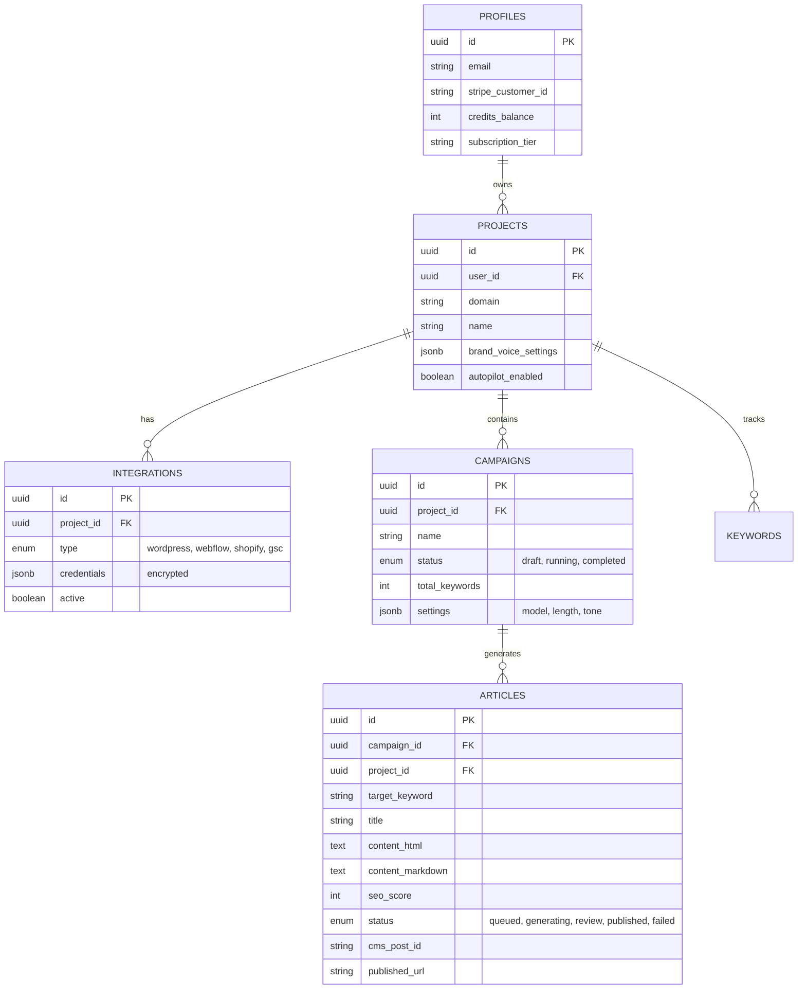

# Database Schema

AutopilotRank uses PostgreSQL (Supabase) with strict RLS policies.

## Entity Relationship Diagram



## Tables

### profiles

Extends Supabase `auth.users`.

- `credits_balance`: Current available credits for content generation.
- `subscription_tier`: 'starter', 'growth', 'agency'.

### projects

Represents a website or client.

- `domain`: The target domain (e.g., `example.com`).
- `brand_voice_settings`: JSON blob containing tone, excluded words, persona details.
- `autopilot_enabled`: Boolean, if true, system auto-generates from GSC opportunities.

### integrations

Stores connection details for external services.

- `type`: 'wordpress', 'webflow', 'shopify', 'gsc'.
- `credentials`: **Encrypted** storage of API keys/Passwords. Use Postgres pgcrypto or application-level encryption.

### campaigns

A batch of content generation tasks.

- `settings`: specific generation parameters for this batch (e.g., "Use GPT-4, Aggressive SEO, Long-form").

### articles

The core content unit.

- `target_keyword`: Primary keyword.
- `content_html`: Final generic HTML.
- `seo_score`: Internal calculation (0-100).
- `status`: Lifecycle state.
- `cms_post_id`: ID returned from the CMS after publishing.

### credit_transactions

Ledger for credit usage.

- `amount`: Negative for usage, positive for purchase.
- `resource_id`: FK to `articles.id` (if usage) or `stripe_payment_id`.

## RLS Policies

All tables reference `user_id` (either directly or via `project_id`). Policies must ensure users can only access their own data.

```sql
-- Example for Projects
CREATE POLICY "Users can view own projects"
    ON projects FOR SELECT
    USING (auth.uid() = user_id);

-- Example for Articles (via Project)
CREATE POLICY "Users can view own articles"
    ON articles FOR SELECT
    USING (
        EXISTS (
            SELECT 1 FROM projects
            WHERE projects.id = articles.project_id
            AND projects.user_id = auth.uid()
        )
    );
```
