# Database Schema

AutopilotRank uses PostgreSQL (Supabase) with strict RLS policies.

> **Status:** This document describes the **current production database schema** as implemented in `supabase/migrations/`. All tables listed below exist and are in use.

## Entity Relationship Diagram

```mermaid
erDiagram
    PROFILES ||--o{ SUBSCRIPTIONS : "has"
    PROFILES ||--o{ CREDIT_TRANSACTIONS : "owns"
    PROFILES ||--o{ WEBHOOK_EVENTS : "tracked via"
    PROFILES ||--o{ EMAIL_PREFERENCES : "has"
    PROFILES ||--o{ PROCESSING_JOBS : "creates"
    PROFILES ||--o{ DISPUTE_EVENTS : "involved in"
    PROFILES ||--o{ PRODUCTS : "subscribes to"
    PROFILES ||--o{ PRICES : "pays"
    PROFILES ||--o{ PROJECTS : "owns"

    SUBSCRIPTIONS ||--o{ SYNC_RUNS : "synchronized in"

    PROJECTS ||--o{ CAMPAIGNS : "contains"
    CAMPAIGNS ||--o{ ARTICLES : "generates"
    CAMPAIGNS ||--o{ KEYWORDS : "targets"

    PRODUCTS ||--o{ PRICES : "has pricing for"

    PROFILES {
        uuid id PK
        text stripe_customer_id UK
        int subscription_credits_balance
        int purchased_credits_balance
        text subscription_status
        text subscription_tier
        text role
        text dispute_status
        timestamptz created_at
        timestamptz updated_at
    }

    SUBSCRIPTIONS {
        text id PK "Stripe subscription ID"
        uuid user_id FK
        text status
        text price_id
        timestamptz current_period_start
        timestamptz current_period_end
        boolean cancel_at_period_end
        timestamptz canceled_at
        timestamptz trial_end
        text cancellation_reason
        timestamptz created_at
        timestamptz updated_at
    }

    PRODUCTS {
        text id PK "Stripe product ID"
        text name
        text description
        boolean active
        jsonb metadata
        timestamptz created_at
        timestamptz updated_at
    }

    PRICES {
        text id PK "Stripe price ID"
        text product_id FK
        boolean active
        text currency
        int unit_amount "Amount in cents"
        text type
        text interval
        int interval_count
        int trial_period_days
        jsonb metadata
        timestamptz created_at
        timestamptz updated_at
    }

    CREDIT_TRANSACTIONS {
        uuid id PK
        uuid user_id FK
        int amount "Positive for additions, negative for deductions"
        text type
        text reference_id
        text credit_pool
        text description
        timestamptz created_at
    }

    WEBHOOK_EVENTS {
        uuid id PK
        text event_id UK
        text event_type
        text status "processing, completed, failed, unrecoverable"
        jsonb payload
        text error_message
        int retry_count
        timestamptz last_retry_at
        boolean recoverable
        timestamptz processed_at
        timestamptz completed_at
        timestamptz created_at
        timestamptz updated_at
    }

    EMAIL_PREFERENCES {
        uuid user_id PK "References profiles"
        boolean marketing_emails
        boolean product_updates
        boolean low_credit_alerts
        timestamptz created_at
        timestamptz updated_at
    }

    EMAIL_LOGS {
        uuid id PK
        uuid user_id FK
        text email_type
        text template_name
        text recipient_email
        text status
        jsonb provider_response
        timestamptz sent_at
    }

    PROCESSING_JOBS {
        uuid id PK
        uuid user_id FK
        text status
        text input_image_path
        text output_image_path
        int credits_used
        text processing_mode
        jsonb settings
        text error_message
        timestamptz created_at
        timestamptz completed_at
        timestamptz updated_at
    }

    SYNC_RUNS {
        uuid id PK
        text job_type "expiration_check, webhook_recovery, full_reconciliation"
        timestamptz started_at
        timestamptz completed_at
        text status
        int records_processed
        int records_fixed
        int discrepancies_found
        text error_message
        jsonb metadata
        timestamptz created_at
    }

    CREDIT_EXPIRATION_EVENTS {
        uuid id PK
        uuid user_id FK
        int expired_amount
        text expiration_reason
        timestamptz billing_cycle_end
        text subscription_id
        text notes
        timestamptz created_at
    }

    DISPUTE_EVENTS {
        uuid id PK
        text dispute_id UK
        uuid user_id FK
        text charge_id
        int amount_cents
        int credits_held
        text status
        text reason
        timestamptz evidence_due_at
        timestamptz created_at
        timestamptz updated_at
    }

    PROJECTS {
        uuid id PK
        uuid user_id FK
        text name
        text domain
        text industry
        text cms_type
        jsonb cms_credentials
        jsonb content_preferences
        text status
        timestamptz created_at
        timestamptz updated_at
    }

    CAMPAIGNS {
        uuid id PK
        uuid user_id FK
        uuid project_id FK
        text name
        text status
        text ai_model
        text tone
        int target_word_count
        jsonb settings
        timestamptz created_at
        timestamptz updated_at
    }

    ARTICLES {
        uuid id PK
        uuid campaign_id FK
        uuid user_id FK
        uuid project_id FK
        text title
        text content
        text primary_keyword
        jsonb outline
        text status
        text ai_model_used
        int seo_score
        int ai_detection_score
        int word_count
        int token_count
        int generation_time_ms
        text meta_description
        text published_url
        text slug
        int credits_used
        text generation_error
        timestamptz generated_at
        timestamptz published_at
        timestamptz created_at
        timestamptz updated_at
    }

    KEYWORDS {
        uuid id PK
        uuid campaign_id FK
        text keyword
        int search_volume
        text difficulty
        text status
        int priority
        timestamptz created_at
        timestamptz updated_at
    }

    PROVIDER_USAGE {
        uuid id PK
        text provider "replicate, gemini, stability_ai, openai"
        date date
        text month
        int daily_requests
        int monthly_credits
        timestamptz last_daily_reset
        timestamptz last_monthly_reset
        timestamptz created_at
        timestamptz updated_at
    }

    EMAIL_PROVIDER_USAGE {
        uuid id PK
        text provider "brevo, resend"
        date date
        text month
        int daily_requests
        int monthly_credits
        timestamptz last_daily_reset
        timestamptz last_monthly_reset
        timestamptz created_at
        timestamptz updated_at
    }
```



## Core Tables

### profiles

Extended user profile data linked to `auth.users`.

| Column                         | Type          | Description                                                     |
| ------------------------------ | ------------- | --------------------------------------------------------------- |
| `id`                           | UUID (PK)     | References `auth.users(id)`                                     |
| `stripe_customer_id`           | TEXT (UNIQUE) | Stripe customer identifier                                      |
| `subscription_credits_balance` | INTEGER       | Credits from subscription (expire at cycle end)                 |
| `purchased_credits_balance`    | INTEGER       | Purchased credits (never expire)                                |
| `subscription_status`          | TEXT          | `active`, `trialing`, `past_due`, `canceled`, `unpaid`, or NULL |
| `subscription_tier`            | TEXT          | Plan identifier                                                 |
| `role`                         | TEXT          | `user` or `admin` (default: `user`)                             |
| `dispute_status`               | TEXT          | `none`, `pending`, `resolved`, `lost` (default: `none`)         |
| `created_at`                   | TIMESTAMPTZ   | Profile creation timestamp                                      |
| `updated_at`                   | TIMESTAMPTZ   | Last update timestamp (auto-managed)                            |

**Constraints:**

- `subscription_credits_balance >= 0`
- `purchased_credits_balance >= 0`
- `subscription_status` is NULL or one of the allowed values
- `role` must be `user` or `admin`

**Triggers:**

- `handle_new_user()`: Auto-creates profile on signup with 10 free subscription credits
- `on_profiles_updated`: Auto-updates `updated_at`

### subscriptions

Mirrors Stripe subscription data for local queries and sync tracking.

| Column                 | Type        | Description                          |
| ---------------------- | ----------- | ------------------------------------ |
| `id`                   | TEXT (PK)   | Stripe subscription ID               |
| `user_id`              | UUID (FK)   | References `profiles(id)`            |
| `status`               | TEXT        | Stripe subscription status           |
| `price_id`             | TEXT        | Stripe price ID                      |
| `current_period_start` | TIMESTAMPTZ | Billing period start                 |
| `current_period_end`   | TIMESTAMPTZ | Billing period end                   |
| `cancel_at_period_end` | BOOLEAN     | Will cancel at period end            |
| `canceled_at`          | TIMESTAMPTZ | Cancellation timestamp               |
| `trial_end`            | TIMESTAMPTZ | Trial end date                       |
| `cancellation_reason`  | TEXT        | User-provided cancellation reason    |
| `created_at`           | TIMESTAMPTZ | Record creation timestamp            |
| `updated_at`           | TIMESTAMPTZ | Last update timestamp (auto-managed) |

**Triggers:**

- `on_subscriptions_updated`: Auto-updates `updated_at`

### products

Stripe product catalog cache.

| Column        | Type        | Description                          |
| ------------- | ----------- | ------------------------------------ |
| `id`          | TEXT (PK)   | Stripe product ID                    |
| `name`        | TEXT        | Product name                         |
| `description` | TEXT        | Product description                  |
| `active`      | BOOLEAN     | Whether product is active            |
| `metadata`    | JSONB       | Product metadata                     |
| `created_at`  | TIMESTAMPTZ | Record creation timestamp            |
| `updated_at`  | TIMESTAMPTZ | Last update timestamp (auto-managed) |

### prices

Stripe price cache for product pricing.

| Column              | Type        | Description                          |
| ------------------- | ----------- | ------------------------------------ |
| `id`                | TEXT (PK)   | Stripe price ID                      |
| `product_id`        | TEXT (FK)   | References `products(id)`            |
| `active`            | BOOLEAN     | Whether price is active              |
| `currency`          | TEXT        | Currency code (e.g., `usd`)          |
| `unit_amount`       | INTEGER     | Amount in cents                      |
| `type`              | TEXT        | `one_time` or `recurring`            |
| `interval`          | TEXT        | `day`, `week`, `month`, `year`       |
| `interval_count`    | INTEGER     | Interval multiplier                  |
| `trial_period_days` | INTEGER     | Trial length                         |
| `metadata`          | JSONB       | Price metadata                       |
| `created_at`        | TIMESTAMPTZ | Record creation timestamp            |
| `updated_at`        | TIMESTAMPTZ | Last update timestamp (auto-managed) |

## Credit System Tables

### credit_transactions

Audit log for all credit transactions.

| Column         | Type        | Description                                     |
| -------------- | ----------- | ----------------------------------------------- |
| `id`           | UUID (PK)   | Transaction ID                                  |
| `user_id`      | UUID (FK)   | References `profiles(id)`                       |
| `amount`       | INTEGER     | Positive for additions, negative for deductions |
| `type`         | TEXT        | Transaction type (see below)                    |
| `reference_id` | TEXT        | Stripe session/job ID                           |
| `credit_pool`  | TEXT        | `subscription`, `purchased`, or `mixed`         |
| `description`  | TEXT        | Human-readable description                      |
| `created_at`   | TIMESTAMPTZ | Transaction timestamp                           |

**Transaction Types:**

- `purchase` - One-time credit pack purchase
- `subscription` - Monthly subscription credit allocation
- `usage` - Credit consumption
- `refund` - Credit refund
- `bonus` - Promotional/admin credits
- `plan_upgrade` - Credits from plan upgrade
- `plan_downgrade` - Credit adjustment on downgrade
- `trial` - Trial credits
- `expiration` - Credits expired at cycle end
- `clawback` - Credits removed due to refund/dispute

**Indexes:**

- `idx_credit_transactions_user_id`
- `idx_credit_transactions_type`
- `idx_credit_transactions_created_at`
- `idx_credit_transactions_reference_id`
- `idx_credit_transactions_ref_type_amount`

### credit_expiration_events

Tracks credit expiration events for analytics and audit.

| Column              | Type        | Description                                            |
| ------------------- | ----------- | ------------------------------------------------------ |
| `id`                | UUID (PK)   | Event ID                                               |
| `user_id`           | UUID (FK)   | References `profiles(id)`                              |
| `expired_amount`    | INTEGER     | Number of credits expired                              |
| `expiration_reason` | TEXT        | `cycle_end`, `rolling_window`, `subscription_canceled` |
| `billing_cycle_end` | TIMESTAMPTZ | Cycle end timestamp                                    |
| `subscription_id`   | TEXT        | Associated subscription ID                             |
| `notes`             | TEXT        | Additional notes                                       |
| `created_at`        | TIMESTAMPTZ | Event timestamp                                        |

**Indexes:**

- `idx_credit_expiration_user`
- `idx_credit_expiration_date`
- `idx_credit_expiration_reason`

## Webhook & Sync Tables

### webhook_events

Idempotency tracking for Stripe webhooks.

| Column          | Type          | Description                                          |
| --------------- | ------------- | ---------------------------------------------------- |
| `id`            | UUID (PK)     | Event record ID                                      |
| `event_id`      | TEXT (UNIQUE) | Stripe event ID                                      |
| `event_type`    | TEXT          | Stripe event type                                    |
| `status`        | TEXT          | `processing`, `completed`, `failed`, `unrecoverable` |
| `payload`       | JSONB         | Full event payload (debugging)                       |
| `error_message` | TEXT          | Error details if failed                              |
| `retry_count`   | INTEGER       | Number of retry attempts                             |
| `last_retry_at` | TIMESTAMPTZ   | Last retry timestamp                                 |
| `recoverable`   | BOOLEAN       | Whether event can be retried                         |
| `processed_at`  | TIMESTAMPTZ   | Initial processing timestamp                         |
| `completed_at`  | TIMESTAMPTZ   | Completion timestamp                                 |
| `created_at`    | TIMESTAMPTZ   | Record creation timestamp                            |
| `updated_at`    | TIMESTAMPTZ   | Last update timestamp                                |

**Indexes:**

- `idx_webhook_events_event_id`
- `idx_webhook_events_status`
- `idx_webhook_events_processed_at`
- `idx_webhook_events_retryable`

### sync_runs

Scheduled synchronization job execution history.

| Column                | Type        | Description                                                   |
| --------------------- | ----------- | ------------------------------------------------------------- |
| `id`                  | UUID (PK)   | Sync run ID                                                   |
| `job_type`            | TEXT        | `expiration_check`, `webhook_recovery`, `full_reconciliation` |
| `started_at`          | TIMESTAMPTZ | Job start timestamp                                           |
| `completed_at`        | TIMESTAMPTZ | Job completion timestamp                                      |
| `status`              | TEXT        | `running`, `completed`, `failed`                              |
| `records_processed`   | INTEGER     | Number of records processed                                   |
| `records_fixed`       | INTEGER     | Number of records fixed                                       |
| `discrepancies_found` | INTEGER     | Number of discrepancies found                                 |
| `error_message`       | TEXT        | Error details if failed                                       |
| `metadata`            | JSONB       | Additional job metadata                                       |
| `created_at`          | TIMESTAMPTZ | Record creation timestamp                                     |

**Indexes:**

- `idx_sync_runs_job_type`
- `idx_sync_runs_started_at`
- `idx_sync_runs_status`

## Email System Tables

### email_preferences

User email opt-in preferences.

| Column              | Type          | Description                   |
| ------------------- | ------------- | ----------------------------- |
| `user_id`           | UUID (PK, FK) | References `profiles(id)`     |
| `marketing_emails`  | BOOLEAN       | Receive marketing emails      |
| `product_updates`   | BOOLEAN       | Receive product updates       |
| `low_credit_alerts` | BOOLEAN       | Receive low credit alerts     |
| `created_at`        | TIMESTAMPTZ   | Preference creation timestamp |
| `updated_at`        | TIMESTAMPTZ   | Last update timestamp         |

### email_logs

Audit trail for sent emails.

| Column              | Type        | Description                    |
| ------------------- | ----------- | ------------------------------ |
| `id`                | UUID (PK)   | Log entry ID                   |
| `user_id`           | UUID (FK)   | References `profiles(id)`      |
| `email_type`        | TEXT        | `transactional` or `marketing` |
| `template_name`     | TEXT        | Email template used            |
| `recipient_email`   | TEXT        | Recipient email address        |
| `status`            | TEXT        | `sent`, `failed`, `skipped`    |
| `provider_response` | JSONB       | Email provider response        |
| `sent_at`           | TIMESTAMPTZ | Send timestamp                 |

**Indexes:**

- `idx_email_logs_user_id`
- `idx_email_logs_sent_at`
- `idx_email_logs_template`

### email_provider_usage

Email provider usage tracking for rate limits.

| Column               | Type        | Description               |
| -------------------- | ----------- | ------------------------- |
| `id`                 | UUID (PK)   | Usage record ID           |
| `provider`           | TEXT        | `breso` or `resend`       |
| `date`               | DATE        | Current date              |
| `month`              | TEXT        | Current month (YYYY-MM)   |
| `daily_requests`     | INTEGER     | Daily request count       |
| `monthly_credits`    | INTEGER     | Monthly credit usage      |
| `last_daily_reset`   | TIMESTAMPTZ | Last daily reset          |
| `last_monthly_reset` | TIMESTAMPTZ | Last monthly reset        |
| `created_at`         | TIMESTAMPTZ | Record creation timestamp |
| `updated_at`         | TIMESTAMPTZ | Last update timestamp     |

**Unique Constraint:** `(provider, month)`

**Indexes:**

- `idx_email_provider_usage_provider_month`
- `idx_email_provider_usage_date`

## Provider Usage Tables

### provider_usage

AI provider usage tracking for free tier limits.

| Column               | Type        | Description                                     |
| -------------------- | ----------- | ----------------------------------------------- |
| `id`                 | UUID (PK)   | Usage record ID                                 |
| `provider`           | TEXT        | `replicate`, `gemini`, `stability_ai`, `openai` |
| `date`               | DATE        | Current date                                    |
| `month`              | TEXT        | Current month (YYYY-MM)                         |
| `daily_requests`     | INTEGER     | Daily request count                             |
| `monthly_credits`    | INTEGER     | Monthly credit usage                            |
| `last_daily_reset`   | TIMESTAMPTZ | Last daily reset                                |
| `last_monthly_reset` | TIMESTAMPTZ | Last monthly reset                              |
| `created_at`         | TIMESTAMPTZ | Record creation timestamp                       |
| `updated_at`         | TIMESTAMPTZ | Last update timestamp                           |

**Unique Constraint:** `(provider, month)`

**Indexes:**

- `idx_provider_usage_provider_month`
- `idx_provider_usage_date`

### processing_jobs

Image processing job tracking (legacy feature).

| Column              | Type        | Description                                             |
| ------------------- | ----------- | ------------------------------------------------------- |
| `id`                | UUID (PK)   | Job ID                                                  |
| `user_id`           | UUID (FK)   | References `profiles(id)`                               |
| `status`            | TEXT        | `queued`, `processing`, `completed`, `failed`           |
| `input_image_path`  | TEXT        | Input image path                                        |
| `output_image_path` | TEXT        | Output image path                                       |
| `credits_used`      | INTEGER     | Credits consumed                                        |
| `processing_mode`   | TEXT        | `standard`, `enhanced`, `gentle`, `portrait`, `product` |
| `settings`          | JSONB       | Processing settings                                     |
| `error_message`     | TEXT        | Error details if failed                                 |
| `created_at`        | TIMESTAMPTZ | Job creation timestamp                                  |
| `completed_at`      | TIMESTAMPTZ | Job completion timestamp                                |
| `updated_at`        | TIMESTAMPTZ | Last update timestamp                                   |

**Indexes:**

- `idx_processing_jobs_user_id`
- `idx_processing_jobs_status`
- `idx_processing_jobs_created_at`

## Dispute Management Tables

### dispute_events

Stripe dispute tracking with credit holds.

| Column            | Type          | Description                           |
| ----------------- | ------------- | ------------------------------------- |
| `id`              | UUID (PK)     | Dispute event ID                      |
| `dispute_id`      | TEXT (UNIQUE) | Stripe dispute ID                     |
| `user_id`         | UUID (FK)     | References `profiles(id)`             |
| `charge_id`       | TEXT          | Associated charge ID                  |
| `amount_cents`    | INTEGER       | Dispute amount in cents               |
| `credits_held`    | INTEGER       | Credits held during dispute           |
| `status`          | TEXT          | `created`, `updated`, `closed`, `won` |
| `reason`          | TEXT          | Dispute reason                        |
| `evidence_due_at` | TIMESTAMPTZ   | Evidence deadline                     |
| `created_at`      | TIMESTAMPTZ   | Event creation timestamp              |
| `updated_at`      | TIMESTAMPTZ   | Last update timestamp                 |

**Indexes:**

- `idx_dispute_events_user_id`
- `idx_dispute_events_dispute_id`
- `idx_dispute_events_status`

## AutopilotRank Content Tables

### projects

User projects for content organization and CMS integration.

| Column                | Type        | Description                                              |
| --------------------- | ----------- | -------------------------------------------------------- |
| `id`                  | UUID (PK)   | Project ID                                               |
| `user_id`             | UUID (FK)   | References `profiles(id)`                                |
| `name`                | TEXT        | Project name                                             |
| `domain`              | TEXT        | Website domain (optional)                                |
| `industry`            | TEXT        | Industry category (optional)                             |
| `cms_type`            | TEXT        | CMS platform: `wordpress`, `webflow`, `shopify`, `other` |
| `cms_credentials`     | JSONB       | Encrypted CMS connection details                         |
| `content_preferences` | JSONB       | Content settings (tone, style, etc.)                     |
| `status`              | TEXT        | `active`, `inactive`, `error`                            |
| `created_at`          | TIMESTAMPTZ | Creation timestamp                                       |
| `updated_at`          | TIMESTAMPTZ | Last update timestamp                                    |

**Constraints:**

- `cms_type` must be one of the allowed values
- `status` must be one of the allowed values

**RLS Policies:**

- Users can CRUD own projects
- Service role has full access

**Indexes:**

- `idx_projects_user_id`
- `idx_projects_status`

### campaigns

Content generation campaigns with settings and AI parameters.

| Column              | Type        | Description                              |
| ------------------- | ----------- | ---------------------------------------- |
| `id`                | UUID (PK)   | Campaign ID                              |
| `user_id`           | UUID (FK)   | References `profiles(id)`                |
| `project_id`        | UUID (FK)   | References `projects(id)` (nullable)     |
| `name`              | TEXT        | Campaign name                            |
| `status`            | TEXT        | `draft`, `active`, `paused`, `completed` |
| `ai_model`          | TEXT        | AI model to use (default: `auto`)        |
| `tone`              | TEXT        | Content tone (default: `professional`)   |
| `target_word_count` | INTEGER     | Target article length (default: 1500)    |
| `settings`          | JSONB       | Additional campaign settings             |
| `created_at`        | TIMESTAMPTZ | Creation timestamp                       |
| `updated_at`        | TIMESTAMPTZ | Last update timestamp                    |

**Constraints:**

- `status` must be one of the allowed values

**RLS Policies:**

- Users can CRUD own campaigns
- Service role has full access

**Indexes:**

- `idx_campaigns_user_id`
- `idx_campaigns_project_id`
- `idx_campaigns_status`

### articles

Generated SEO articles with content and metadata.

| Column               | Type        | Description                                                        |
| -------------------- | ----------- | ------------------------------------------------------------------ |
| `id`                 | UUID (PK)   | Article ID                                                         |
| `campaign_id`        | UUID (FK)   | References `campaigns(id)`                                         |
| `user_id`            | UUID (FK)   | References `profiles(id)`                                          |
| `project_id`         | UUID (FK)   | References `projects(id)` (for quick-generate)                     |
| `title`              | TEXT        | Article title                                                      |
| `content`            | TEXT        | Article body content                                               |
| `primary_keyword`    | TEXT        | Target keyword                                                     |
| `outline`            | JSONB       | Structured outline from LLM (headings, key points)                 |
| `status`             | TEXT        | `queued`, `generating`, `draft`, `reviewed`, `published`, `failed` |
| `ai_model_used`      | TEXT        | AI model used for generation                                       |
| `seo_score`          | INTEGER     | SEO quality score (0-100)                                          |
| `ai_detection_score` | INTEGER     | AI detection score (0-100, lower is more human)                    |
| `word_count`         | INTEGER     | Actual word count                                                  |
| `token_count`        | INTEGER     | Total tokens used across all LLM calls                             |
| `generation_time_ms` | INTEGER     | Total generation time in milliseconds                              |
| `meta_description`   | TEXT        | SEO meta description                                               |
| `published_url`      | TEXT        | URL where article was published                                    |
| `slug`               | TEXT        | URL slug for the article                                           |
| `credits_used`       | INTEGER     | Credits consumed (default: 1)                                      |
| `generation_error`   | TEXT        | Error message if generation failed                                 |
| `generated_at`       | TIMESTAMPTZ | Generation completion timestamp                                    |
| `published_at`       | TIMESTAMPTZ | Publication timestamp                                              |
| `created_at`         | TIMESTAMPTZ | Creation timestamp                                                 |
| `updated_at`         | TIMESTAMPTZ | Last update timestamp                                              |

**Constraints:**

- `seo_score` and `ai_detection_score` must be 0-100
- `word_count`, `token_count`, `generation_time_ms` must be >= 0

**RLS Policies:**

- Users can CRUD own articles
- Service role has full access

**Indexes:**

- `idx_articles_user_id`
- `idx_articles_campaign_id`
- `idx_articles_project_id`
- `idx_articles_status`
- `idx_articles_campaign_status`

### keywords

Target keywords for campaign generation.

| Column          | Type        | Description                                              |
| --------------- | ----------- | -------------------------------------------------------- |
| `id`            | UUID (PK)   | Keyword ID                                               |
| `campaign_id`   | UUID (FK)   | References `campaigns(id)`                               |
| `keyword`       | TEXT        | Target keyword text                                      |
| `search_volume` | INTEGER     | Monthly search volume (optional)                         |
| `difficulty`    | TEXT        | SEO difficulty: `easy`, `medium`, `hard`, `unknown`      |
| `status`        | TEXT        | `pending`, `queued`, `generating`, `generated`, `failed` |
| `priority`      | INTEGER     | Generation priority (default: 0)                         |
| `created_at`    | TIMESTAMPTZ | Creation timestamp                                       |
| `updated_at`    | TIMESTAMPTZ | Last update timestamp                                    |

**Constraints:**

- Unique combination of `(campaign_id, keyword)`
- `difficulty` must be one of the allowed values
- `status` must be one of the allowed values

**RLS Policies:**

- Users can access keywords through their campaigns (indirect access)
- Service role has full access

**Indexes:**

- `idx_keywords_campaign_id`
- `idx_keywords_status`

## Views

### user_credits

Convenience view showing credit breakdown and totals.

```sql
CREATE VIEW user_credits AS
SELECT
    id AS user_id,
    subscription_credits_balance,
    purchased_credits_balance,
    (subscription_credits_balance + purchased_credits_balance) AS total_credits_balance,
    created_at,
    updated_at
FROM profiles;
```

## Key RPC Functions

| Function                                    | Purpose                                                |
| ------------------------------------------- | ------------------------------------------------------ |
| `get_user_data(UUID)`                       | Fetch user profile and active subscription in one call |
| `increment_credits(UUID, INTEGER)`          | Add credits to user balance                            |
| `decrement_credits(UUID, INTEGER)`          | Deduct credits (with balance check)                    |
| `increment_credits_with_log(...)`           | Add credits with transaction logging                   |
| `decrement_credits_with_log(...)`           | Deduct credits with transaction logging                |
| `refund_credits(UUID, INTEGER, TEXT)`       | Refund credits for failed processing                   |
| `admin_adjust_credits(UUID, INTEGER, TEXT)` | Admin credit adjustment                                |
| `expire_credits_at_cycle_end(...)`          | Expire subscription credits at renewal                 |
| `clawback_credits_v2(...)`                  | Remove credits with pool selection                     |
| `clawback_from_transaction_v2(...)`         | Clawback credits from specific transaction             |
| `has_sufficient_credits(UUID, INTEGER)`     | Check if user has enough credits                       |
| `get_active_subscription(UUID)`             | Get user's active subscription                         |
| `get_users_with_expiring_credits(INTEGER)`  | Get users with credits expiring soon                   |
| `get_retryable_webhook_events(INTEGER)`     | Get failed webhooks ready for retry                    |
| `get_sync_run_stats(TEXT, INTEGER)`         | Get sync job statistics                                |

## RLS Policy Summary

All tables use Row Level Security (RLS) with the following patterns:

1. **User tables (`profiles`, `email_preferences`):** Users can read/update own data
2. **Subscription tables (`subscriptions`):** Users can read own subscriptions
3. **Transaction tables (`credit_transactions`, `email_logs`):** Users can read own history
4. **Content tables (`projects`, `campaigns`, `articles`):** Users can CRUD own content
5. **Keywords table:** Users can access keywords through their campaigns (indirect RLS)
6. **System tables (`webhook_events`, `sync_runs`, `provider_usage`, `dispute_events`):** Service role only
7. **Admin access:** Admin role (via `profiles.role`) grants read access to all user-facing tables
8. **Public tables (`products`, `prices`):** Readable by all (including anonymous)

> **Note:** The `keywords` table uses indirect RLS - access is granted through the parent `campaigns` table rather than direct user_id checks.

## Migration Files

Schema is defined in the following migration files (in execution order):

- `20250120000000_create_profiles_table.sql` - Base profiles table
- `20250120100000_create_subscriptions_table.sql` - Subscriptions, products, prices
- `20250121000000_create_credit_transactions_table.sql` - Credit transactions
- `20250121010000_create_processing_jobs_table.sql` - Processing jobs
- `20250120200000_create_rpc_functions.sql` - Core RPC functions
- `20250121020000_enhanced_credit_functions.sql` - Enhanced credit RPCs
- `20250121030000_fix_initial_credits.sql` - Fix initial credit handling
- `20250121040000_fix_profiles_subscription_status.sql` - Fix subscription status constraints
- `20250202000000_add_admin_role.sql` - Admin role system
- `20250202010000_add_cancellation_reason.sql` - Cancellation reason tracking
- `20250202020000_add_credit_clawback_rpc.sql` - Credit clawback functions
- `20250202030000_create_webhook_events_table.sql` - Webhook idempotency
- `20250202040000_add_webhook_events_columns.sql` - Enhanced webhook tracking
- `20250205000000_add_trial_end_to_subscriptions.sql` - Trial end tracking
- `20250205020000_separate_credit_pools.sql` - Dual credit pool system
- `20250205030000_update_credit_rpcs.sql` - Updated RPCs for dual pools
- `20250221000000_secure_credits.sql` - Security enhancements
- `20250302000000_add_sync_tables.sql` - Sync system tables
- `20250302010000_fix_admin_adjust_credits.sql` - Fix admin credit RPC
- `20250303000000_add_credit_expiration_support.sql` - Credit expiration system
- `20250303010000_revoke_credit_rpc_from_authenticated.sql` - Security fix
- `20251205000000_add_plan_upgrade_transaction_type.sql` - Plan change tracking
- `20251205010000_add_trial_end_to_subscriptions.sql` - Trial tracking
- `20251205020000_separate_credit_pools.sql` - Dual pool implementation
- `20251205030000_update_credit_rpcs.sql` - Updated credit functions
- `20251209000000_get_user_data_rpc.sql` - Optimized user data fetch
- `20251217000000_add_unrecoverable_webhook_status.sql` - Webhook status tracking
- `20251229000000_drop_dead_tables.sql` - Cleanup unused tables
- `20251229010000_fix_credit_clawback.sql` - V2 clawback system
- `20260115000000_security_fixes.sql` - Security hardening
- `20260116000000_add_email_providers_to_usage.sql` - Email provider tracking
- `20260116010000_create_email_tables.sql` - Email preferences and logs
- `20260116020000_create_provider_usage_tracking.sql` - AI provider usage
- `20260116030000_fix_email_logs_rls.sql` - Fix email logs policies
- `20260120000000_enable_email_provider_usage_rls.sql` - Enable RLS on email usage
- `20260120010000_fix_function_search_paths.sql` - Fix function security
- `20260120020000_fix_signup_trigger.sql` - Fix signup trigger
- `20260205000000_enable_missing_rls.sql` - Enable RLS on system tables
- `20260205100000_create_projects_table.sql` - Projects for content organization
- `20260205100100_create_campaigns_table.sql` - Campaigns with AI settings
- `20260205100200_create_articles_table.sql` - Generated SEO articles
- `20260205100300_create_keywords_table.sql` - Target keywords
- `20260205200000_add_project_details_columns.sql` - Additional project metadata
- `20260206100000_add_article_generation_columns.sql` - Generation tracking (outline, token_count, generation_time_ms, project_id)
