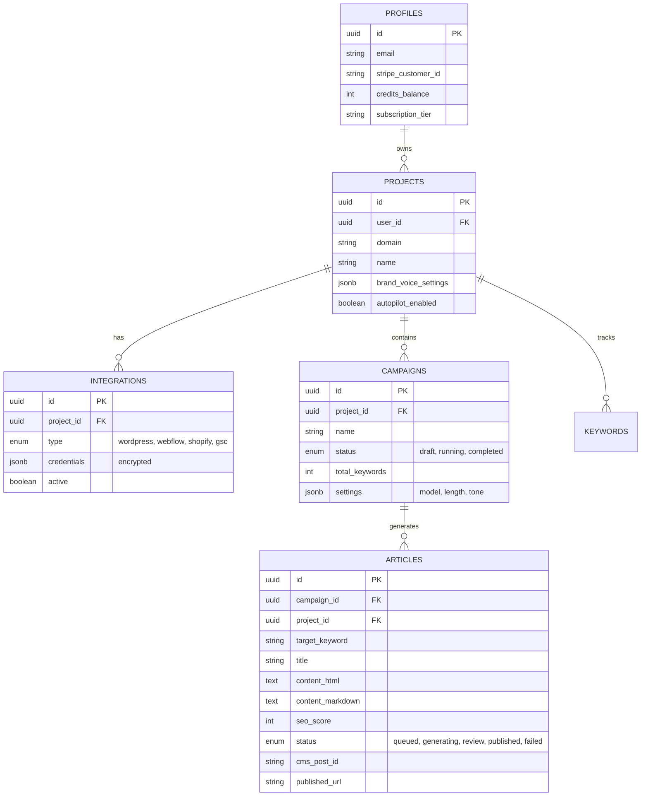

# Database Schema

AutopilotRank uses PostgreSQL (Supabase) with strict RLS policies.

> **Status:** This document describes the **target schema for Post-MVP Phase 1**. The MVP (Milestone 1) creates only these 4 tables. Most tables below do not exist yet — see `supabase/migrations/` for the actual current schema.

## Entity Relationship Diagram



## Existing Tables (Current MVP)

These tables exist in migrations and are used by the current boilerplate:

- **profiles** — User profile + subscription tier
- **subscriptions** — Stripe subscription tracking
- **credit_transactions** — Credit ledger (usage, purchases, expiration)
- **webhook_events** — Stripe webhook audit trail
- **email_preferences** — User opt-in/opt-out preferences
- **email_logs** — Email audit trail
- **credit_expiration_events** — Credit expiration tracking
- **provider_usage** — Email provider usage stats

## Target Tables (MVP Milestone 1 + Post-MVP)

These tables will be created in the MVP and Post-MVP phases:

### projects (MVP Milestone 1)

Represents a website or client. Stores connection credentials for CMS platforms.

- `user_id`: FK to profiles
- `name`: User-friendly site name
- `domain`: The target domain (e.g., `example.com`)
- `cms_type`: 'wordpress', 'webflow', 'shopify', 'gsc'
- `credentials`: **Encrypted** JSON blob with API keys/passwords
- `connected_at`: Timestamp of successful connection test

### campaigns (MVP Milestone 1)

A batch of content generation tasks.

- `user_id`: FK to profiles
- `project_id`: FK to projects
- `name`: Campaign name (e.g., "SEO Content Nov 2026")
- `model`: LLM choice ('gpt-4', 'claude-3', 'gemini-pro')
- `tone`: 'professional', 'casual', 'technical'
- `word_count_target`: Integer (e.g., 1500)
- `settings`: JSONB for future expansion
- `status`: 'draft', 'running', 'paused', 'completed'
- `created_at`, `updated_at`

### articles (MVP Milestone 1)

The core content unit.

- `user_id`: FK to profiles
- `campaign_id`: FK to campaigns
- `project_id`: FK to projects
- `target_keyword`: Primary keyword
- `title`: Generated article title
- `content`: Full article content (Markdown)
- `seo_score`: Internal calculation (0-100) based on keyword density, structure, word count
- `ai_detection_score`: Percentage from GPTZero/Originality.ai (0-100, higher = more human)
- `status`: 'queued', 'generating', 'draft', 'reviewed', 'published', 'failed'
- `model_used`: Which LLM generated it
- `humanizer_pass`: Boolean (whether humanizer was applied)
- `cms_post_id`: ID returned from the CMS after publishing
- `published_url`: Full URL to published article
- `created_at`, `updated_at`, `published_at`

### keywords (Post-MVP Phase 1)

Individual keywords tracked per campaign.

- `campaign_id`: FK to campaigns
- `keyword`: The search term
- `status`: 'pending', 'in_progress', 'completed'
- `article_id`: FK to articles (if generated)
- `created_at`

### integrations (Post-MVP Phase 1)

Stores connection details for external services (keyword research, SERP analysis, GSC).

- `user_id`: FK to profiles
- `type`: 'wordpress', 'webflow', 'shopify', 'gsc', 'serp_api', 'keyword_research'
- `credentials`: **Encrypted** JSON with API keys
- `active`: Boolean
- `last_tested_at`: Timestamp of last successful connection

## RLS Policies

All tables reference `user_id` (either directly or via `project_id`). Policies must ensure users can only access their own data.

```sql
-- Example for Projects
CREATE POLICY "Users can view own projects"
    ON projects FOR SELECT
    USING (auth.uid() = user_id);

-- Example for Articles (via Project)
CREATE POLICY "Users can view own articles"
    ON articles FOR SELECT
    USING (
        EXISTS (
            SELECT 1 FROM projects
            WHERE projects.id = articles.project_id
            AND projects.user_id = auth.uid()
        )
    );
```
