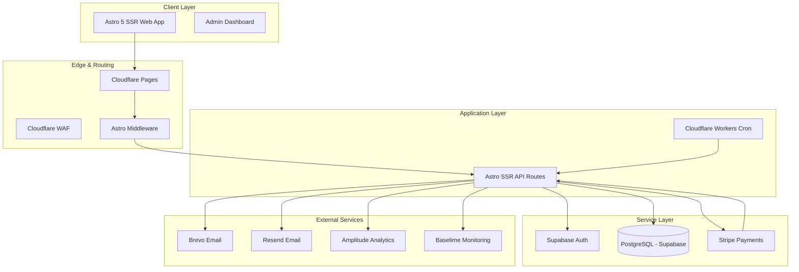
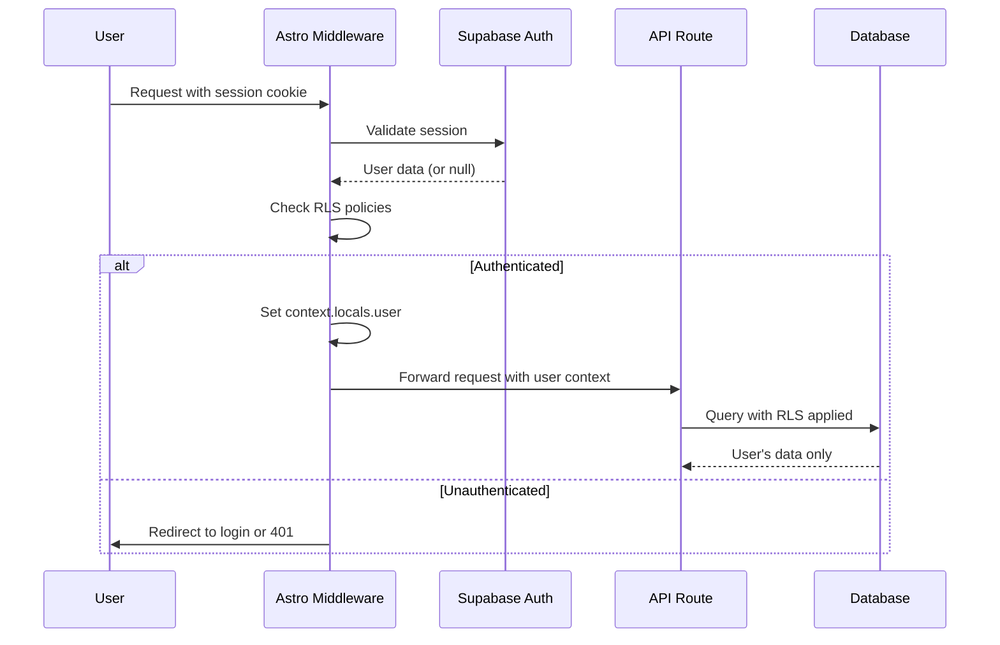
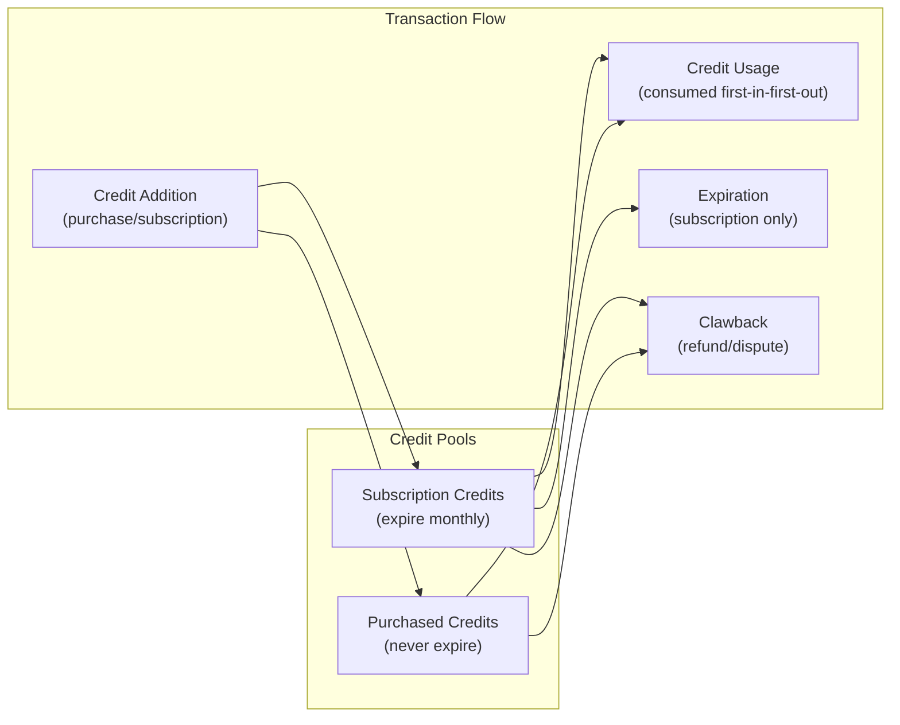
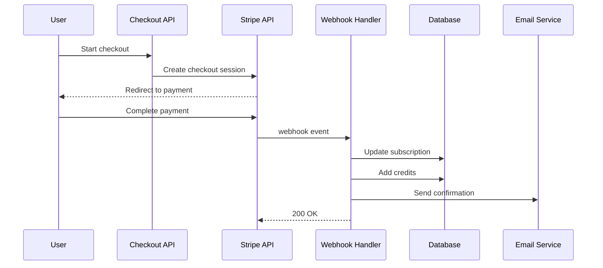
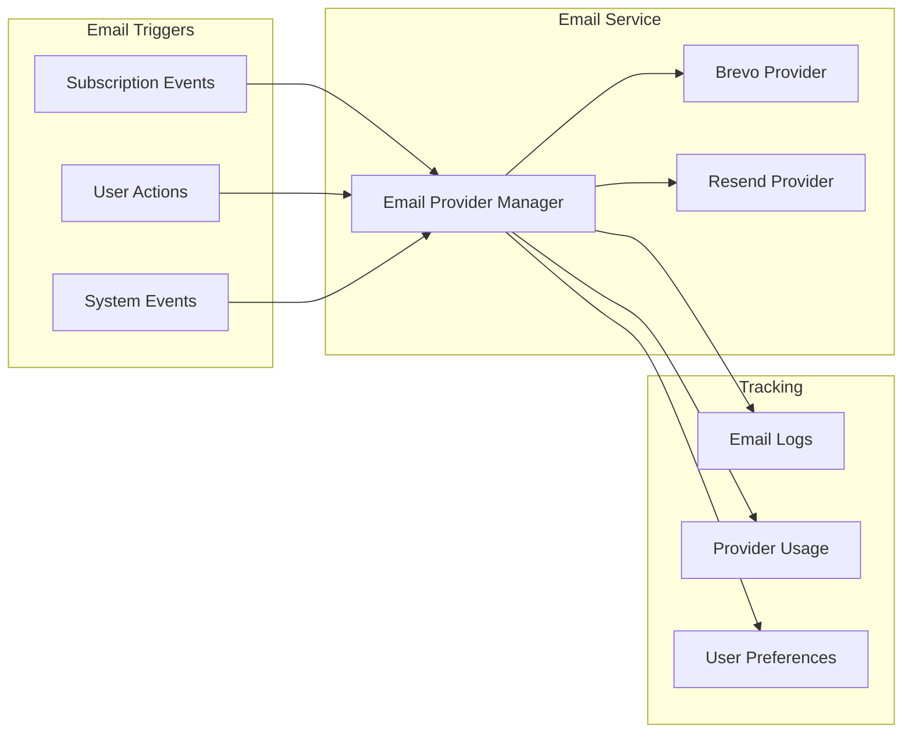
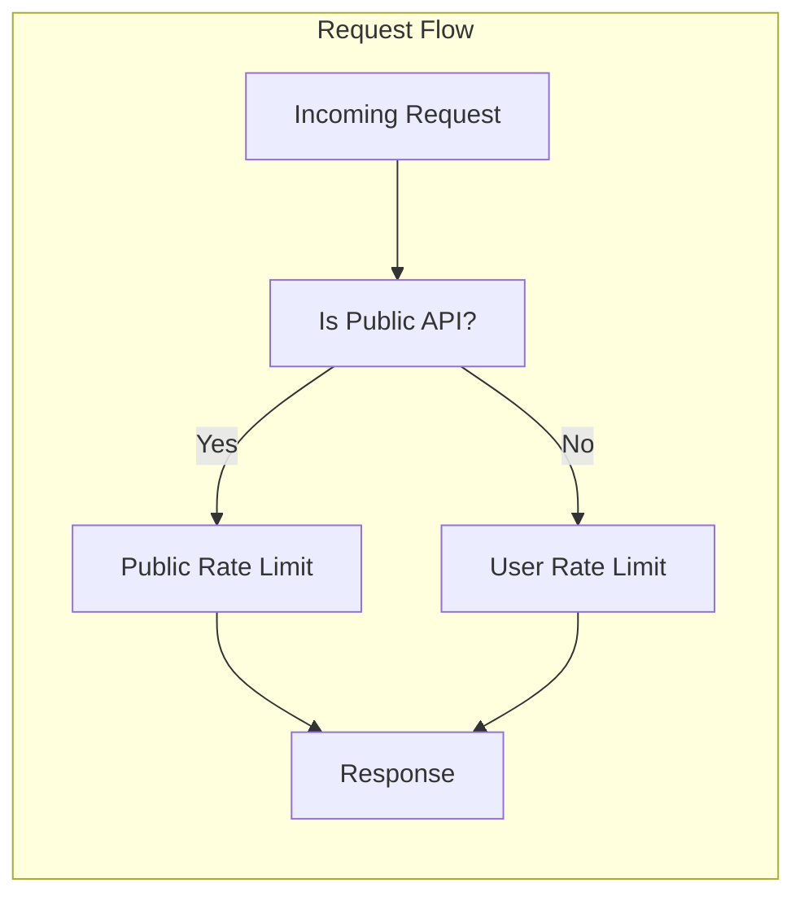
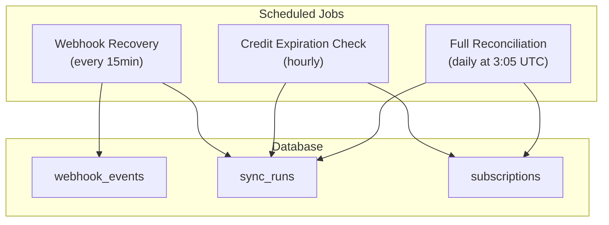
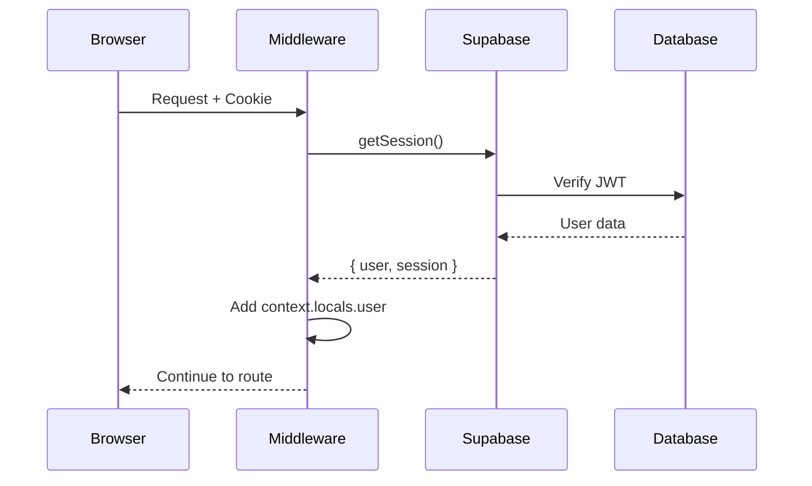
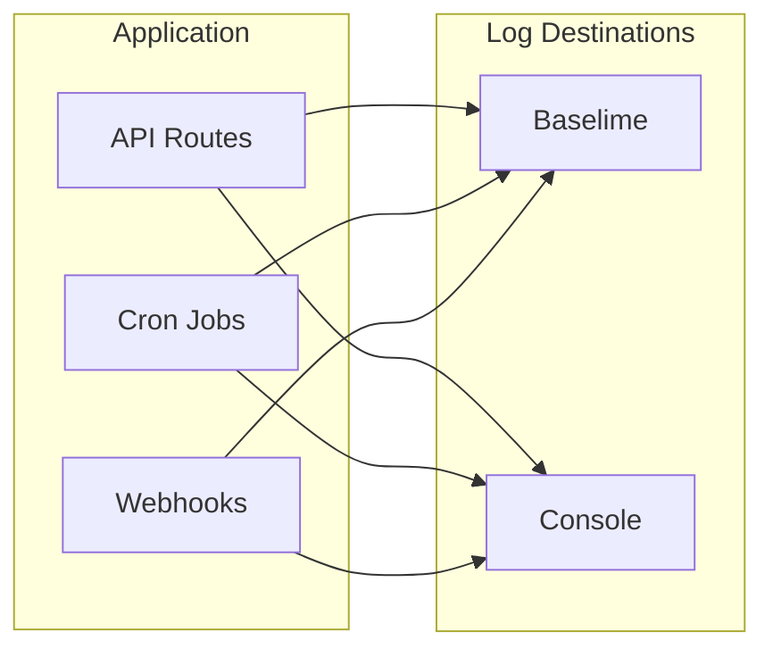
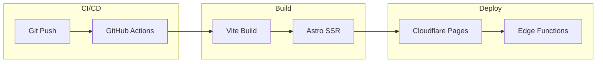

# System Architecture

High-level architecture for **AutopilotRank**, an Astro 5 + React 18 SaaS boilerplate with Supabase, Stripe, and Cloudflare Pages deployment.

> **Status:** This document describes the **current production architecture**. The system is fully deployed and operational.
>
> **Feature Implementation Status:** SEO content automation capabilities are in **Beta**. For a complete breakdown of what is implemented vs. planned, see the [Capability Status Matrix](./capability-status-matrix.md).

## Architecture Overview



## Technology Stack

### Frontend

| Technology    | Version  | Purpose             |
| ------------- | -------- | ------------------- |
| Astro         | 5.2.11   | SSR meta-framework  |
| React         | 18.2.0   | Client-side islands |
| Tailwind CSS  | 3.4.1    | Styling             |
| TypeScript    | 5.5.3    | Type safety         |
| MDX           | 4.0.1    | Blog content        |
| Framer Motion | 12.23.25 | Animations          |

### Backend

| Technology         | Purpose   |
| ------------------ | --------- | ------------------------ |
| Supabase SSR       | 0.7.0     | Database client (server) |
| Supabase JS        | 2.46.1    | Database client (client) |
| Stripe             | 20.0.0    | Payment processing       |
| Cloudflare Workers | Cron jobs |

### Database

| Component | Technology                    |
| --------- | ----------------------------- |
| Database  | PostgreSQL (Supabase hosted)  |
| Auth      | Supabase Auth (JWT)           |
| Storage   | Supabase Storage (future use) |
| RLS       | Row Level Security enabled    |

### Deployment

| Component      | Technology                       |
| -------------- | -------------------------------- |
| Hosting        | Cloudflare Pages                 |
| CDN            | Cloudflare CDN                   |
| Edge Functions | Cloudflare Workers               |
| Cron           | Cloudflare Workers Cron Triggers |
| Domain         | Cloudflare managed DNS           |

### External Services

| Service   | Purpose                                      |
| --------- | -------------------------------------------- |
| Stripe    | Payment processing & subscription management |
| Brevo     | Primary email provider                       |
| Resend    | Fallback email provider                      |
| Amplitude | Product analytics                            |
| Baselime  | Edge function monitoring                     |
| Dicebear  | Avatar generation                            |

## Project Structure

```
autopilotrank.com/
├── src/
│   ├── pages/                 # Astro file-based routing
│   │   ├── api/              # API routes (server-side)
│   │   ├── dashboard/        # Protected dashboard pages
│   │   ├── auth/             # Authentication pages
│   │   └── index.astro       # Landing page
│   ├── layouts/              # Page layouts
│   ├── components/           # React components (client)
│   └── middleware.ts         # Astro middleware (auth, security, rate limiting)
├── server/                   # Server-side code
│   ├── controllers/          # API route handlers
│   ├── services/             # Business logic
│   ├── webhooks/             # Stripe webhook handlers
│   ├── middleware/           # Server middleware
│   ├── monitoring/           # Logging (Baselime)
│   └── supabase/            # Supabase clients
├── shared/                   # Shared code (client + server)
│   ├── config/              # Configuration
│   ├── repositories/        # Data access layer
│   ├── types/               # Shared TypeScript types
│   ├── utils/               # Utility functions
│   └── validation/          # Zod schemas
├── client/                   # Client-side code
│   ├── components/          # React components
│   ├── utils/               # Browser utilities
│   └── stores/              # Zustand state management
├── emails/                   # Email templates
│   └── templates/           # React Email components
├── supabase/
│   └── migrations/          # Database migrations
└── locales/                 # i18n translations
```

## Core Architecture Patterns

### 1. Authentication & Authorization



**Key Components:**

- `src/middleware.ts` - Centralized authentication, authorization, and security
- `shared/utils/supabase/middleware.ts` - Session management helpers
- `shared/utils/supabase/server.ts` - Server Supabase client
- `shared/utils/supabase/client.ts` - Browser Supabase client

**Auth Providers:**

- Google OAuth (Supabase)
- Azure AD OAuth (Supabase)
- Email/Password (Supabase)

### 2. Credit System Architecture



**Credit Transaction Types:**

- `purchase` - One-time credit pack
- `subscription` - Monthly allocation
- `usage` - Consumption
- `refund` - Credit return
- `bonus` - Promotional/admin
- `plan_upgrade` - Tier change credit
- `plan_downgrade` - Tier change debit
- `trial` - Trial credits
- `expiration` - Monthly expiration
- `clawback` - Dispute/refund removal

**Key Functions:**

- `increment_credits_with_log()` - Atomic credit addition
- `decrement_credits_with_log()` - Atomic credit deduction
- `expire_credits_at_cycle_end()` - Monthly expiration
- `clawback_credits_v2()` - Pool-aware credit removal

### 3. Subscription & Billing Flow



**Webhook Events Handled:**

- `checkout.session.completed` - New subscription/purchase
- `customer.subscription.created` - Subscription created
- `customer.subscription.updated` - Plan changes
- `customer.subscription.deleted` - Cancellations
- `invoice.paid` - Successful payments
- `invoice.payment_failed` - Failed payments
- `charge.refunded` - Refunds
- `charge.dispute.*` - Payment disputes

### 4. Email System Architecture



**Email Templates:**

- `WelcomeEmail` - New user signup
- `PaymentSuccessEmail` - Successful payment
- `SubscriptionUpdateEmail` - Plan changes
- `LowCreditsEmail` - Credit threshold alert
- `PasswordResetEmail` - Password reset
- `SupportRequestEmail` - Support form submissions

**Provider Failover:**

1. Try Brevo (primary)
2. On rate limit/error, fall back to Resend
3. Track usage in `email_provider_usage` table
4. Respect daily/monthly limits per provider

### 5. API Route Architecture

```
/api
├── health/              # Health check endpoint
├── webhooks/
│   └── stripe/         # Stripe webhook handler
├── checkout/           # Stripe checkout session creation
├── subscriptions/      # Subscription management
├── credits/
│   └── history/        # Transaction history
├── portal/             # Stripe customer portal
├── email/
│   ├── send/           # Send email (test)
│   └── preferences/    # Manage email preferences
├── admin/              # Admin-only routes
│   ├── stats/          # Dashboard stats
│   ├── users/          # User management
│   ├── credits/        # Credit adjustments
│   └── subscription/   # Subscription overrides
├── support/
│   └── contact/        # Support form (public, rate-limited)
├── analytics/
│   └── event/          # Analytics events (public)
└── cron/
    ├── recover-webhooks/    # Retry failed webhooks
    ├── check-expirations/   # Check credit expirations
    └── reconcile/           # Full Stripe sync
```

**Route Protection:**

- Public routes (no auth): `/api/health/*`, `/api/webhooks/*`, `/api/support/*`, `/api/analytics/event`
- Protected routes (auth required): All other `/api/*` routes
- Admin routes (admin role): `/api/admin/*`

### 6. Rate Limiting Strategy



**Rate Limit Tiers:**

- Public routes: 10 requests/minute per IP
- Authenticated routes: 100 requests/minute per user
- Support form: 3 submissions/hour per IP
- Stripe webhooks: No limit (verified by signature)

### 7. Stripe Sync System



**Sync Job Types:**

1. **Webhook Recovery** (`/api/cron/recover-webhooks`)
   - Runs every 15 minutes
   - Retries failed webhooks with `retry_count < 3`
   - Marks unrecoverable events

2. **Credit Expiration Check** (`/api/cron/check-expirations`)
   - Runs hourly
   - Finds users with expiring subscriptions
   - Sends expiration warning emails
   - Triggers credit expiration at cycle end

3. **Full Reconciliation** (`/api/cron/reconcile`)
   - Runs daily at 3:05 UTC
   - Fetches all subscriptions from Stripe
   - Compares with database
   - Fixes discrepancies
   - Logs to `sync_runs` table

## Security Architecture

### Authentication Flow



### Security Headers

Applied via middleware on all responses:

- `X-Content-Type-Options: nosniff`
- `X-Frame-Options: DENY`
- `X-XSS-Protection: 1; mode=block`
- `Referrer-Policy: strict-origin-when-cross-origin`
- `Permissions-Policy` (restricted)
- `Strict-Transport-Security` (HTTPS only)

### Row Level Security (RLS)

All database tables have RLS enabled:

- Users can only read their own data
- Admin role (via `profiles.role`) grants read access to all user-facing tables
- Service role bypasses RLS for webhook operations
- Public tables (`products`, `prices`) readable by anonymous users

### API Security

1. **JWT Verification**: All protected routes verify Supabase JWT
2. **Rate Limiting**: Per-IP and per-user limits
3. **CORS**: Configured for specific origins
4. **Input Validation**: Zod schemas on all API inputs
5. **Stripe Webhook Signature**: Verified before processing

## Monitoring & Observability

### Logging



**Log Levels:**

- `error` - Application errors
- `warning` - Non-critical issues
- `info` - Important events
- `debug` - Detailed diagnostics

### Monitoring

- **Baselime**: Edge function monitoring and alerting
- **Amplitude**: Product analytics and user tracking
- **Supabase Logs**: Database and auth logs
- **Stripe Dashboard**: Payment monitoring
- **Cloudflare Analytics**: CDN and edge performance

### Error Handling

```typescript
// All API routes return consistent error format
interface ApiError {
  error: string;
  message: string;
  details?: unknown;
}
```

**Error Types:**

- `AuthError` - Authentication/authorization failures
- `ValidationError` - Input validation failures
- `NotFoundError` - Resource not found
- `RateLimitError` - Rate limit exceeded
- `DatabaseError` - Database operation failures

## Performance Optimization

### Database Optimization

1. **Indexes** on all frequently queried columns
2. **Composite indexes** for complex queries
3. **Partial indexes** for filtered queries
4. **RLS check function** caching
5. **Connection pooling** via Supabase

### API Optimization

1. **Single-query user data fetch** (`get_user_data()` RPC)
2. **Streaming responses** for large datasets
3. **Edge caching** for static data
4. **Lazy loading** for dashboard components
5. **Debouncing** on client actions

### Frontend Optimization

1. **Astro SSR** for initial page load
2. **React Islands** for interactive components
3. **Code splitting** by route
4. **Tree shaking** via Vite
5. **Image optimization** via Sharp (Cloudflare)

## Deployment Architecture

### Cloudflare Pages



### Environment Configuration

- `.env.client` - Public variables (exposed to browser)
- `.env.api` - Secret variables (server-side only)
- Never use `process.env` directly - use `clientEnv()` or `serverEnv()`

### Cron Triggers

Cloudflare Workers cron triggers:

- `*/15 * * * *` - Webhook recovery
- `0 * * * *` - Credit expiration check
- `5 3 * * *` - Full reconciliation (UTC)

## Future Architecture (Not Implemented)

The following features were planned but have **not** been implemented:

1. **SEO Content Automation**
   - AI content generation pipeline
   - Keyword research system
   - CMS integrations (WordPress, Webflow, Shopify)
   - SERP analysis
   - AI detection and humanization

2. **Vector Database**
   - Semantic search
   - Content deduplication
   - Quality scoring

3. **Multi-Tenant Projects**
   - User projects table
   - Campaign management
   - Article generation queue

4. **WordPress Plugin**
   - Direct CMS publishing
   - Real-time sync

These features remain as design concepts and are not represented in the current codebase.

## Key Files Reference

| File                               | Purpose                       |
| ---------------------------------- | ----------------------------- |
| `src/middleware.ts`                | Auth, security, rate limiting |
| `astro.config.mjs`                 | Astro configuration           |
| `shared/config/env.ts`             | Environment variable handling |
| `shared/config/security.ts`        | Security constants            |
| `shared/config/stripe.ts`          | Stripe configuration          |
| `server/supabase/supabaseAdmin.ts` | Admin database client         |
| `server/webhooks/stripe/handlers/` | Webhook event handlers        |
| `server/services/email.service.ts` | Email provider manager        |
| `server/controllers/`              | API route handlers            |
| `supabase/migrations/`             | Database schema               |
