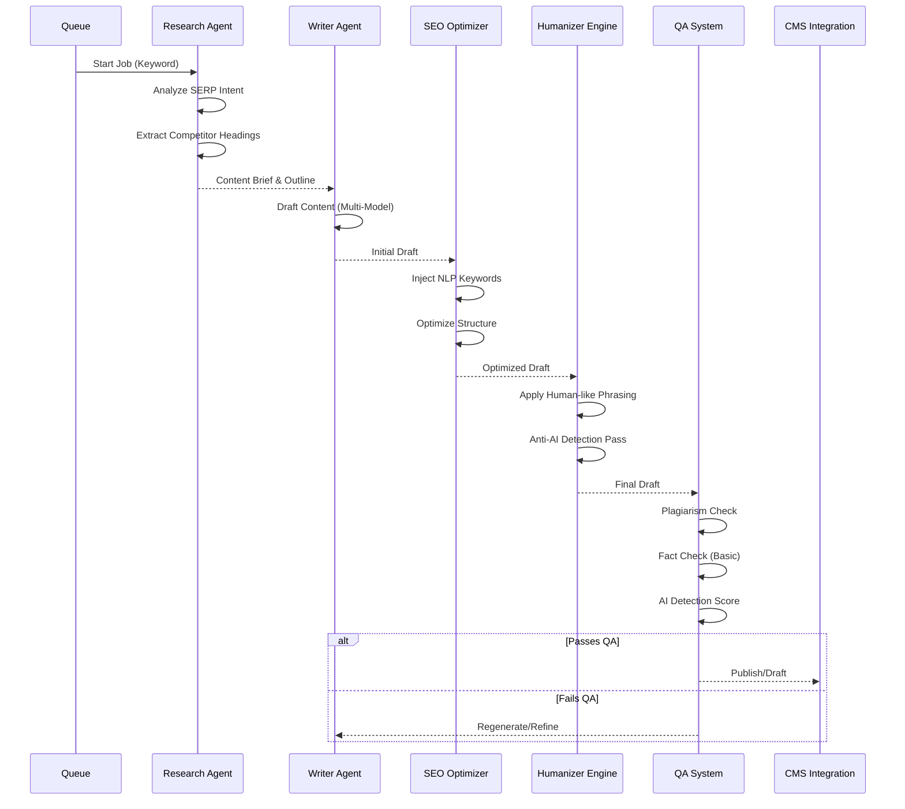
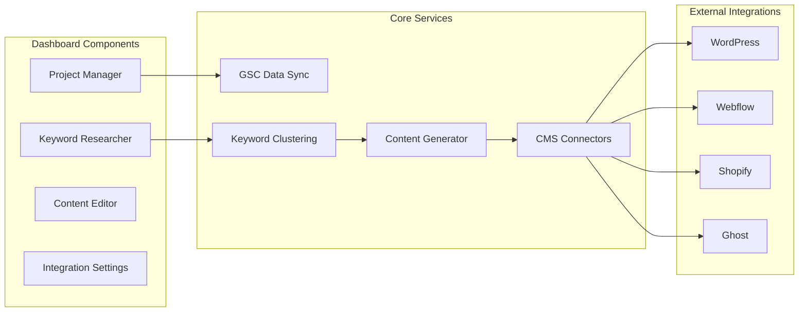
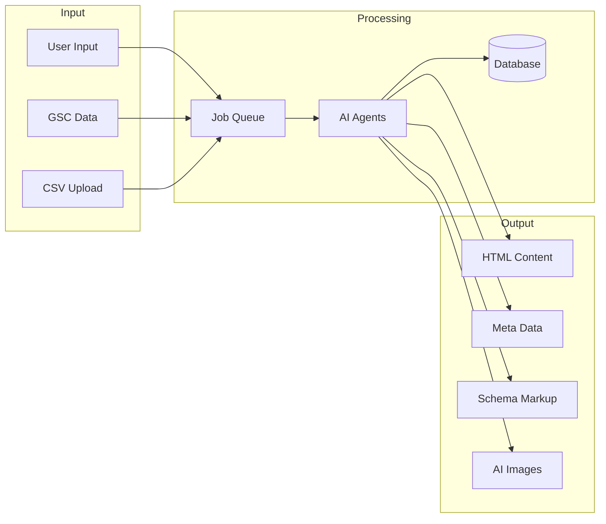

# System Architecture

High-level architecture for **AutopilotRank**, an autonomous SEO content automation platform.

## Architecture Overview

```mermaid
graph TB
    subgraph "Client Layer"
        WEB[Web App (Next.js)]
        PLUGIN[WordPress Plugin]
        API_CLIENT[External API Clients]
    end

    subgraph "Edge & Routing"
        CDN[Cloudflare CDN]
        WAF[Cloudflare WAF]
    end

    subgraph "Application Layer"
        API[Next.js API Routes]
        QUEUE[Job Queue (BullMQ/Inngest)]
        WORKERS[Background Workers]
    end

    subgraph "Service Layer"
        AUTH[Supabase Auth]
        DB[(PostgreSQL)]
        VECTOR[(Vector DB)]
        CACHE[Redis]
    end

    subgraph "AI & Data Engine"
        ORCHESTRATOR[Agent Orchestrator]
        LLMS[LLM Gateway (GPT-4/Claude/Gemini)]
        SERP[SERP Data Provider]
        GSC[GSC Integration Service]
    end

    WEB --> CDN
    PLUGIN --> CDN
    CDN --> API

    API --> AUTH
    API --> QUEUE
    API --> DB

    QUEUE --> WORKERS
    WORKERS --> ORCHESTRATOR

    ORCHESTRATOR --> LLMS
    ORCHESTRATOR --> SERP
    ORCHESTRATOR --> GSC
    ORCHESTRATOR --> VECTOR
```

## Content Generation Pipeline

The core engine of AutopilotRank uses a multi-agent system to generate high-quality SEO content.



## Component Architecture



## Data Flow Architecture



## Infrastructure & Scaling

- **Compute**: Serverless/Edge functions for API, specific long-running containers for AI processing agents.
- **Database**: PostgreSQL (Supabase) for relational data, Vector DB for semantic search/context.
- **Queues**: Redis-backed queues (BullMQ) to handle massive bulk generation jobs without timeouts.
- **Storage**: Object storage (R2/S3) for generated images and backups.

## Security Architecture

- **Authentication**: Usage of Supabase Auth (JWT).
- **API Security**: Rate limiting, API Key management for external access.
- **Data Privacy**: User credentials (CMS passwords/keys) encrypted at rest.
- **Isolation**: Tenant isolation via RLS (Row Level Security).
