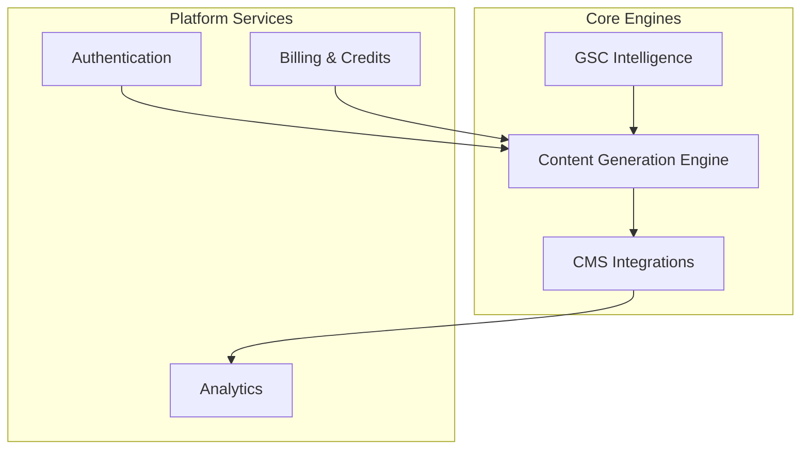

# Systems Documentation

Detailed documentation for **AutopilotRank**'s subsystems.

## Overview

## System Documents

> **Implementation Status:** For current capability status of each system, see the [Capability Status Matrix](../capability-status-matrix.md).

| Document                                                       | Description                                             | Status |
| -------------------------------------------------------------- | ------------------------------------------------------- | ------ |
| [content-generation-engine.md](./content-generation-engine.md) | The AI pipeline (Research -> Draft -> SEO -> Humanize). | Beta/Planned |
| [cms-integration.md](./cms-integration.md)                     | Adapters for WordPress, Webflow, Shopify, etc.          | Planned |
| [authentication.md](./authentication.md)                       | Supabase auth, user sessions.                           | Implemented |
| [billing.md](./billing.md)                                     | Stripe integration, credit consumption logic.           | Implemented |
| [credits.md](./credits.md)                                     | Credit balance management and transactional history.    | Implemented |
| [monitoring.md](./monitoring.md)                               | Observability for the agent pipeline.                   | Implemented |

## Deprecated/Removed

- `image-processing.md` (Replaced by Content Generation Engine)
