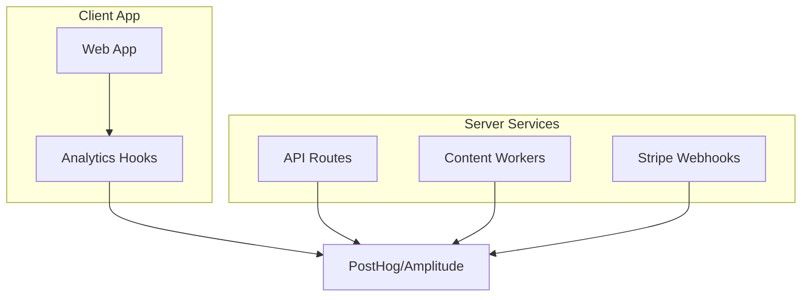

# Analytics System

Comprehensive analytics tracking using PostHog/Amplitude for user behavior and content engine performance.

## Overview



## Event Tracking Schema

### 1. User Lifecycle

- `user_signed_up`: Method (email/google), Source (referral/organic).
- `project_created`: Domain, Platform (WordPress/Shopify), GSC Connected (bool).
- `onboarding_completed`: Time taken, Steps skipped.

### 2. Core Value Events (Content Engine)

These are the most critical events for measuring product value.

```typescript
// Job Started
analytics.track('content_job_created', {
  batch_size: 10,
  keywords: ['seo tools', 'ai writing'],
  settings: {
    model: 'claude-3.5-sonnet',
    length: 'long',
    tone: 'professional',
  },
  project_id: 'proj_123',
});

// Job Progress (Server-side)
analytics.track('article_generated', {
  article_id: 'art_456',
  keyword: 'seo tools',
  word_count: 2500,
  seo_score: 85,
  cost_in_credits: 5,
  model_used: 'claude-3.5-sonnet',
  duration_ms: 45000,
});

// Publishing
analytics.track('article_published', {
  article_id: 'art_456',
  cms_type: 'wordpress',
  status: 'success',
  url: 'https://example.com/seo-tools',
});
```

### 3. GSC Intelligence Events

- `gsc_connected`: Status, Site Count.
- `opportunity_detected`: Keyword volume, Difficulty.
- `autopilot_action_triggered`: Auto-created 5 drafts from GSC data.

### 4. Billing & Credits

- `subscription_upgraded`: From Tier X to Y.
- `credits_purchased`: Amount, Price.
- `credits_low_warning`: Threshold hit.

## Dashboard Metrics

1. **North Star:** "Words Published" or "Traffic Generated" (via GSC sync).
2. **Activation:** % of users who publish their first article within 24h.
3. **Retention:** % of users generating content in Week 4.
4. **Reliability:** Success rate of generation jobs (Target > 99%).
