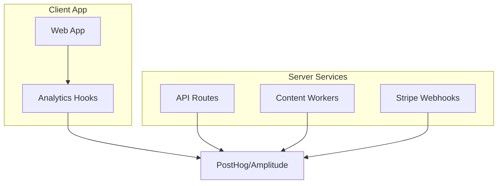

# Analytics System

Comprehensive analytics tracking using PostHog/Amplitude for user behavior and content engine performance.

## Overview



## Event Tracking Schema

### 1. User Lifecycle

- `user_signed_up`: Method (email/google), Source (referral/organic).
- `project_created`: Domain, Platform (WordPress/Shopify), GSC Connected (bool).
- `onboarding_completed`: Time taken, Steps skipped.

### 2. Core Value Events (Content Engine)

These are the most critical events for measuring product value.

```typescript
// Job Started
analytics.track('content_job_created', {
  batch_size: 10,
  keywords: ['seo tools', 'ai writing'],
  settings: {
    model: 'claude-3.5-sonnet',
    length: 'long',
    tone: 'professional',
  },
  project_id: 'proj_123',
});

// Job Progress (Server-side)
analytics.track('article_generated', {
  article_id: 'art_456',
  keyword: 'seo tools',
  word_count: 2500,
  seo_score: 85,
  cost_in_credits: 5,
  model_used: 'claude-3.5-sonnet',
  duration_ms: 45000,
});

// Publishing
analytics.track('article_published', {
  article_id: 'art_456',
  cms_type: 'wordpress',
  status: 'success',
  url: 'https://example.com/seo-tools',
});
```

### 3. GSC Intelligence Events

- `gsc_connected`: Status, Site Count.
- `opportunity_detected`: Keyword volume, Difficulty.
- `autopilot_action_triggered`: Auto-created 5 drafts from GSC data.

### 4. Billing & Credits

- `subscription_upgraded`: From Tier X to Y.
- `credits_purchased`: Amount, Price.
- `credits_low_warning`: Threshold hit.

## Dashboard Metrics

1. **North Star:** "Words Published" or "Traffic Generated" (via GSC sync).
2. **Activation:** % of users who publish their first article within 24h.
3. **Retention:** % of users generating content in Week 4.
4. **Reliability:** Success rate of generation jobs (Target > 99%).

---

## PMF & Revenue KPI Contract

> **Source of Truth:** Business KPIs are defined in [Revenue Streams](../../business/business-model-canvas/revenue-streams.md). This section maps each KPI to specific analytics events.

### KPI-to-Event Mapping

| KPI                             | Formula                                            | Source Events                                                                                       | Owner       | Dashboard                              |
| ------------------------------- | -------------------------------------------------- | --------------------------------------------------------------------------------------------------- | ----------- | -------------------------------------- |
| **Sean Ellis Test**             | % very disappointed if product no longer available | `signup_completed` → Survey trigger event (planned)                                                 | Product     | [Amplitude](https://app.amplitude.com) |
| **30-Day Retention**            | % users who return within 30 days                  | `signup_completed` → `login` or `article_generated` within 30 days                                  | Product     | Amplitude Retention Analysis           |
| **Trial-to-Paid**               | % trial users who purchase subscription            | `signup_completed` → `subscription_created` with plan != free                                       | Growth      | Stripe Dashboard                       |
| **Net Revenue Retention (NRR)** | (MRR + expansion - churn - downgrades) / MRR       | `subscription_created`, `subscription_upgraded`, `subscription_canceled`, `subscription_downgraded` | Finance     | Custom Dashboard (planned)             |
| **LTV:CAC Ratio**               | LTV / CAC                                          | Subscription revenue (Stripe) + Marketing spend (ads)                                               | Finance     | Google Sheets + Stripe                 |
| **Weekly Active Users**         | Unique users generating content in 7-day window    | `article_generated` distinct count by week                                                          | Product     | Amplitude                              |
| **Articles Published**          | Total published articles                           | `article_published`                                                                                 | Product     | Amplitude                              |
| **Generation Success Rate**     | `article_generated` / `content_job_created`        | `article_generated` success vs failure                                                              | Engineering | Baselime                               |

### Event Definitions

```typescript
// PMF & Revenue Events (to be added to types.ts)
interface IPMFEventProperties {
  // Sean Ellis Survey
  sean_ellis_response: 'very_disappointed' | 'somewhat_disappointed' | 'not_disappointed';

  // Trial-to-Paid
  trial_source: 'organic' | 'referral' | 'paid';
  days_to_conversion: number; // Days from signup to first paid subscription
  entry_plan: 'starter' | 'growth' | 'agency';
}

interface IRetentionEventProperties {
  // 30-Day Retention
  returned_at: number; // Unix timestamp of return
  days_since_signup: number;
  returning_action: 'login' | 'article_generated' | 'content_viewed';
}

interface IExpansionEventProperties {
  // NRR Expansion
  previous_plan: 'starter' | 'growth' | 'agency';
  new_plan: 'starter' | 'growth' | 'agency';
  previous_amount_cents: number;
  new_amount_cents: number;
}
```

### Target Values (from revenue-streams.md)

| KPI                   | Target    | Current Status      |
| --------------------- | --------- | ------------------- |
| **Trial-to-Paid**     | 20-25%    | Tracking via Stripe |
| **Monthly Churn**     | <5%       | Planned             |
| **NRR**               | >110%     | Planned             |
| **CAC (Self-Serve)**  | $80       | Planned             |
| **CAC Payback**       | <6 months | Planned             |
| **LTV:CAC (Blended)** | >10:1     | Planned             |

### Implementation Status

| Feature                        | Status      | Notes                                     |
| ------------------------------ | ----------- | ----------------------------------------- |
| **Signup/Subscription Events** | Implemented | See `server/analytics/types.ts`           |
| **Article Generation Events**  | Planned     | `article_generated` event not yet tracked |
| **Sean Ellis Survey**          | Planned     | Survey mechanism not built                |
| **Retention Dashboard**        | Planned     | Amplitude retention analysis configured   |
| **Revenue Dashboard**          | Planned     | Stripe Revenue Recognition + custom       |

---

## Event Tracking Implementation Guide

### Adding New KPIs

1. **Define the KPI** in business docs (`revenue-streams.md`)
2. **Add event type** to `server/analytics/types.ts`
3. **Track the event** at the appropriate code location
4. **Update this contract** table above
5. **Create dashboard** in Amplitude/Stripe

### Example: Tracking Article Generation

```typescript
// In article-generation.service.ts
await analytics.track('article_generated', {
  article_id: article.id,
  user_id: userId,
  keyword: article.primaryKeyword,
  word_count: article.wordCount,
  seo_score: article.seoScore,
  credits_used: 1,
  model_used: model,
  duration_ms: generationTime,
});
```
