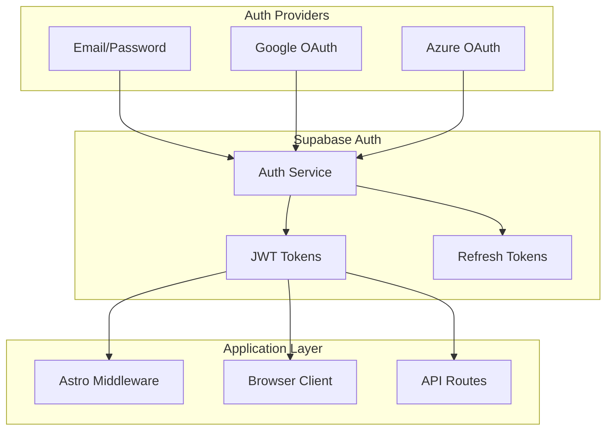
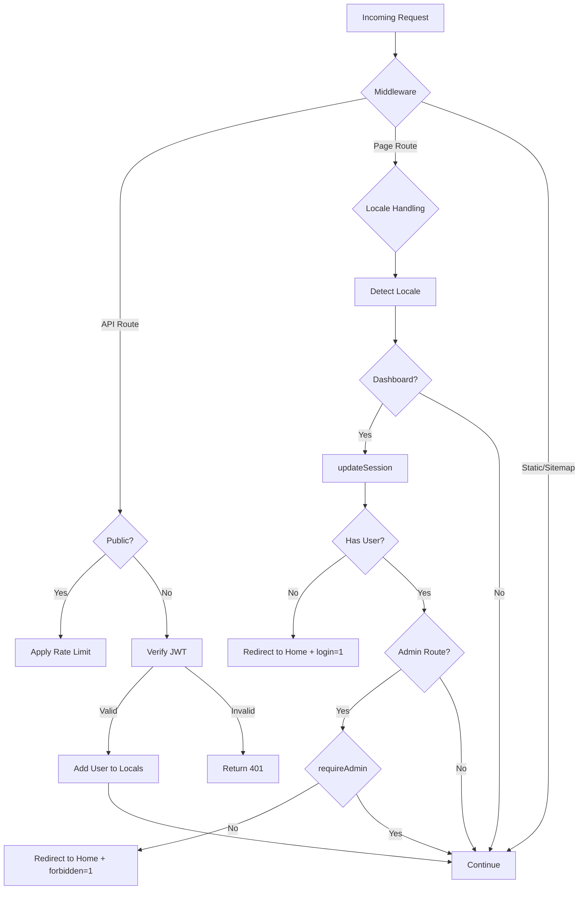

# Authentication System

Authentication and authorization implementation using Supabase Auth.

## Overview



## Authentication Methods

### 1. Email/Password

- **Sign Up**: `supabase.auth.signUp({ email, password })`
- **Sign In**: `supabase.auth.signInWithPassword({ email, password })`
- **Email Confirmation**: Redirects to `/auth/confirm` after verification
- **Password Reset**: `supabase.auth.resetPasswordForEmail()` redirects to `/auth/reset-password`

### 2. Google OAuth

- **Provider**: `google`
- **Redirect URI**: `/auth/callback`
- **Scopes**: `email profile`
- **Hook**: `useGoogleSignIn()` in `/client/hooks/useGoogleSignIn.ts`
- **Environment Toggle**: `PUBLIC_ENABLE_GOOGLE_OAUTH` (default: `true`)

```typescript
// Client-side usage
const { signIn, loading } = useGoogleSignIn();
await signIn(returnTo); // Optional return URL after auth
```

### 3. Azure OAuth

- **Provider**: `azure`
- **Redirect URI**: `/auth/callback`
- **Scopes**: `email openid profile User.Read`
- **Hook**: `useAzureSignIn()` in `/client/hooks/useAzureSignIn.ts`
- **Environment Toggle**: `PUBLIC_ENABLE_AZURE_OAUTH` (default: `false`)

```typescript
// Client-side usage
const { signIn, loading } = useAzureSignIn();
await signIn();
```

## Client-Side Implementation

### Browser Client

```typescript
// shared/utils/supabase/client.ts
import { createBrowserClient } from '@supabase/ssr';

export function createClient(): SupabaseClient {
  return createBrowserClient(clientEnv.SUPABASE_URL, clientEnv.SUPABASE_ANON_KEY);
}
```

### Auth Store (Zustand)

Located at `/client/store/auth/authStore.ts`:

```typescript
// State
interface IAuthState {
  isAuthenticated: boolean;
  isLoading: boolean;
  user: IAuthUser | null;
  signInWithEmail: (email: string, password: string) => Promise<void>;
  signUpWithEmail: (email: string, password: string) => Promise<ISignUpResult>;
  signOut: () => Promise<void>;
  changePassword: (current: string, new: string) => Promise<void>;
  resetPassword: (email: string) => Promise<void>;
  updatePassword: (new: string) => Promise<void>;
}

// Usage in components
const { user, isAuthenticated, signInWithEmail, signOut } = useAuthStore();
```

### Auth Operations

Located at `/client/store/auth/authOperations.ts`:

- **Caching**: Instant UI load from localStorage cache, validated in background
- **Analytics**: Tracks `login`, `signup_started`, `signup_completed` events
- **Timeout**: 5-second timeout for auth initialization

## Server-Side Implementation

### Server Client (API Routes)

```typescript
// shared/utils/supabase/server.ts
export async function createClient(
  cookies: AstroCookies,
  request?: Request
): Promise<SupabaseClient> {
  return createServerClient(clientEnv.SUPABASE_URL, clientEnv.SUPABASE_ANON_KEY, {
    cookies: {
      getAll() {
        /* ... */
      },
      setAll(cookiesToSet) {
        /* ... */
      },
    },
  });
}
```

### Middleware Auth Helpers

Located at `/shared/utils/supabase/middleware.ts`:

```typescript
// Update session and get user
export async function updateSession(
  cookies: AstroCookies,
  request?: Request
): Promise<{ user: User | null }>;

// Check if user is admin
export async function requireAdmin(
  cookies: AstroCookies,
  request?: Request
): Promise<{ isAdmin: boolean; error?: Response }>;
```

## Middleware Flow

Located at `/src/middleware.ts`:



### Middleware Features

1. **SEO Redirects**: WWW to non-WWW, tracking parameter cleanup
2. **Locale Detection**: URL path, cookie, CF-IPCountry, Accept-Language
3. **API Auth**: JWT verification via `verifyApiAuth()`
4. **Dashboard Protection**: Redirects unauthenticated users
5. **Admin Protection**: Role-based access via `requireAdmin()`

### API Authentication

Located at `/lib/middleware/auth.ts`:

```typescript
// Verify JWT for protected API routes
export async function verifyApiAuth(
  req: Request
): Promise<{ user: { id: string; email?: string } } | { error: Response }>;

// Add user context to Astro locals
export function addUserContextLocals(user: { id: string; email?: string }): {
  userId: string;
  userEmail: string;
};
```

**Test Environment Support**:

- Hardcoded token: `test_auth_token_for_testing_only`
- Environment token: `TEST_AUTH_TOKEN`
- Mock tokens: `test_token_{userId}`

## Session Management

### Token Structure

Supabase uses standard JWT tokens:

```typescript
interface Session {
  access_token: string; // JWT (1 hour expiry)
  refresh_token: string; // Long-lived (7 days)
  expires_at: number;
  user: User;
}
```

### Token Refresh

- Automatic refresh handled by Supabase SSR client
- Refresh triggers when access token expires
- Session persists across page reloads via cookies

## Protected Routes

### Dashboard Routes (Auth Required)

- `/dashboard` - User dashboard
- `/dashboard/*` - All dashboard sub-routes

### Admin Routes (Admin Role Required)

- `/dashboard/admin` - Admin dashboard
- `/dashboard/admin/*` - All admin sub-routes

### Public API Routes

Defined in `/shared/config/security.ts`:

| Pattern            | Purpose                            |
| ------------------ | ---------------------------------- |
| `/api/health`      | Health checks                      |
| `/api/webhooks/*`  | External webhook endpoints         |
| `/api/analytics/*` | Anonymous + authenticated tracking |
| `/api/cron/*`      | Cron jobs (x-cron-secret auth)     |
| `/api/proxy-image` | CORS proxy download                |
| `/api/support/*`   | Support contact form               |

## Security Considerations

### JWT Validation

1. Format validation (3 parts, valid base64url)
2. Supabase signature verification
3. Issuer validation
4. Expiry check

### Security Headers

Applied via `/lib/middleware/securityHeaders.ts`:

```typescript
{
  'X-Frame-Options': 'DENY',
  'X-Content-Type-Options': 'nosniff',
  'X-XSS-Protection': '1; mode=block',
  'Referrer-Policy': isDevelopment()
    ? 'no-referrer-when-downgrade'
    : 'strict-origin-when-cross-origin',
  'Permissions-Policy': 'camera=(), microphone=(), geolocation=()',
  'Content-Security-Policy': buildCspHeader()
}
```

### Content Security Policy

Configured in `/shared/config/security.ts`:

- `default-src`: 'self'
- `script-src`: Includes Google Analytics, Stripe, Google Accounts
- `connect-src`: Includes Supabase, Amplitude, Stripe
- `frame-src`: Stripe, Google Accounts
- `worker-src`: 'self', blob: (for background removal WASM)

### Cookie Configuration

Managed by Supabase SSR client:

- `httpOnly`: true (prevents XSS access)
- `secure`: true (HTTPS only)
- `sameSite`: 'lax' (CSRF protection)
- Automatic refresh token rotation

## Environment Variables

### Client-Side (Public)

- `PUBLIC_SUPABASE_URL` - Supabase project URL
- `PUBLIC_SUPABASE_ANON_KEY` - Supabase anonymous key
- `PUBLIC_ENABLE_GOOGLE_OAUTH` - Enable Google OAuth
- `PUBLIC_ENABLE_AZURE_OAUTH` - Enable Azure OAuth

### Server-Side (Secret)

- `SUPABASE_SERVICE_ROLE_KEY` - Supabase service role key (bypasses RLS)
- `TEST_AUTH_TOKEN` - Test authentication token

## Error Handling

| Error Code                | Description           | Resolution                  |
| ------------------------- | --------------------- | --------------------------- |
| `invalid_credentials`     | Wrong email/password  | Show error to user          |
| `email_not_confirmed`     | Email not verified    | Redirect to confirm page    |
| `user_already_exists`     | Duplicate email       | Redirect to login           |
| `refresh_token_not_found` | Invalid refresh token | Force re-login              |
| `Auth session missing`    | No active session     | Ignore (expected on logout) |

## Auth Pages

| Path                   | Purpose                    |
| ---------------------- | -------------------------- |
| `/auth/callback`       | OAuth callback handler     |
| `/auth/confirm`        | Email confirmation handler |
| `/auth/reset-password` | Password reset form        |

## Key Files

| File                                  | Purpose               |
| ------------------------------------- | --------------------- |
| `shared/utils/supabase/client.ts`     | Browser client        |
| `shared/utils/supabase/server.ts`     | Server client         |
| `shared/utils/supabase/middleware.ts` | Middleware helpers    |
| `client/store/auth/authStore.ts`      | Client auth state     |
| `client/store/auth/authOperations.ts` | Auth operations       |
| `lib/middleware/auth.ts`              | API auth verification |
| `src/middleware.ts`                   | Astro middleware      |
| `shared/config/security.ts`           | Security config       |
| `shared/config/env.ts`                | Environment config    |
