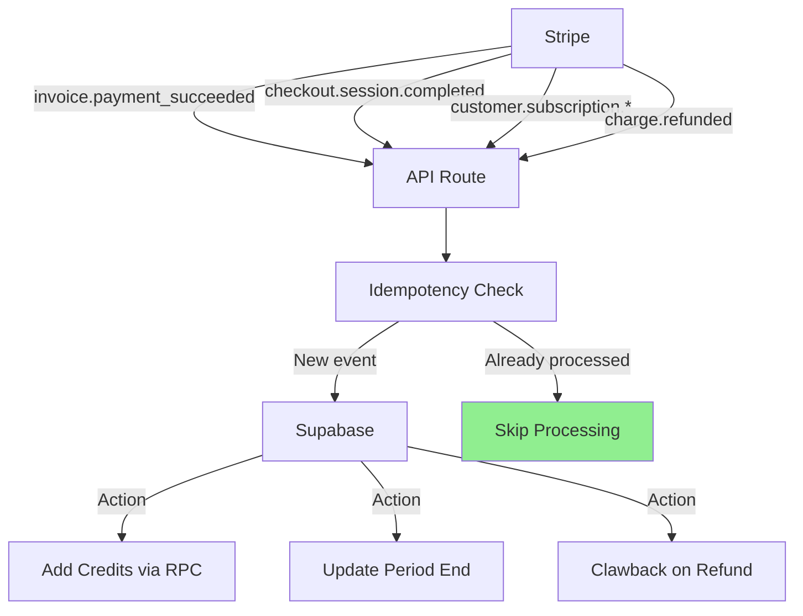

# Billing System

Subscription and credit management using Stripe.

## Overview

Stripe is the single source of truth for subscriptions. Supabase handles the local credit balance.

## Pricing Tiers

> **Canonical Source:** All pricing is defined in [Revenue Streams](../../business/business-model-canvas/revenue-streams.md). Technical implementation uses `shared/config/subscription.config.ts` which should always match the business documentation.

| Tier        | Price/Month | Articles/Month | Rollover Cap |
| ----------- | ----------- | -------------- | ------------ |
| **Trial**   | $0 (one-time) | 3 | No refresh |
| **Starter** | $49 | 30 | 90 (3x) |
| **Growth**  | $99 | 100 | 300 (3x) |
| **Agency**  | $249 | 500 | 0 (use it or lose it) |

### Credit Packs (One-Time Purchase)

| Pack       | Price  | Articles | Description        |
| ---------- | ------ | -------- | ------------------ |
| **Small**  | $9.99  | 10       | For occasional use |
| **Medium** | $19.99 | 25       | Best value         |
| **Large**  | $34.99 | 50       | For power users    |

### Credit Rollover Rules

- **Starter/Growth**: Credits roll over up to 3x monthly allowance
- **Agency**: No rollover - use it or lose it each month
- **Trial**: One-time 3 articles, no monthly refresh

**See also:** [Credit System](./credits.md) for detailed credit management.

## Webhook Handling

We listen to Stripe webhooks to provision credits at `/app/api/webhooks/stripe/route.ts`.



### Idempotency

All webhook handlers are idempotent via the `webhook_events` table with atomic claims:

```typescript
// IdempotencyService.checkAndClaimEvent()
// 1. Check if event exists
// 2. Insert with 'processing' status (unique constraint)
// 3. Mark as 'completed' or 'failed' after processing
```

**Key Behaviors:**

- Duplicate webhooks are skipped (returns 200 with `skipped: true`)
- Processing errors trigger 500 response (Stripe retries)
- Failed events are tracked with retry_count and recoverable flag

### Webhook Events Handled

| Event                           | Handler             | Action                                                               |
| ------------------------------- | ------------------- | -------------------------------------------------------------------- |
| `checkout.session.completed`    | PaymentHandler      | Add initial credits (subscription) or purchased credits (pack)       |
| `customer.created`              | SubscriptionHandler | Link stripe_customer_id to profile                                   |
| `customer.subscription.created` | SubscriptionHandler | Create subscription record, set trial credits if applicable          |
| `customer.subscription.updated` | SubscriptionHandler | Update status, tier, period; handle plan changes (upgrade/downgrade) |
| `customer.subscription.deleted` | SubscriptionHandler | Mark as canceled, send notification                                  |
| `invoice.payment_succeeded`     | InvoiceHandler      | Add monthly credits with rollover cap (skips first invoice)          |
| `invoice.payment_failed`        | InvoiceHandler      | Set status to `past_due`                                             |
| `charge.refunded`               | PaymentHandler      | Clawback credits from appropriate pool                               |
| `charge.dispute.*`              | DisputeHandler      | Hold credits, flag account                                           |
| `invoice.payment_refunded`      | PaymentHandler      | Clawback subscription credits                                        |

### Key Implementation Details

**First Invoice Skip:** The `invoice.payment_succeeded` handler skips invoices with `billing_reason: subscription_create` to prevent double credit allocation since `checkout.session.completed` already adds initial credits.

**Reference ID Format:** Credit transactions use consistent reference formats for refund correlation:

- Subscription invoices: `invoice_{invoice_id}`
- Credit packs: `pi_{payment_intent_id}`
- Checkout sessions: `session_{session_id}` (fallback)

**Credit Pool Separation:**

- Subscription credits: `subscription_credits_balance` (renew monthly, expire based on plan)
- Purchased credits: `purchased_credits_balance` (one-time, no expiration)
- Refunds clawback from the correct pool using `clawback_from_transaction_v2()`

## Credit System

### RPC Functions

| Function                       | Purpose                                   |
| ------------------------------ | ----------------------------------------- |
| `add_subscription_credits`     | Add subscription credits with audit log   |
| `add_purchased_credits`        | Add purchased (one-time) credits          |
| `decrement_credits`            | Deduct credits on API usage               |
| `expire_subscription_credits`  | Apply credit expiration rules             |
| `clawback_credits_v2`          | Remove credits (FIFO: subscription first) |
| `clawback_from_transaction_v2` | Reverse a specific transaction            |

### Credit Transaction Types

| Type           | Description                   | Reference Format         |
| -------------- | ----------------------------- | ------------------------ |
| `purchase`     | One-time credit pack purchase | `pi_{payment_intent_id}` |
| `subscription` | Monthly subscription renewal  | `invoice_{invoice_id}`   |
| `usage`        | API consumption               | Job/Request ID           |
| `refund`       | Credit clawback on refund     | Original transaction ref |
| `bonus`        | Promotional credits           | Campaign ID              |

### Credit Expiration

The system supports two expiration modes (configured per plan):

1. **Never** (default): Credits roll over with a monthly cap
   - Starter: 3x cap (300 max)
   - Hobby/Pro: 6x cap (1200/6000 max)

2. **End of cycle**: Unused credits expire at renewal
   - Used by Business plan (no rollover)

Expiration is handled by `calculateBalanceWithExpiration()` and the `expire_subscription_credits` RPC.

## Configuration

All pricing is configured in `shared/config/subscription.config.ts` (single source of truth):

```typescript
{
  key: 'pro',
  name: 'Professional',
  stripePriceId: 'price_1SZmVzALMLhQocpfPyRX2W8D',
  priceInCents: 4900, // $49.00
  creditsPerCycle: 1000,
  maxRollover: 6000, // 6x monthly
  rolloverMultiplier: 6,
  // ...
}
```

**Price ID Resolution:**

- `assertKnownPriceId()` - Validates price ID exists in config (throws if unknown)
- `resolvePlanOrPack()` - Returns plan or pack metadata
- `getPlanByPriceId()` - Gets full plan configuration

## Stripe-Database Sync (Scheduled Recovery)

Three cron jobs ensure database consistency:

| Job                 | Schedule      | Purpose                        | Endpoint                      |
| ------------------- | ------------- | ------------------------------ | ----------------------------- |
| Webhook Recovery    | Every 15 min  | Retry failed webhook events    | `/api/cron/recover-webhooks`  |
| Expiration Check    | Hourly        | Detect expired subscriptions   | `/api/cron/check-expirations` |
| Full Reconciliation | Daily 3AM UTC | Comprehensive sync all records | `/api/cron/reconcile`         |

See [Stripe DB Sync PRD](../../PRDs/done/stripe-db-sync-prd.md) for details.

## Security

- Webhook signature verification via `WebhookVerificationService`
- Cron job authentication via `x-cron-secret` header
- Row Level Security (RLS) on all Supabase tables
- Service role required for webhook processing

## Testing

```bash
# Forward webhooks to local
stripe listen --forward-to localhost:3000/api/webhooks/stripe

# Trigger test events
stripe trigger checkout.session.completed
stripe trigger invoice.payment_succeeded
stripe trigger charge.refunded
```
