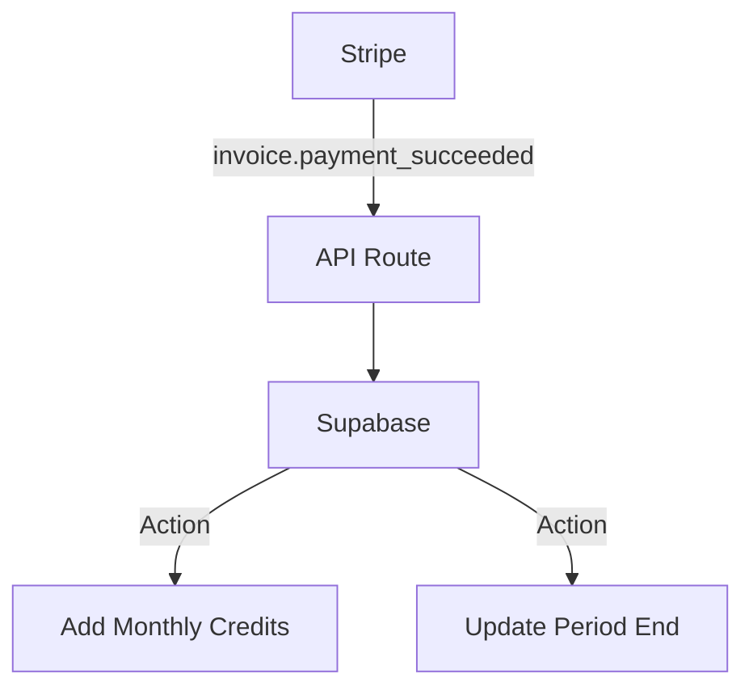

# Billing System

Subscription and credit management using Stripe.

## Overview

Stripe is the single source of truth for subscriptions. Supabase handles the local credit balance.

## Pricing Tiers

### Monthly Subscriptions

| Plan        | Price   | Credits/Month | Features                                   |
| ----------- | ------- | ------------- | ------------------------------------------ |
| **Starter** | $29/mo  | 30            | 30 Articles, 1 Website                     |
| **Growth**  | $79/mo  | 100           | 100 Articles, 5 Websites, GSC Sync         |
| **Agency**  | $249/mo | 500           | 500 Articles, Unlimited Sites, White-label |

- **1 Credit = 1 Standard Article** (approx 1500 words).
- **Rollover:** Unused credits roll over up to 2x the monthly allowance.

### Pay-as-you-go Packs

| Pack      | Price | Credits | Cost/Article |
| --------- | ----- | ------- | ------------ |
| **Pilot** | $15   | 10      | $1.50        |
| **Scale** | $50   | 50      | $1.00        |
| **Bulk**  | $200  | 250     | $0.80        |

## Webhook Handling

We listen to stripe webhooks to provision credits.



### Idempotency

All webhook handlers must be idempotent.

- Check `credit_transactions` for existing `reference_id` (stripe_invoice_id) before adding credits.

```typescript
// Example Logic
if (event.type === 'invoice.payment_succeeded') {
  const invoice = event.data.object;
  const existingTx = await db
    .from('credit_transactions')
    .select('*')
    .eq('reference_id', invoice.id)
    .single();

  if (existingTx) return; // Already processed

  // Add credits...
}
```
