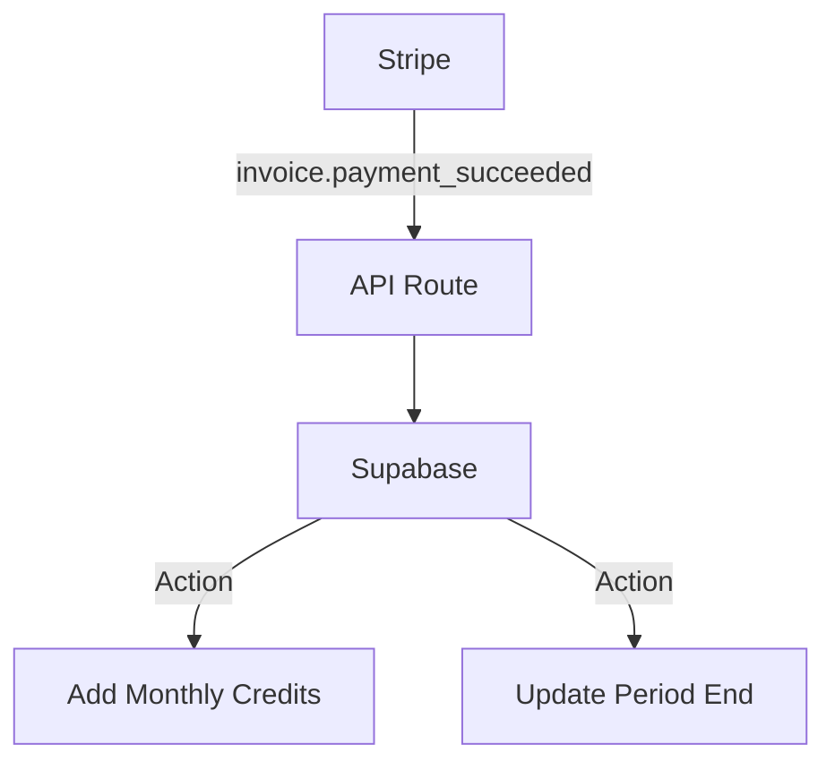

# Billing System

Subscription and credit management using Stripe.

## Overview

Stripe is the single source of truth for subscriptions. Supabase handles the local credit balance.

## Pricing Tiers

**See [Revenue Streams](../../business/business-model-canvas/revenue-streams.md) for complete pricing details, competitive analysis, and rationale.**

### Monthly Subscriptions (MVP)

| Plan        | Price   | Articles/Month | Features                                   |
| ----------- | ------- | -------------- | ------------------------------------------ |
| **Trial**   | $0      | 3 (one-time)   | Try before buying, no CC required          |
| **Starter** | $49/mo  | 30             | All core features, 1 WordPress site        |
| **Growth**  | $99/mo  | 100            | GSC integration, 3 CMS sites               |
| **Agency**  | $249/mo | 500            | White-label, team (5), API, unlimited sites |

- **1 Credit = 1 Standard Article** (approx 1,500 words)
- **Rollover:** Unused credits roll over up to 2x the monthly allowance
- **Annual billing:** 20% off (2 months free)

### Overage Charges (Post-MVP Phase 1)

| Tier       | Overage Rate | Rationale                                              |
| ---------- | ------------ | ------------------------------------------------------ |
| **Starter** | $2.00/article | Nudges upgrade to Growth ($0.99/article at $99/mo)    |
| **Growth**  | $1.50/article | Nudges upgrade to Agency ($0.50/article at $249/mo)   |
| **Agency**  | $0.75/article | Volume discount on occasional overage                 |

See [Revenue Streams](../../business/business-model-canvas/revenue-streams.md) for detailed overage strategy and examples.

## Webhook Handling

We listen to stripe webhooks to provision credits.



### Idempotency

All webhook handlers must be idempotent.

- Check `credit_transactions` for existing `reference_id` (stripe_invoice_id) before adding credits.

```typescript
// Example Logic
if (event.type === 'invoice.payment_succeeded') {
  const invoice = event.data.object;
  const existingTx = await db
    .from('credit_transactions')
    .select('*')
    .eq('reference_id', invoice.id)
    .single();

  if (existingTx) return; // Already processed

  // Add credits...
}
```
