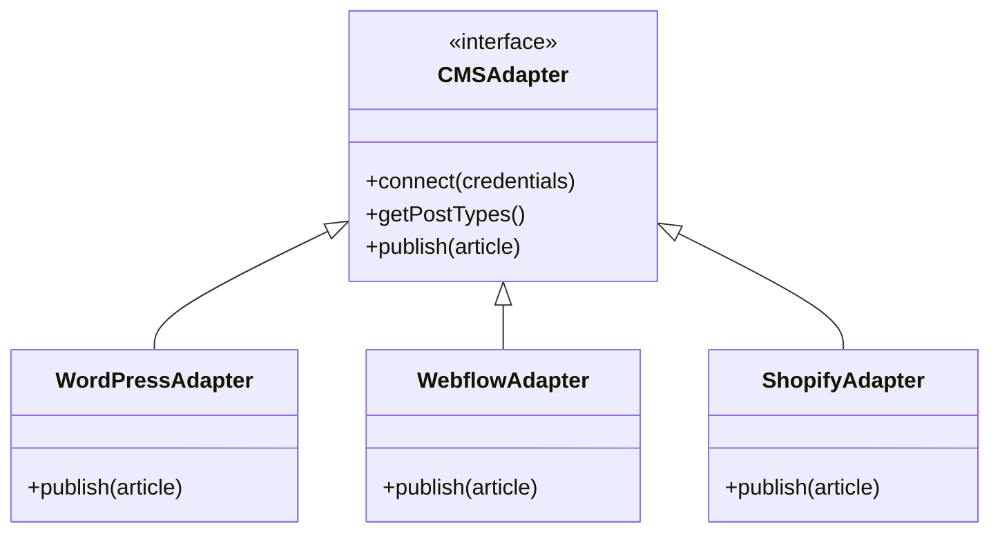
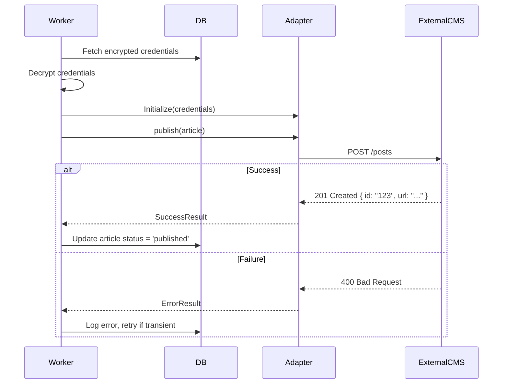

# CMS Integration System

Handles the connection and publishing of content to external platforms.

## Supported Platforms

| Platform | Auth Method | Capabilities |
|Data Visualization|
| **WordPress** | Application Password / JWT | Post, Pages, Media, Tags, Categories |
| **Webflow** | API Token | CMS Collections |
| **Shopify** | Admin API Token | Blog Posts, Pages |
| **Ghost** | Admin API Key | Posts, Pages |
| **Zapier/Webhook** | Secret Key | JSON Payload delivery |

## Architecture

We use a "Adapter Pattern" to normalize publishing actions across different CMSs.

## Credential Storage

Credentials are stored **encrypted** in the database using `pgcrypto`.

- **Encryption Key:** Managed via environment variable `CMS_ENCRYPTION_KEY`.
- **Flow:**
  1. User enters API Key.
  2. Server encrypts with AES-256.
  3. Stored in `integrations` table.
  4. Decrypted only inside the Worker scope when publishing.

## Publishing Flow

## Image Handling

1. **Generation:** Images generated by AI (DALL-E 3) are stored in R2.
2. **Upload:** Before publishing the text, the Adapter uploads the image to the Target CMS media library.
3. **Linking:** The returned Media ID or URL is inserted into the content HTML/Markdown.
