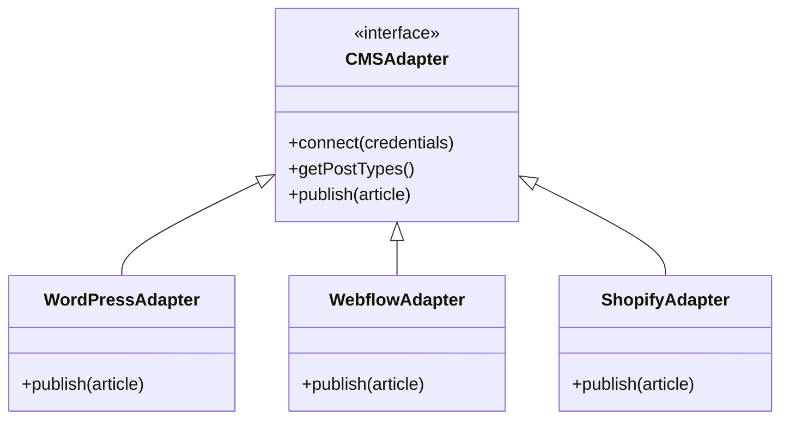
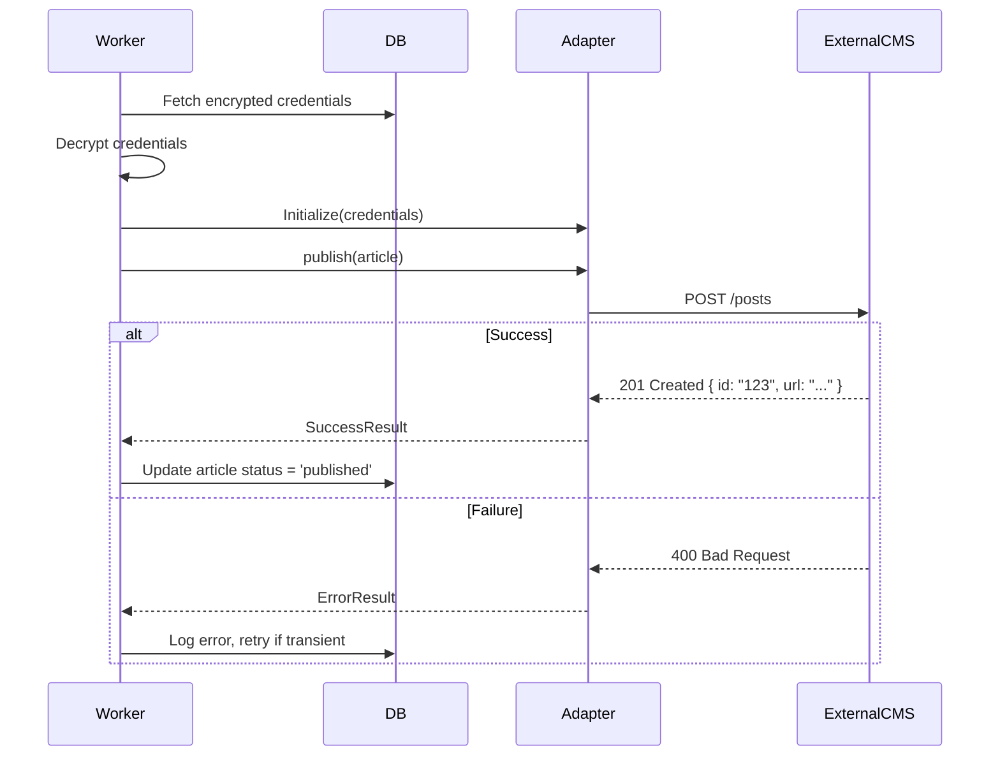

# CMS Integration System

Handles the connection and publishing of content to external platforms.

> **Implementation Status:** This is a **target architecture** document. CMS integrations are **not yet implemented**. See [Capability Status Matrix](../capability-status-matrix.md) for status.

---

## Current Implementation

**Status:** No CMS adapters implemented

Currently, articles are generated and stored in the database but publishing to external CMS platforms is **not implemented**.

**What Exists:**

- Database schema supports CMS credentials storage (`projects.cms_credentials`)
- Articles have `published_url` and `published_at` fields for future tracking
- User can specify CMS type when creating a project (wordpress, webflow, shopify, other)

**What's Missing:**

- CMS adapter interfaces and implementations
- Credential encryption/decryption (`CMS_ENCRYPTION_KEY` not configured)
- Publishing API endpoints
- Integration with external CMS APIs

---

## Target Architecture (Planned)

### Supported Platforms

| Platform           | Auth Method                | Capabilities                         | Status  |
| ------------------ | -------------------------- | ------------------------------------ | ------- |
| **WordPress**      | Application Password / JWT | Post, Pages, Media, Tags, Categories | Planned |
| **Webflow**        | API Token                  | CMS Collections                      | Planned |
| **Shopify**        | Admin API Token            | Blog Posts, Pages                    | Planned |
| **Ghost**          | Admin API Key              | Posts, Pages                         | Planned |
| **Zapier/Webhook** | Secret Key                 | JSON Payload delivery                | Planned |

### Adapter Pattern Architecture

We will use an "Adapter Pattern" to normalize publishing actions across different CMSs.

### Credential Storage (Planned)

Credentials will be stored **encrypted** in the database using `pgcrypto`.

- **Encryption Key:** Managed via environment variable `CMS_ENCRYPTION_KEY`
- **Flow:**
  1. User enters API Key
  2. Server encrypts with AES-256
  3. Stored in `projects.cms_credentials` field
  4. Decrypted only inside the Worker scope when publishing

### Publishing Flow (Planned)

### Image Handling (Planned)

1. **Generation:** Images generated by AI (DALL-E 3) are stored in R2.
2. **Upload:** Before publishing the text, the Adapter uploads the image to the Target CMS media library.
3. **Linking:** The returned Media ID or URL is inserted into the content HTML/Markdown.
