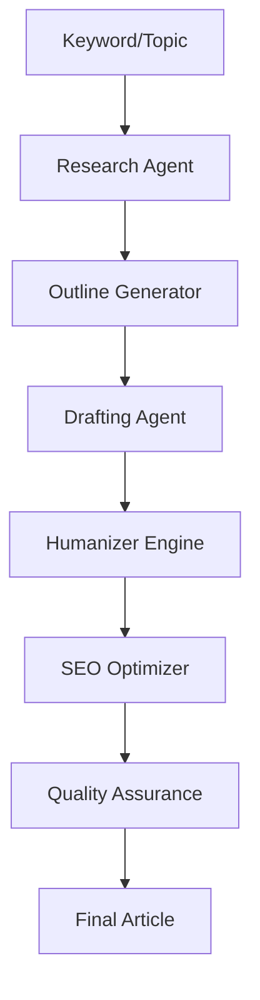

# Content Generation Engine

The core AI pipeline for AutopilotRank that transforms keywords into high-ranking SEO content.

## Pipeline Overview



## 1. Research Agent (Perplexity/Serper)

**Goal:** Gather factual data and analyze search intent.

- **Input:** Keyword + Target URL.
- **Action:**
  - Scrapes top 10 SERP results.
  - Extracts H2/H3 structures of competitors.
  - Identifies "User Intent" (Informational vs Commercial).
  - Gathers statistics and recent facts.
- **Output:** `ResearchBrief` JSON (facts, competitor_headings, intent).

## 2. Outline Generator (GPT-4)

**Goal:** Create a superior structure.

- **Action:**
  - Merges competitor headings with "Skyscraper" technique (adding what's missing).
  - Ensures logical flow.
  - Adds internal linking placeholders.
- **Output:** `ArticleOutline` (list of sections/headings).

## 3. Drafting Agent (Claude 3.5 Sonnet)

**Goal:** Write naturally flowing text.

- **Action:**
  - Writes section by section to maintain context window.
  - Adheres to "Brand Voice" settings (Tone, Perspective).
  - Uses research facts to substantiate claims.
- **Output:** `DraftContent` (Markdown).

## 4. Humanizer Engine (Fine-tuned Model)

**Goal:** Bypass AI detection and remove "AI-isms".

- **Action:**
  - Rewrites sentence structures to vary length.
  - Removes transition words common in AI (e.g., "Moreover", "In conclusion").
  - **Models:** Specialized fine-tuned Llama 3 or proprietary GPT wrapper.
- **Output:** `HumanizedContent`.

## 5. SEO Optimizer (GPT-4 / NLP)

**Goal:** Maximize relevance score.

- **Action:**
  - Injects secondary keywords naturally.
  - optimize Title and Meta Description.
  - Adds Schema Markup (FAQ, Article, Product).
- **Output:** `OptimizedContent`.

## 6. QA System

**Goal:** Guardrails before publishing.

- **Checks:**
  - **Plagiarism**: Copyscape/Originality.ai API.
  - **AI Score**: Check against detection threshold.
  - **Formatting**: Ensure no broken Markdown/HTML.
  - **Banned Words**: Check against client blacklist.

## Data Structures

### Generation Job

```typescript
interface ContentJob {
  id: string;
  keyword: string;
  settings: {
    word_count: 'short' | 'medium' | 'long';
    tone: string;
    include_images: boolean;
  };
  research_data?: ResearchBrief;
  current_step: 'research' | 'writing' | 'optimization' | 'qa';
  status: 'queued' | 'processing' | 'completed' | 'failed';
}
```
