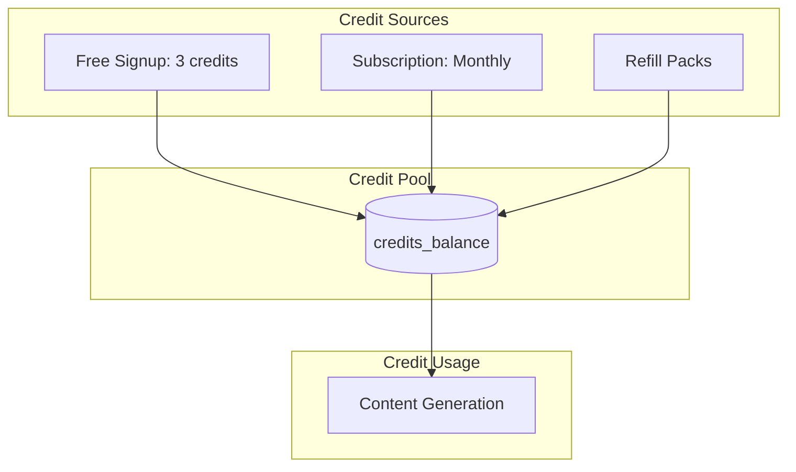

# Credit System

Credit-based usage tracking for content generation.

## Overview

AutopilotRank uses a simple credit system. 1 Credit is generally equal to 1 Article.



## Credit Costs

| Action                                 | Cost                 |
| -------------------------------------- | -------------------- |
| **Standard Article** (1000-1500 words) | 1 Credit             |
| **Long-Form Guide** (2500+ words)      | 2 Credits            |
| **Bulk Batch** (10 Articles)           | 10 Credits           |
| **Keyword Research**                   | 0 Credits (Included) |
| **Publishing**                         | 0 Credits (Included) |

## Credit Allocation by Tier

| Tier        | Monthly Credits | Rollover Cap |
| ----------- | --------------- | ------------ |
| **Starter** | 30              | 60           |
| **Growth**  | 100             | 200          |
| **Agency**  | 500             | 1000         |

## Deduction Flow

Atomic deduction ensures no race conditions during bulk generation.

```sql
CREATE OR REPLACE FUNCTION deduct_credits(
  p_user_id UUID,
  p_amount INTEGER,
  p_description TEXT
) RETURNS void AS $$
DECLARE
  current_balance INTEGER;
BEGIN
  -- Lock row
  SELECT credits_balance INTO current_balance
  FROM profiles WHERE id = p_user_id FOR UPDATE;

  IF current_balance < p_amount THEN
    RAISE EXCEPTION 'insufficient credits';
  END IF;

  UPDATE profiles
  SET credits_balance = credits_balance - p_amount
  WHERE id = p_user_id;

  INSERT INTO credit_transactions (user_id, amount, type, description)
  VALUES (p_user_id, -p_amount, 'usage', p_description);
END;
$$ LANGUAGE plpgsql;
```
