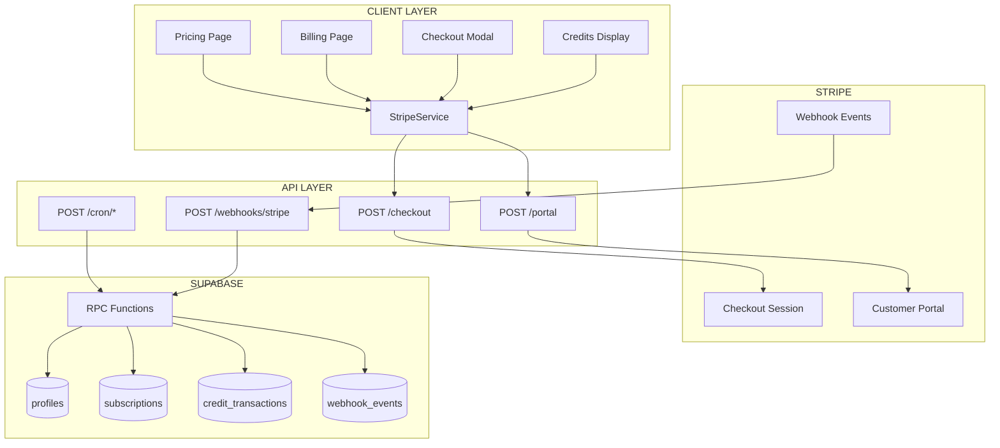
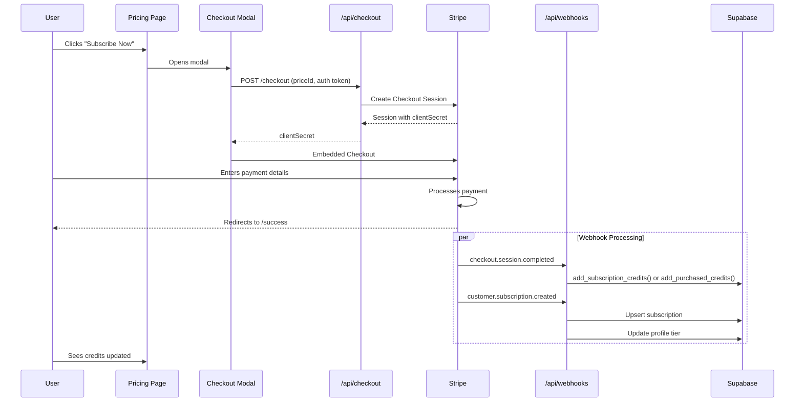
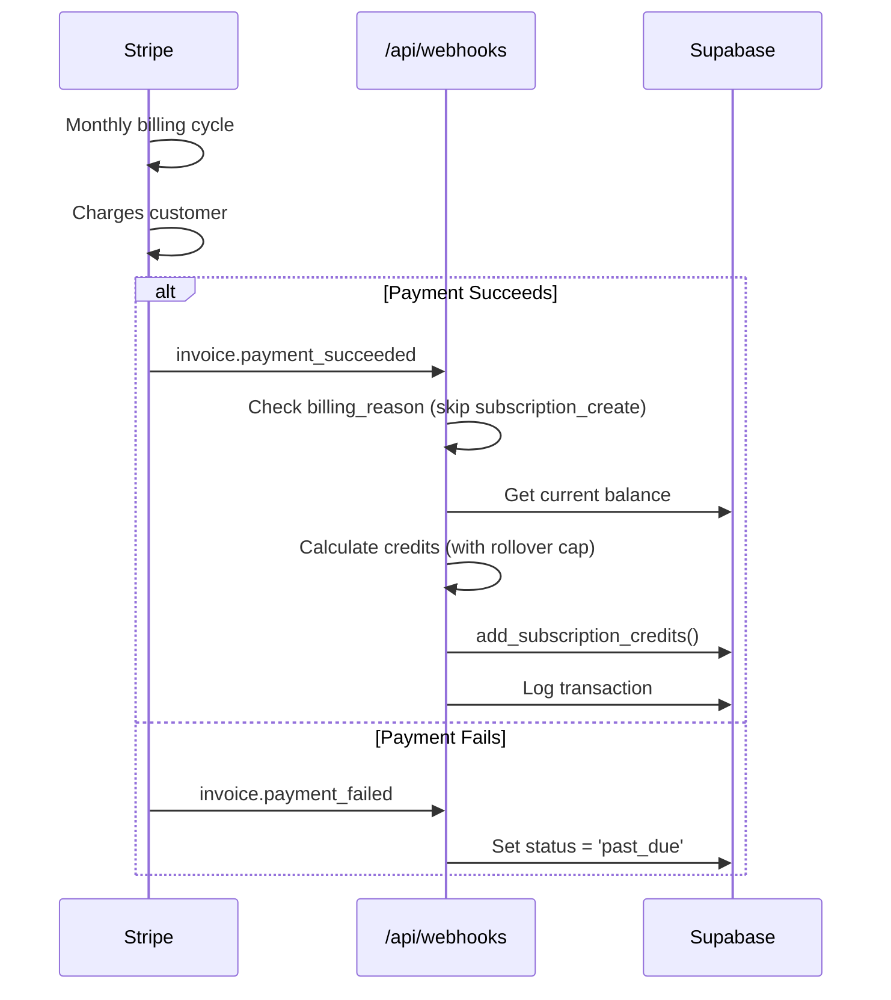
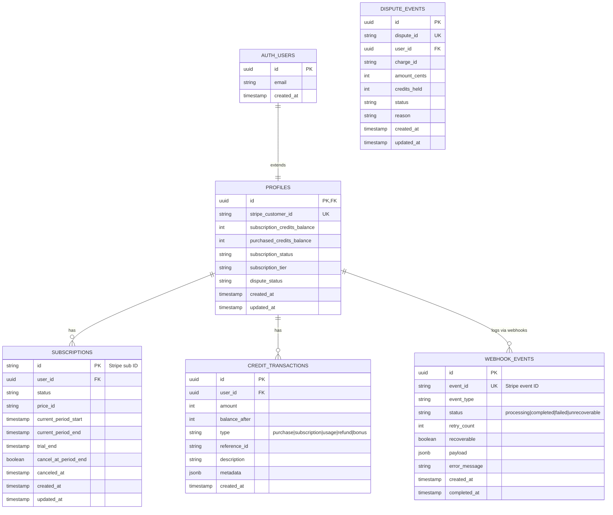
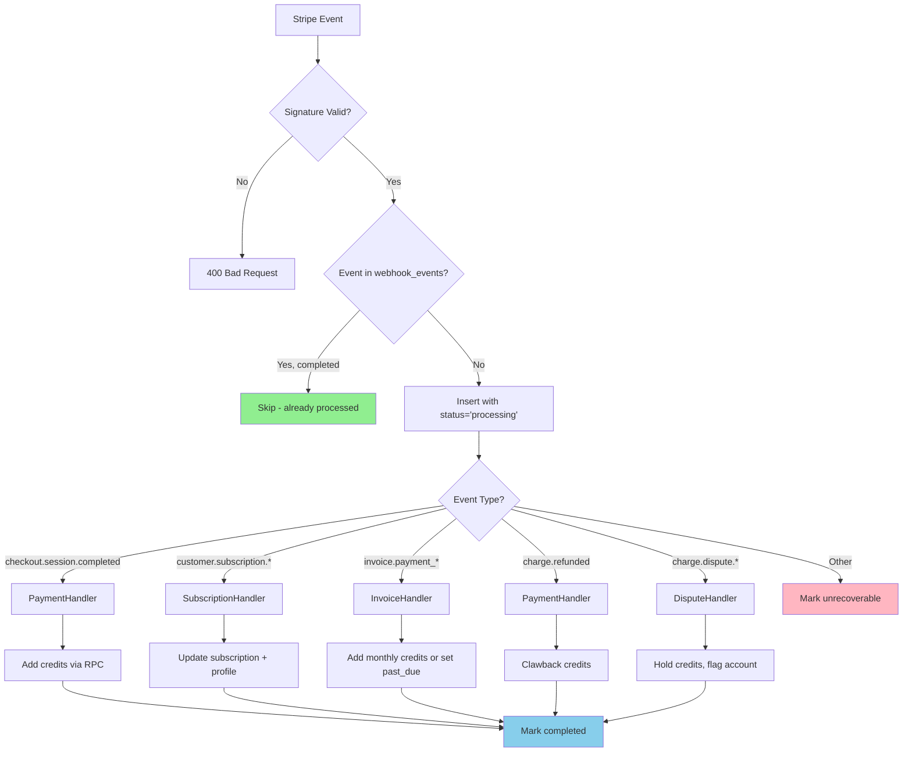
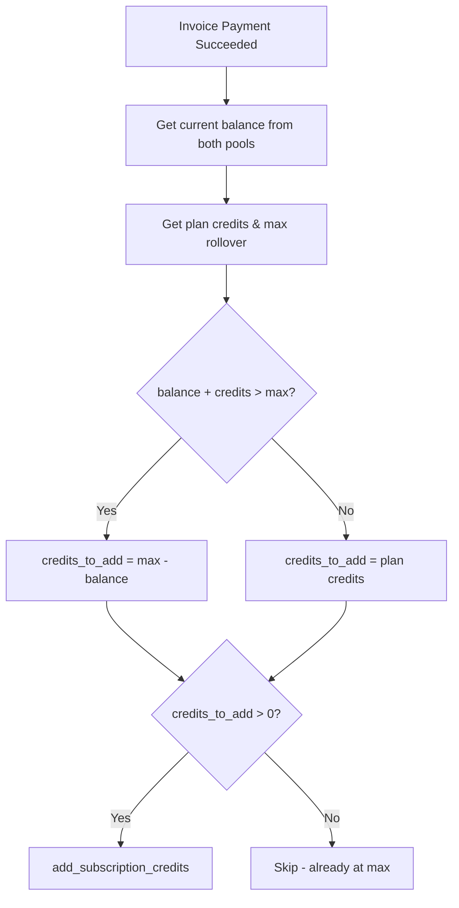
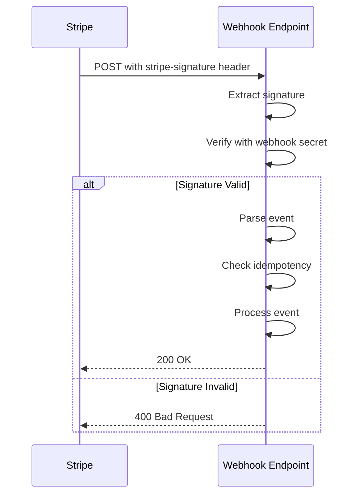

# Subscription System Architecture

**Version:** 4.0 (AutopilotRank - Image Upscaler SaaS)
**Last Updated:** February 5, 2026

## Quick Reference

**For AutopilotRank pricing & plans:** See [Revenue Streams](../../business/business-model-canvas/revenue-streams.md)

**For implementation details:** This document describes the actual billing system implementation.

---

## Technology Stack

- **Payment Provider:** Stripe (Checkout, Customer Portal, Webhooks)
- **Database:** Supabase (PostgreSQL with RLS)
- **Backend:** Astro 5 SSR + Cloudflare Workers
- **Frontend:** Astro 5 + React 18 (islands architecture)
- **Hosting:** Cloudflare Pages

---

## Pricing Tiers

### Monthly Subscriptions

| Plan         | Price   | Credits/Month | Rollover Cap    | Batch Limit |
| ------------ | ------- | ------------- | --------------- | ----------- |
| **Free**     | $0      | 10 (one-time) | N/A             | 1           |
| **Starter**  | $9/mo   | 100           | 300 (3x)        | 5           |
| **Hobby**    | $19/mo  | 200           | 1200 (6x)       | 10          |
| **Pro**      | $49/mo  | 1000          | 6000 (6x)       | 50          |
| **Business** | $149/mo | 5000          | 0 (no rollover) | 500         |

### Credit Packs

| Pack   | Price  | Credits |
| ------ | ------ | ------- |
| Small  | $4.99  | 50      |
| Medium | $14.99 | 200     |
| Large  | $39.99 | 600     |

---

## Implementation Status

### Feature Matrix

| Feature                        | Status      |
| ------------------------------ | ----------- |
| Subscription purchase          | Implemented |
| Monthly credit allocation      | Implemented |
| Credit pack purchase           | Implemented |
| Subscription cancellation      | Implemented |
| Billing page                   | Implemented |
| Pricing page                   | Implemented |
| Webhook signature verification | Implemented |
| Credit transaction logging     | Implemented |
| Upgrade/downgrade flow         | Implemented |
| Webhook idempotency            | Implemented |
| Refund credit clawback         | Implemented |
| Dispute handling               | Implemented |
| Scheduled Stripe sync          | Implemented |

### API Endpoints

| Endpoint                           | Status      |
| ---------------------------------- | ----------- |
| `POST /api/checkout`               | Implemented |
| `POST /api/portal`                 | Implemented |
| `POST /api/webhooks/stripe`        | Implemented |
| `POST /api/subscription/change`    | Implemented |
| `POST /api/subscriptions/cancel`   | Implemented |
| `POST /api/admin/subscription`     | Implemented |
| `POST /api/cron/recover-webhooks`  | Implemented |
| `POST /api/cron/check-expirations` | Implemented |
| `POST /api/cron/reconcile`         | Implemented |

### Webhook Coverage

| Event                                  | Status      |
| -------------------------------------- | ----------- |
| `checkout.session.completed`           | Implemented |
| `customer.created`                     | Implemented |
| `customer.subscription.created`        | Implemented |
| `customer.subscription.updated`        | Implemented |
| `customer.subscription.deleted`        | Implemented |
| `customer.subscription.trial_will_end` | Implemented |
| `invoice.payment_succeeded`            | Implemented |
| `invoice.payment_failed`               | Implemented |
| `charge.refunded`                      | Implemented |
| `charge.dispute.created`               | Implemented |
| `charge.dispute.updated`               | Implemented |
| `charge.dispute.closed`                | Implemented |
| `invoice.payment_refunded`             | Implemented |

---

## System Architecture

### High-Level Architecture



### Subscription Purchase Flow



### Monthly Renewal Flow



---

## Database Schema

### Entity Relationship Diagram



### Table Definitions

#### profiles

```sql
CREATE TABLE profiles (
  id UUID PRIMARY KEY REFERENCES auth.users(id) ON DELETE CASCADE,
  stripe_customer_id TEXT UNIQUE,
  subscription_credits_balance INTEGER DEFAULT 0,
  purchased_credits_balance INTEGER DEFAULT 0,
  subscription_status TEXT CHECK (subscription_status IN
    ('active', 'trialing', 'past_due', 'canceled', 'unpaid')),
  subscription_tier TEXT,
  dispute_status TEXT CHECK (dispute_status IN ('pending', 'resolved')),
  created_at TIMESTAMPTZ DEFAULT NOW(),
  updated_at TIMESTAMPTZ DEFAULT NOW()
);
```

#### subscriptions

```sql
CREATE TABLE subscriptions (
  id TEXT PRIMARY KEY,  -- Stripe subscription ID
  user_id UUID REFERENCES profiles(id) ON DELETE CASCADE,
  status TEXT NOT NULL,
  price_id TEXT NOT NULL,
  current_period_start TIMESTAMPTZ NOT NULL,
  current_period_end TIMESTAMPTZ NOT NULL,
  trial_end TIMESTAMPTZ,
  cancel_at_period_end BOOLEAN DEFAULT FALSE,
  canceled_at TIMESTAMPTZ,
  created_at TIMESTAMPTZ DEFAULT NOW(),
  updated_at TIMESTAMPTZ DEFAULT NOW()
);
```

#### credit_transactions

```sql
CREATE TABLE credit_transactions (
  id UUID PRIMARY KEY DEFAULT gen_random_uuid(),
  user_id UUID REFERENCES profiles(id) ON DELETE CASCADE,
  amount INTEGER NOT NULL,
  balance_after INTEGER NOT NULL,
  type TEXT CHECK (type IN
    ('purchase', 'subscription', 'usage', 'refund', 'bonus')),
  reference_id TEXT,
  description TEXT,
  metadata JSONB,
  created_at TIMESTAMPTZ DEFAULT NOW()
);
```

#### webhook_events

```sql
CREATE TABLE webhook_events (
  id UUID PRIMARY KEY DEFAULT gen_random_uuid(),
  event_id TEXT UNIQUE NOT NULL,  -- Stripe event ID
  event_type TEXT NOT NULL,
  status TEXT CHECK (status IN
    ('processing', 'completed', 'failed', 'unrecoverable')),
  retry_count INTEGER DEFAULT 0,
  recoverable BOOLEAN DEFAULT TRUE,
  payload JSONB,
  error_message TEXT,
  created_at TIMESTAMPTZ DEFAULT NOW(),
  completed_at TIMESTAMPTZ
);
```

### RPC Functions

| Function                       | Purpose                                 |
| ------------------------------ | --------------------------------------- |
| `add_subscription_credits`     | Add subscription credits with audit log |
| `add_purchased_credits`        | Add purchased credits with audit log    |
| `decrement_credits`            | Deduct credits on API usage             |
| `has_sufficient_credits`       | Check if user has enough credits        |
| `get_active_subscription`      | Get user's active subscription          |
| `expire_subscription_credits`  | Apply credit expiration rules           |
| `clawback_credits_v2`          | Remove credits (FIFO)                   |
| `clawback_from_transaction_v2` | Reverse a specific transaction          |

---

## API Endpoints

### POST /api/checkout

Creates a Stripe Checkout Session for subscription or credit pack purchase.

**Request:**

```typescript
interface ICheckoutSessionRequest {
  priceId: string;
  mode?: 'subscription' | 'payment';
  successUrl?: string;
  cancelUrl?: string;
  metadata?: Record<string, string>;
}
```

**Response:**

```typescript
interface ICheckoutSessionResponse {
  success: true;
  data: {
    url: string;
    sessionId: string;
    clientSecret?: string;
  };
}
```

**Location:** `app/api/checkout/index.ts`

---

### POST /api/portal

Creates a Stripe Customer Portal session for subscription management.

**Request:**

```typescript
interface IPortalRequest {
  returnUrl?: string;
}
```

**Response:**

```typescript
interface IPortalResponse {
  success: true;
  data: {
    url: string;
  };
}
```

**Location:** `app/api/portal/index.ts`

---

### POST /api/webhooks/stripe

Handles Stripe webhook events. All events are processed with idempotency checks.

**Location:** `app/api/webhooks/stripe/route.ts`

**Handlers:**

- `PaymentHandler` - checkout.session.completed, charge.refunded, invoice.payment_refunded
- `SubscriptionHandler` - customer.subscription.\*, subscription_schedule.completed
- `InvoiceHandler` - invoice.payment_succeeded, invoice.payment_failed
- `DisputeHandler` - charge.dispute.\*

---

## Webhook Processing

### Event Flow



### Idempotency

All webhook handlers use `IdempotencyService` for atomic event claims:

```typescript
// 1. Check if event exists
const existing = await checkAndClaimEvent(eventId, eventType, payload);

// 2. If already completed, skip
if (!existing.isNew && existing.existingStatus === 'completed') {
  return NextResponse.json({ received: true, skipped: true });
}

// 3. Process event...

// 4. Mark as completed
await markEventCompleted(eventId);
```

### Rollover Cap Logic



---

## Credit System

### Credit Pools

The system maintains two separate credit pools:

1. **Subscription Credits** (`subscription_credits_balance`)
   - Allocated monthly via subscription
   - Subject to rollover caps
   - Can expire based on plan configuration

2. **Purchased Credits** (`purchased_credits_balance`)
   - One-time credit pack purchases
   - No expiration
   - Used after subscription credits (FIFO)

### Credit Transaction Types

| Type           | Description               | Reference Format         |
| -------------- | ------------------------- | ------------------------ |
| `purchase`     | Credit pack purchase      | `pi_{payment_intent_id}` |
| `subscription` | Monthly renewal           | `invoice_{invoice_id}`   |
| `usage`        | API consumption           | Job ID                   |
| `refund`       | Credit clawback on refund | Original transaction ref |
| `bonus`        | Promotional credits       | Campaign ID              |

### Credit Expiration

Plans support two expiration modes via `creditsExpiration.mode`:

1. **Never** (default): Credits roll over with cap
2. **End of cycle**: Unused credits expire at renewal

Expiration is calculated by `calculateBalanceWithExpiration()` in `shared/config/subscription.utils.ts`.

---

## Stripe-Database Sync System

### Overview

Three cron jobs ensure database state matches Stripe source of truth:

| Job              | Schedule      | Endpoint                      | Purpose                           |
| ---------------- | ------------- | ----------------------------- | --------------------------------- |
| Webhook Recovery | Every 15 min  | `/api/cron/recover-webhooks`  | Retry failed webhook events       |
| Expiration Check | Hourly        | `/api/cron/check-expirations` | Detect expired subscriptions      |
| Reconciliation   | Daily 3AM UTC | `/api/cron/reconcile`         | Comprehensive sync of all records |

### Monitoring

Query sync statistics:

```sql
-- Recent sync runs
SELECT * FROM sync_runs
WHERE started_at > NOW() - INTERVAL '24 hours'
ORDER BY started_at DESC;

-- Sync health by job type
SELECT * FROM get_sync_run_stats('expiration_check', 24);
```

See [Stripe DB Sync PRD](../../PRDs/done/stripe-db-sync-prd.md) for complete details.

---

## Configuration

### Environment Variables

```typescript
// .env.client (public)
PUBLIC_STRIPE_PUBLISHABLE_KEY=pk_live_...

// .env.api (secret)
STRIPE_SECRET_KEY=sk_live_...
STRIPE_WEBHOOK_SECRET=whsec_...
CRON_SECRET=... # For cron job authentication
```

### Subscription Configuration

All pricing is in `shared/config/subscription.config.ts`:

```typescript
{
  key: 'pro',
  name: 'Professional',
  stripePriceId: 'price_1SZmVzALMLhQocpfPyRX2W8D',
  priceInCents: 4900,
  creditsPerCycle: 1000,
  maxRollover: 6000,
  rolloverMultiplier: 6,
  features: [...],
  batchLimit: 50,
}
```

---

## Security Model

### Webhook Security



### Row Level Security

| Table               | Policy Access          |
| ------------------- | ---------------------- |
| profiles            | `auth.uid() = id`      |
| subscriptions       | `auth.uid() = user_id` |
| credit_transactions | `auth.uid() = user_id` |
| webhook_events      | Service role only      |

---

## Related Files

### API Routes

- `app/api/checkout/index.ts` - Creates Stripe Checkout Session
- `app/api/portal/index.ts` - Creates Stripe Customer Portal session
- `app/api/webhooks/stripe/route.ts` - Main webhook handler

### Webhook Handlers

- `app/api/webhooks/stripe/handlers/payment.handler.ts` - Checkout, refunds
- `app/api/webhooks/stripe/handlers/subscription.handler.ts` - Subscription updates
- `app/api/webhooks/stripe/handlers/invoice.handler.ts` - Invoice payments
- `app/api/webhooks/stripe/handlers/dispute.handler.ts` - Charge disputes

### Services

- `app/api/webhooks/stripe/services/webhook-verification.service.ts` - Signature verification
- `app/api/webhooks/stripe/services/idempotency.service.ts` - Idempotency checks

### Configuration

- `shared/config/subscription.config.ts` - Plan/credit pack definitions
- `shared/config/stripe.ts` - Stripe price ID mappings
- `shared/config/credits.config.ts` - Credit cost constants

### Database

- `supabase/migrations/20250120100000_create_subscriptions_table.sql`
- `supabase/migrations/20250121000000_create_credit_transactions_table.sql`
- `supabase/migrations/20250202030000_create_webhook_events_table.sql`
