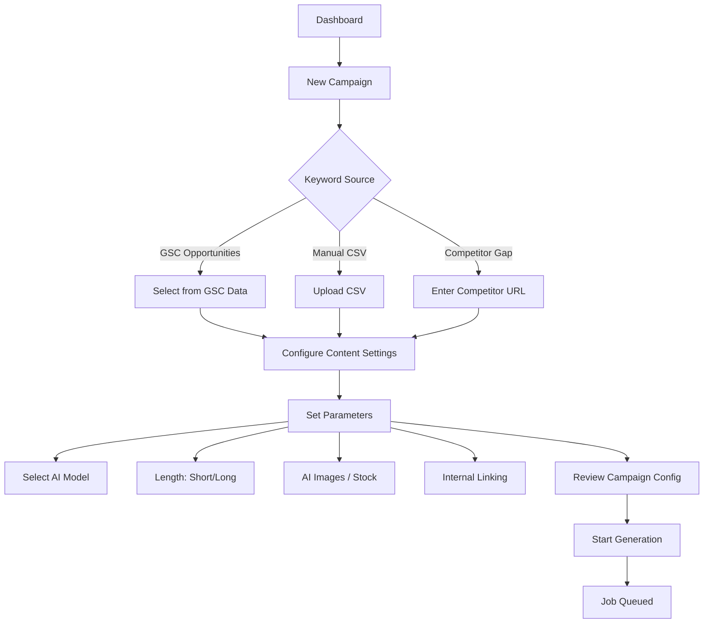
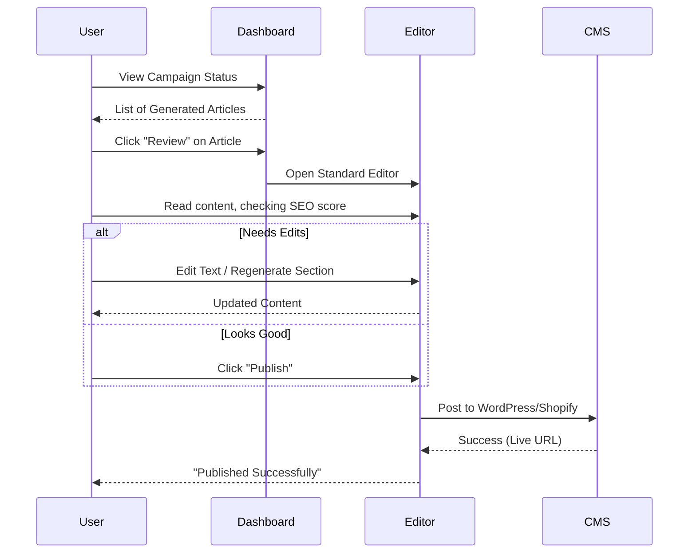
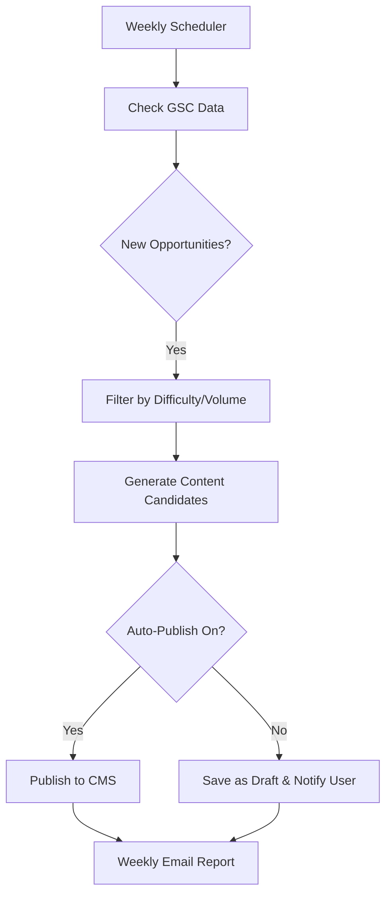
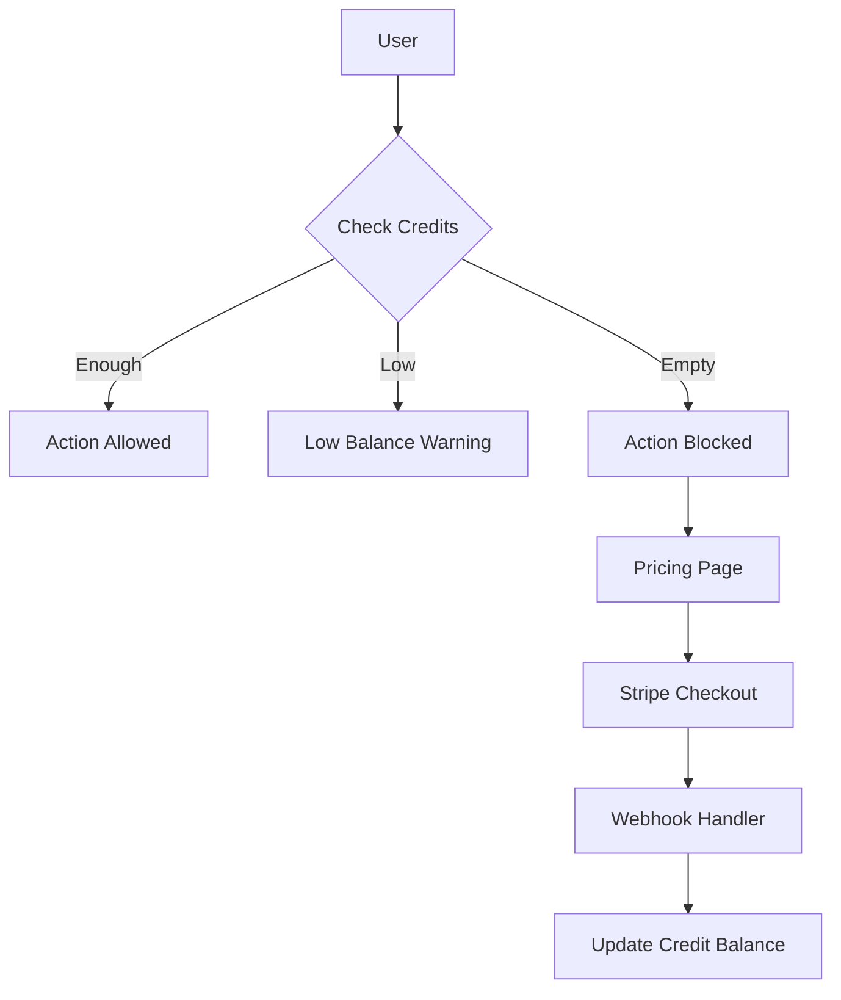

# User Flows

Detailed user journeys for **AutopilotRank**.

## 1. Onboarding & Setup

```mermaid
flowchart TD
    A[Sign Up] --> B{Select User Type}
    B -->|SMB Owner| C[Project Wizard]
    B -->|Agency| D[Agency Dashboard]

    C --> C1[Enter Website URL]
    C1 --> C2[Connect GSC (Optional)]

    C2 --> C3{GSC Connected?}
    C3 -->|Yes| C4[Auto-Analyze Opportunities]
    C3 -->|No| C5[Manual Keyword/Competitor Entry]

    C4 --> E[Configure Brand Voice]
    C5 --> E

    E --> F[Connect CMS (WordPress/etc)]
    F --> G[Onboarding Complete]
```

## 2. Campaign Creation (The Core Loop)



## 3. Content Review & Publishing



## 4. The "Autopilot" Mode (GSC Driven)



## 5. Subscription & Credits


